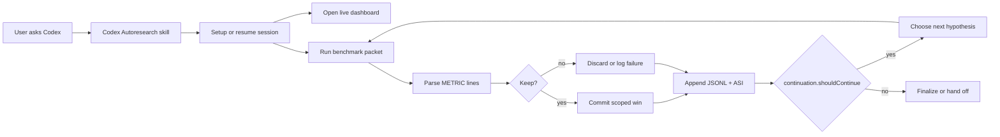
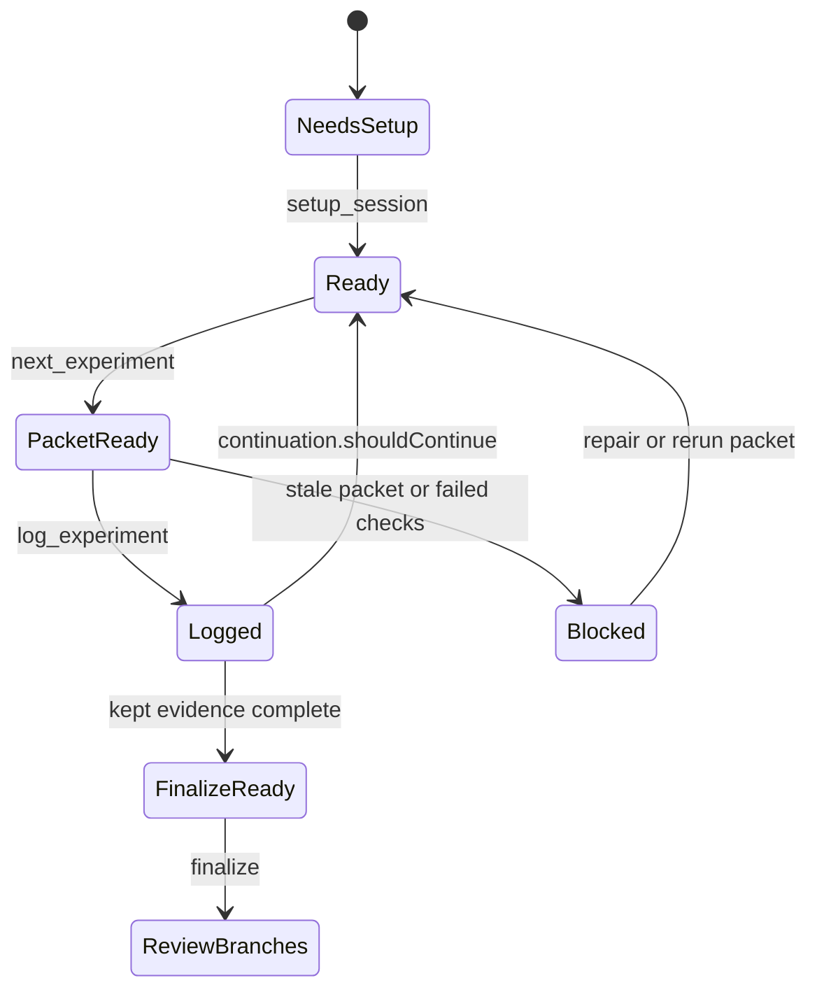
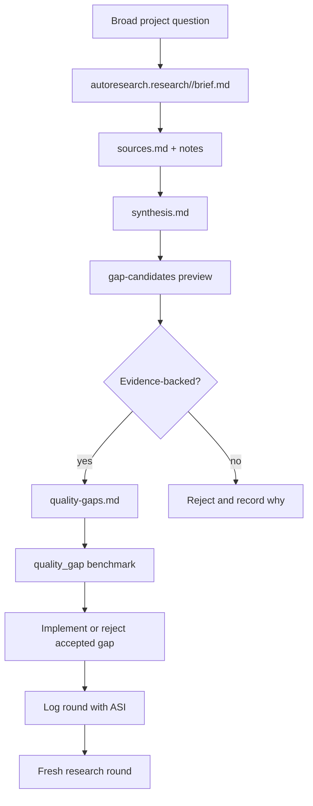
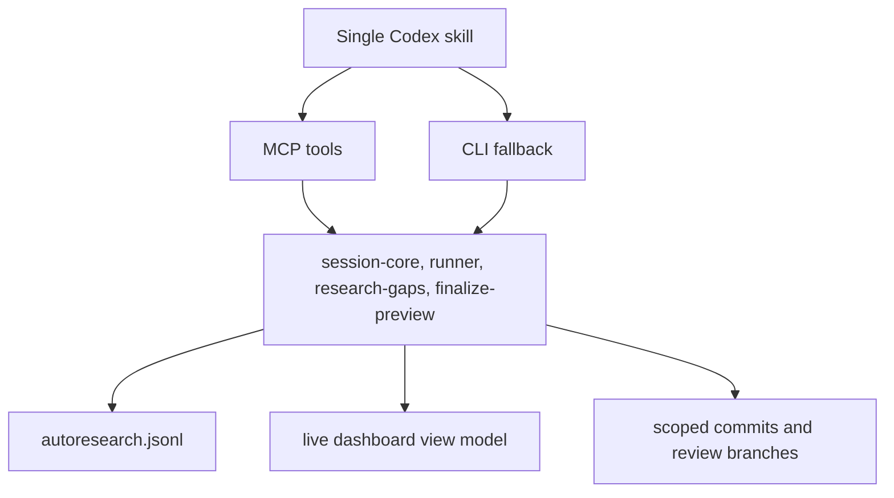

<div align="center">


# Codex Autoresearch
### Measured optimization loops for Codex

**[Start With Codex](#start-with-codex)** - **[Golden Paths](#golden-paths)** - **[Dashboard](#dashboard)** - **[Docs](#docs)** - **[Changelog](#changelog)** - **[Maintainers](#maintainers)**
</div>

Codex Autoresearch turns an open-ended improvement request into a measured loop: one primary metric, one benchmark, explicit keep/discard decisions, durable ASI, a live dashboard, and clean review branches when the noisy work is done.

The CLI is the canonical engine. MCP tools and the served dashboard are bounded adapters over the same session state, while static exports are read-only evidence snapshots.

It is adapted from [pi-autoresearch](https://github.com/davebcn87/pi-autoresearch) and the broader [karpathy/autoresearch](https://github.com/karpathy/autoresearch) idea.

## Start With Codex

Install the plugin, then talk to Codex in the repo you want to improve:

```bash
codex marketplace add TheGreenCedar/codex-autoresearch
```

Use natural requests:

```text
Use Codex Autoresearch to reduce unit test runtime.
Benchmark: npm test -- --runInBand
Metric: seconds, lower is better
Checks: npm test
Scope: test runner config and test helpers only
```

```text
Use Codex Autoresearch to study this project and make the dashboard feel effortless.
Turn the accepted findings into a quality_gap loop.
```

```text
Use Codex Autoresearch to open the live dashboard, summarize the current loop, and continue from the latest ASI.
```

```text
Use Codex Autoresearch to finalize the kept experiments into review branches.
```

Codex should give you the live dashboard URL, run the next measured packet, log the decision, and keep iterating until a real stop condition is reached.

## Golden Paths

**UX: user experience**

The user interacts with one thing: Codex Autoresearch. The request can be vague or precise. Codex asks only for missing essentials, opens the live dashboard, reports evidence in plain language, and keeps the loop moving.

**AX: AI experience**

The agent gets one skill surface and deterministic helpers underneath it. The skill chooses the workflow, MCP tools execute bounded actions, the JSONL log preserves truth, and `continuation` tells Codex whether to keep going.

## What Codex Creates

| Artifact | Role |
| --- | --- |
| `autoresearch.md` | Goal, metric, scope, constraints, decisions, and stop conditions |
| `autoresearch.jsonl` | Append-only history of setup, packets, metrics, status, commits, and ASI |
| `autoresearch.sh` or `autoresearch.ps1` | Benchmark entrypoint that prints `METRIC name=value` |
| `autoresearch.checks.sh` or `autoresearch.checks.ps1` | Optional correctness gate |
| `autoresearch.ideas.md` | Deferred hypotheses, avoided dead ends, and next lanes |
| `autoresearch.research/<slug>/` | Source-backed deep-research scratchpad and `quality_gap` checklist |
| live dashboard URL | Served operator surface with refresh, readout, chart, runway, guarded actions, and receipts |
| `autoresearch-dashboard.html` | Read-only static export with embedded evidence and no live action token |
| review branches | Finalized kept work under `autoresearch-review/<goal>/...` |

## Dashboard

The live dashboard is the normal operator surface. Codex should hand you a served local URL like:

```text
http://127.0.0.1:49152/
```

The operator runway is `Setup -> Gap -> Packet -> Log -> Finalize`. The served dashboard keeps that path visible while preserving the CLI as the source of truth.

The dashboard prioritizes:

- metric trajectory with baseline, best, latest, status, and run markers
- newest-first run log with metric deltas, commits, descriptions, and ASI
- current readout for best kept change, recent failures, next action, confidence, and finalization readiness
- loop runway for setup, gap review, packet readiness, log decision, and finalization
- strategy memory for plateau detection and lane guidance
- guarded local actions for doctor, setup-plan, recipes, gap preview, finalize preview, export, and confirmed log decisions
- action receipts with command summary, duration, ledger linkage, and next-state hints

Served-dashboard actions are local-only and nonce-bound. Mutating log decisions require a fresh last-run fingerprint, typed confirmation, specific ASI, same-origin request checks, JSON payloads, and bounded command execution. The browser cannot submit arbitrary commands, broad staging, finalizer mutation, or custom output paths.

Static `autoresearch-dashboard.html` exports are fallback snapshots for offline review. They contain no action nonce and expose no live mutation controls.

## Docs

### Loop



### State



### Deep Research



### Runtime Surface



## MCP Tools

| Tool | Use |
| --- | --- |
| `setup_plan` | Read-only first-run or resume plan |
| `setup_session` | Create session files and JSONL config |
| `setup_research_session` | Create `autoresearch.research/<slug>/` and a `quality_gap` session |
| `next_experiment` | Run preflight and benchmark as one decision packet |
| `log_experiment` | Record keep, discard, crash, or checks_failed with ASI |
| `read_state` | Summarize baseline, best, run counts, confidence, and limits |
| `measure_quality_gap` | Count open and closed accepted checklist gaps |
| `gap_candidates` | Preview or apply evidence-backed gap candidates |
| `finalize_preview` | Inspect review-branch readiness without creating branches |
| `serve_dashboard` | Start the live dashboard and return the operator URL |
| `export_dashboard` | Write a read-only fallback dashboard snapshot |
| `doctor_session` | Check setup, Git state, and benchmark metric output |
| `clear_session` | Delete session artifacts after explicit confirmation |

MCP tools reject unknown arguments before dispatch so misspelled options fail loudly. Custom command-bearing fields such as `command`, `benchmark_command`, `checks_command`, and `model_command` require `allow_unsafe_command: true`; configured benchmark scripts are preferred.

## Changelog

User-facing changes are tracked in [CHANGELOG.md](CHANGELOG.md). Surface removals, prompt changes, dashboard behavior changes, and release migration notes belong there before publishing.

## Maintainers

The active package lives under `plugins/codex-autoresearch`. The root README is the only README. The plugin skill lives at [plugins/codex-autoresearch/skills/codex-autoresearch/SKILL.md](plugins/codex-autoresearch/skills/codex-autoresearch/SKILL.md).

Run the plugin gate from the package root:

```bash
cd plugins/codex-autoresearch
npm run check
```

Useful targeted checks:

```bash
node --check scripts/autoresearch.mjs
node --check scripts/autoresearch-mcp.mjs
node --test tests/autoresearch-cli.test.mjs
node --test tests/dashboard-verification.test.mjs
node scripts/autoresearch.mjs mcp-smoke
git diff --check
```

Local plugin routing from the wrapper root:

```bash
node plugins/codex-autoresearch/scripts/autoresearch.mjs mcp-smoke
node plugins/codex-autoresearch/scripts/autoresearch.mjs doctor --cwd plugins/codex-autoresearch --check-benchmark
node plugins/codex-autoresearch/scripts/autoresearch.mjs next --cwd plugins/codex-autoresearch
node plugins/codex-autoresearch/scripts/autoresearch.mjs export --cwd plugins/codex-autoresearch
```

## License

Apache License 2.0. Copyright (c) 2026 Albert Najjar.
