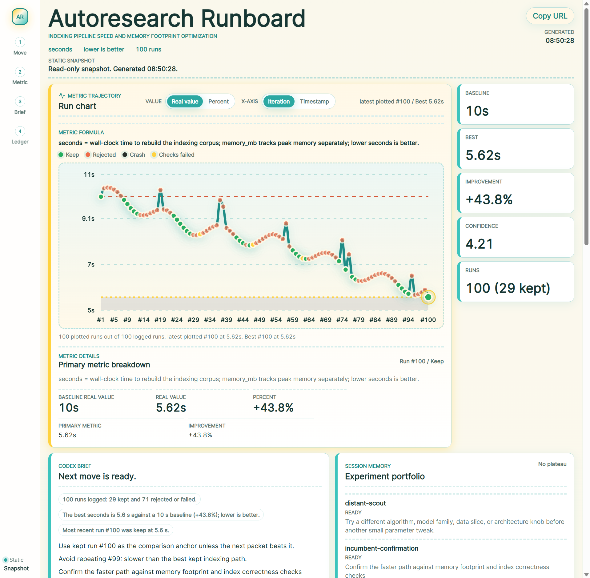

<div align="center">


# Codex Autoresearch
### Measured improvement loops for Codex

**[Install](#install)** - **[First Five Minutes](#first-five-minutes)** - **[Dashboard](#dashboard)** - **[Docs](#docs)** - **[Changelog](#changelog)**
</div>

Codex Autoresearch is for the moment where "make this better" would otherwise become a fog machine.

Give Codex one goal and one benchmark contract, or give it a broad prompt and let it infer the shape. The plugin helps Codex run small measured packets, keep or discard changes with evidence, preserve ASI* and metrics across context loss, and package the useful work for review instead of leaving you with a heroic pile of vibes.

> \* ASI is the structured note attached to each run: hypothesis, evidence, rollback reason, next action hint, and optional lane/family/risk metadata. It is the part that tells the next Codex session "what we thought, what happened, and what not to repeat."

The point is simple: A run should be able to finish uninterrupted, sometimes for hours at a time. If there's an interruption, a future codex session should be able to resume from durable state rather than chat memory, and the interface for the human should be as simple as just invoking the plugin.



Inspired by [pi-autoresearch](https://github.com/davebcn87/pi-autoresearch), generalized so it can work for any measured research task, and the AI-focused [karpathy/autoresearch](https://github.com/karpathy/autoresearch).

## What It Does

1. Codex identifies the real target repo or child package and checks whether a session already exists.
2. A benchmark prints one primary metric as `METRIC name=value`.
3. Codex runs one packet, then logs it as `keep`, `discard`, `crash`, or `checks_failed` with ASI.
4. The dashboard shows the metric trend, Codex brief, session memory, next safe action, ledger, and supporting diagnostics.
5. When there is useful kept work, Codex previews finalization into reviewable branches.

This is not automation theater. The contract is evidence: no invented zeroes, no stale packets, no broad cleanup without consent, and no triumphant little parade before verification.

## Install

```bash
codex marketplace add TheGreenCedar/codex-autoresearch
```

Then open the repo you want to improve and ask Codex to use Codex Autoresearch.

## Start With Codex

Use Codex Autoresearch by giving Codex a goal, a benchmark command, a primary metric, and the scope it is allowed to change. Codex should open with an onboarding packet, name the next safe action, and keep the live dashboard available while it works.

If you only know the problem, say the problem. That is fine. The plugin can turn a broad request into a plan before it starts touching files.

## First Five Minutes

Just ask Codex.

Broad is allowed:

```text
Use $Codex Autoresearch to improve the speed of my indexer's pipeline, while keeping it memory efficient.
```

```text
Use $Codex Autoresearch to keep reducing bugs in the codebase, starting with the most obvious low hanging fruits. Keep doing this 100 times.
```

You can also hand it a sharper investigation. Codex will start with a few lanes, learn from the measurements, and stop wasting time on dead ends.

```text
Use $Codex Autoresearch to figure out why my graphql service's p99 latency is so much higher than its p90 latency at 1 minute metric resolution. I suspect: DNS lookup, event loop throttling, memory spike, CPU spike. For each, run the 4-5 appropriate experiments @experiments.md and if the results are promising keep iterating, otherwise stop and report back.
```

Or be exact about the benchmark and scope:

```text
Use $Codex Autoresearch to optimize my unit tests' speed. different libraries are allowed, but try to avoid it.
Benchmark: npm test -- --runInBand
Metric: seconds, lower is better
Checks: npm test
Scope: test runner config and test helpers only
```

Codex should:

1. Check Git state and identify the owning package.
2. Run an onboarding packet or setup plan.
3. Run `benchmark-inspect`, `benchmark-lint`, or `doctor --check-benchmark` before the first live packet.
4. Checkpoint generated session files before experiment-scoped keep commits.
5. Start the live dashboard and give you a local URL.
6. Run one packet.
7. Log the decision with ASI, using `--asi-file <path>` when inline JSON quoting is brittle.
8. Continue only when the continuation state says it is safe.

Explicit `--benchmark-command` values are treated as commands that print their own `METRIC name=value` lines. To time a raw workload instead, pass `--benchmark-prints-metric false`.

For product, docs, UX, or broad research, ask for a quality-gap loop:

```text
Use Codex Autoresearch to study this project and improve the dashboard.
Turn accepted findings into a quality-gap loop, implement them, and keep the live dashboard open.
```

`quality_gap=0` means the accepted checklist for that round is closed. It does not mean the universe has been conquered. Start another round if the question is still alive.

## Docs

- [Docs index](plugins/codex-autoresearch/docs/index.md)
- [Workflow diagrams](plugins/codex-autoresearch/docs/workflows.md)
- [Architecture diagrams](plugins/codex-autoresearch/docs/architecture.md)

## Live Demo

The demo session shows a 100-packet loop for `Indexing Pipeline Speed and Memory Footprint Optimization`.
Its primary dashboard score is a weighted cost:

`0.7 * (seconds / baseline_seconds) + 0.3 * (memory_mb / baseline_memory_mb)`

Lower is better. The chart can switch between score, percent of baseline, raw value, iteration, and timestamp, while the metric details panel shows the time and memory breakdown for the selected run.

Serve the live demo locally:

```bash
cd plugins/codex-autoresearch
node scripts/autoresearch.mjs serve --cwd examples/demo-session
```

- [Demo tour](plugins/codex-autoresearch/examples/demo-session/demo.md)
- [Demo ledger](plugins/codex-autoresearch/examples/demo-session/autoresearch.jsonl)

The active package lives under `plugins/codex-autoresearch`. The plugin skill lives at [plugins/codex-autoresearch/skills/codex-autoresearch/SKILL.md](plugins/codex-autoresearch/skills/codex-autoresearch/SKILL.md).

## Useful Commands

From `plugins/codex-autoresearch`:

```bash
node scripts/autoresearch.mjs onboarding-packet --cwd <project> --compact
node scripts/autoresearch.mjs prompt-plan --cwd <project> --prompt "Use Codex Autoresearch to improve test speed without deleting tests"
node scripts/autoresearch.mjs recommend-next --cwd <project> --compact
node scripts/autoresearch.mjs setup-plan --cwd <project>
node scripts/autoresearch.mjs benchmark-inspect --cwd <project>
node scripts/autoresearch.mjs benchmark-lint --cwd <project> --sample "METRIC seconds=1.23"
node scripts/autoresearch.mjs doctor --cwd <project> --check-benchmark --explain
node scripts/autoresearch.mjs serve --cwd <project>
node scripts/autoresearch.mjs next --cwd <project> --compact
node scripts/autoresearch.mjs log --cwd <project> --from-last --status keep --description "Describe the kept change"
node scripts/autoresearch.mjs log --cwd <project> --from-last --status keep --description "Describe the kept change" --asi-file asi.json
node scripts/autoresearch.mjs state --cwd <project> --compact
node scripts/autoresearch.mjs new-segment --cwd <project> --dry-run
node scripts/autoresearch.mjs promote-gate --cwd <project> --reason "move to the larger sample" --query-count 150 --dry-run
```

MCP exposes the same workflow behind the skill, including `onboarding_packet`, `prompt_plan`, `recommend_next`, `benchmark_inspect`, `benchmark_lint`, `checks_inspect`, `new_segment`, `promote_gate`, `serve_dashboard`, `next_experiment`, and `log_experiment`.

## Dashboard

The live dashboard is the normal operator surface:

```bash
node scripts/autoresearch.mjs serve --cwd <project>
```

The dashboard is a visual aid, not a command center. It shows:

- baseline, latest, best, confidence, and weighted metric formulas
- the Codex brief and session memory directly below the metric chart
- the next safe action and why it is safe
- the ledger, ASI, and handoff context directly below the next action
- best kept change, recent failures, strategy lanes, runtime drift, and finalization readiness
- copyable status reports and agent handoff packets

Live mutation controls, mission-control buttons, and action receipts are intentionally omitted from the dashboard UI. Use the CLI or MCP tools for actions and logging.

Static exports are portable review snapshots:

```bash
node scripts/autoresearch.mjs export --cwd <project>
```

Static exports are read-only. Serve a fresh dashboard when you need current packet freshness. Use `--showcase` only for checked-in public demo snapshots that must not embed local absolute paths.

## Tooling

The plugin and dashboard source are authored in TypeScript. The package uses `tsdown` for Node builds, `tsgo` for typechecking, `oxlint` for linting, `oxfmt` for formatting, Vite for the dashboard, and `npm-run-all2` for fast gates.

From `plugins/codex-autoresearch`:

```bash
npm run check
npm test
node scripts/autoresearch.mjs mcp-smoke
```

## Changelog

User-facing changes are tracked in [CHANGELOG.md](CHANGELOG.md). Surface removals, prompt changes, dashboard behavior changes, MCP behavior, migration notes, and release notes belong there before publishing.

## License

Apache License 2.0. Copyright (c) 2026 Albert Najjar.
