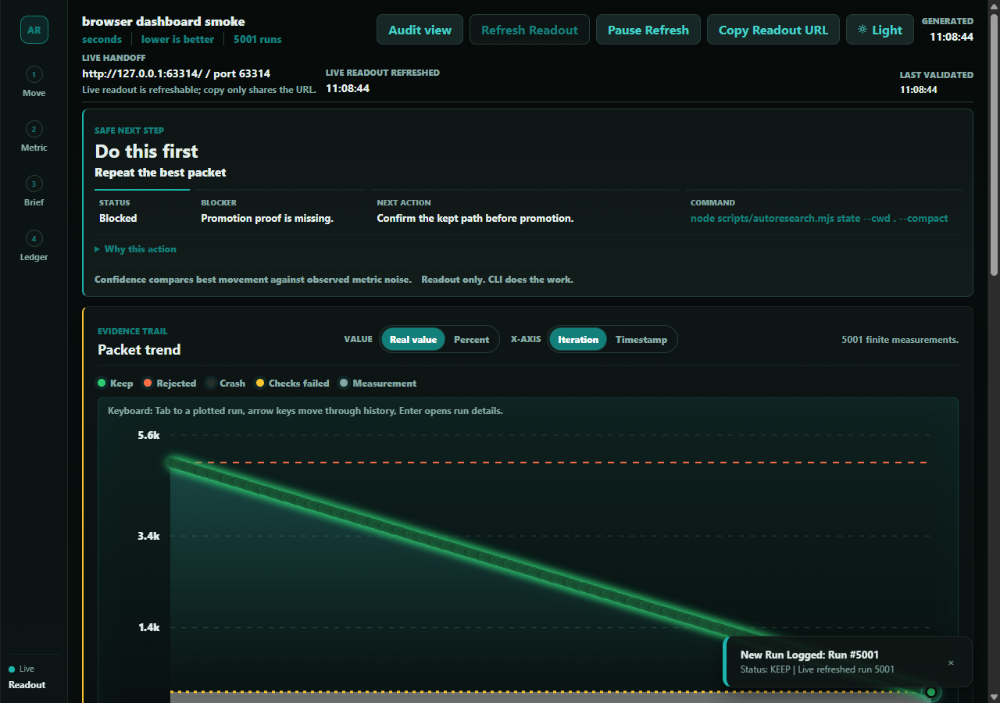

<div align="center">

# Codex Autoresearch

### Measured improvement loops for Codex

**[Try it](#try-it)** - **[Example](#example)** - **[Install](#install)** - **[How it works](#how-it-works)** - **[Questions](#questions)** - **[Dashboard](#dashboard)** - **[Docs](#docs)** - **[Changelog](#changelog)**
</div>

You ask Codex to make something faster, smaller, or more reliable. Without a benchmark and a paper trail, you get a convincing answer — not evidence you can resume, compare, or ship.

Codex Autoresearch keeps each attempt measured, logged, and scoped so you can see what changed, what improved, and what's worth keeping. It fits when the goal is measurable and the edit surface is small enough to review.



Inspired by the AI-focused [karpathy/autoresearch](https://github.com/karpathy/autoresearch) and [pi-autoresearch](https://github.com/davebcn87/pi-autoresearch). Codex Autoresearch adapts measured improvement loops for Codex: local benchmarks, durable state, live readouts, and reviewable branch previews.

This project pairs especially well with [DietrichGebert/ponytail](https://github.com/DietrichGebert/ponytail): Ponytail keeps Codex on the shortest workable implementation path, while Autoresearch checks whether the result actually improves.

## Try it

Ask Codex to use Codex Autoresearch.

Broad prompts work, but you should consider them as a discovery mode, not a real goal. Codex might be good, but it can't read your mind. Tighten the goal, evidence bar, budget, benchmark, and scope as soon as you can.

```text
/goal @Codex Autoresearch improve the speed of my indexer's pipeline, while keeping it memory efficient.
```

```text
/goal @Codex Autoresearch keep reducing bugs in the codebase, starting with
the most obvious low hanging fruits. Run at most 5 attempts or 30 minutes,
stop if checks fail twice, and report the best kept change.
```

You can also hand it a sharper investigation:

```text
/goal @Codex Autoresearch figure out why my graphql service's p99 latency is so much higher
than its p90 latency at 1 minute metric resolution. I suspect: DNS lookup, event loop throttling,
memory spike, CPU spike. For each, run the 4-5 appropriate experiments @experiments.md and if the
results are promising keep iterating, otherwise stop and report back.
```

Or be exact about the benchmark and scope:

```text
/goal @Codex Autoresearch optimize my unit tests' speed. different libraries are allowed, but try to avoid it.
Benchmark: npm test -- --runInBand
Metric: seconds, lower is better
Checks: npm test
Scope: test runner config and test helpers only
```

Autoresearch stores loop evidence in local project files and, in Git repos, active snapshots and pending log receipts under Git-private `.git/autoresearch/`. Outside Git, those transient records fall back to local files such as `autoresearch.last-run.json`, `autoresearch.progress.json`, and `autoresearch.pending-transaction.json`. Read [Privacy](plugins/codex-autoresearch/docs/privacy.md), [Terms](plugins/codex-autoresearch/docs/terms.md), and [Trust](plugins/codex-autoresearch/docs/trust.md) before using it on repos with secrets, sensitive data, external APIs, or expensive commands.

Ask for the live dashboard in a side chat when you want a visual readout or need fresh run state in the browser.

## Example

Your unit tests take too long. You want wall-clock seconds, not a gut feeling. You give Codex a tight scope — test runner config and helpers only — and a benchmark like `npm test -- --runInBand` with seconds as the metric.

Codex sets up the loop, verifies the benchmark contract, then runs measured experiments: change something scoped, run the benchmark, record the result, and compare against the previous evidence. When a change sticks, Autoresearch previews whether the evidence is ready for review branch creation.

The payoff is a kept change you can inspect and merge — not "Codex said it's faster." See [Walkthrough](plugins/codex-autoresearch/docs/walkthrough.md) for the full narrated loop.

## Install

For normal Codex use, install the plugin through the Codex plugin flow for your workspace. Open Codex in the repo you want to improve, then use:

```text
/plugins
```

Choose:

```text
TheGreenCedar -> codex-autoresearch -> Install plugin
```

If your Codex build exposes terminal marketplace management for source marketplaces, add or refresh this marketplace first:

```bash
codex plugin marketplace add TheGreenCedar/AgentPluginMarketplace
```

The marketplace source is `TheGreenCedar/AgentPluginMarketplace`; this repository remains the plugin source.

Some workspace plugin settings are managed from the Codex Apps/Plugins UI rather than the terminal. Use the UI path when the CLI marketplace command is unavailable.

Start a new Codex thread after installation or refresh.

### After install

Open Codex in the repo you want to improve and ask for one measured first packet:

```text
/goal @Codex Autoresearch measure one baseline packet for this repo before making changes.
Goal: <what should improve>
Benchmark: <command that prints METRIC name=value>
Metric: <metric name>, <higher|lower> is better
Scope: <allowed files or packages>
```

A baseline measurement before code changes gives every later attempt something real to beat.

See [Start](plugins/codex-autoresearch/docs/start.md) for copyable first-run prompts and recovery steps.

## How it works

Autoresearch helps Codex turn an improvement request into a bounded evidence loop:

1. establish the goal, metric, benchmark, checks, and allowed scope
2. measure a baseline before changing code
3. run small attempts and compare them against the same metric
4. keep the useful work, discard weak attempts, and preview what is ready for review

The live dashboard is optional. It is a read-only way to see freshness, blockers, run history, and finalization readiness when a terminal summary is not enough.

When you use Codex Goal mode, Autoresearch can summarize session state into a clearer objective and completion audit.

A benchmark experiment is one measured cycle: make a scoped change, run the benchmark, inspect the metric, and record the evidence.

Autoresearch keeps structured session context — hypothesis, evidence, next action hint, and relevant risk notes — so the next session knows what happened and which path deserves the next attempt.

| Responsibility | What it owns |
| --- | --- |
| You | Goal, acceptable scope, benchmark trust, and final review decisions. |
| Codex | Edits, command execution, evidence reading, and reporting from the current repo. |
| Autoresearch | Session files, packet evidence, state, dashboard readouts, and finalization previews. |
| Benchmark/check commands | The local measurement and correctness proof; they run with your normal local process permissions. |

## When to use it

Use Codex Autoresearch when:

* the goal can be measured
* the benchmark is repeatable
* the benchmark inputs are stable and reviewable
* known tradeoffs can be expressed as secondary metric constraints
* correctness checks exist or can be added
* the editable scope is small enough to review
* kept work should become reviewable commits or branches

For qualitative work — product study, docs, UX — Autoresearch can run a checklist-measured loop: study the surface, accept evidence-backed gaps, close them, and verify `quality_gap`. See [Concepts](plugins/codex-autoresearch/docs/concepts.md#quality-gap).

Use a regular Codex task when:

* the work needs one careful edit
* the goal is mainly taste or judgment
* the benchmark is flaky or very expensive
* the metric can improve by weakening the benchmark

Avoid huge generated, cache, fixture, or data directories as the trusted benchmark surface. Compact, reviewable benchmark inputs make the evidence easier to trust.

## Questions

### What is Autoresearch actually doing?

Bounded benchmark runs with a local ledger and resume state. Each attempt is measured, logged, and scoped — you decide what to keep, discard, or finalize. It is not open-ended autonomy.

### Do I need my own benchmark?

Yes, for optimization loops. The plugin can help you create one. You define the command, primary metric, checks, and edit scope. For checklist-style work without a numeric benchmark, the quality-gap recipe applies. See [Recipes](plugins/codex-autoresearch/docs/recipes.md).

### Will it change the git history without my approval?

No. Finalization starts with a read-only preview, review branches are explicit, and you approve merges. See [Trust](plugins/codex-autoresearch/docs/trust.md).

### What if Codex goes in circles?

Budgets and the dashboard readout surface stop/rescope signals. If attempts repeat without progress, it will either report the best evidence it found or ask you to tighten scope, fix a flaky benchmark, or change the measurement.

### Is the dashboard required?

No. The dashboard is an optional live readout when freshness or visual context helps.

### How is this different from "just optimize my tests"?

You get a repeatable metric, an evidence trail across attempts, explicit keep/discard discipline, and a finalization bar before anything lands on a review branch.
There is also an opinionated research and review loop that optimizes for correctness and reliability over raw model output speed, and proud as I am of it, it's a secondary feature.
The primary focus is on measuring and optimizing for a repeatable, reliable metric.

Simple prompts can work when the context is obvious, but tighter goals, benchmarks, and edit scope make the loop safer and easier to review.

### What should I avoid?

Secrets in benchmark or check commands, flaky or very expensive benchmarks, and huge unscoped diffs. Do not put deployment paths, unrelated dirty files, or sensitive data in scope without reading [Privacy](plugins/codex-autoresearch/docs/privacy.md) and [Trust](plugins/codex-autoresearch/docs/trust.md) first.

## Dashboard

Ask Codex to serve the dashboard when you want a live visual readout, run freshness matters, or a stale/static export is confusing the decision.

The dashboard answers three questions:

1. Is this live or a static snapshot?
2. What is the next safe action?
3. What blocks trust?

Audit view includes the deeper trace: metric formulas, lane state, watchdog quiet windows, runtime provenance, run diagnostics, finalization readiness, evidence history, and handoff details.

The dashboard is a read-only visual aid. It does not run experiments, mutate session state, or finalize work. See [Architecture](plugins/codex-autoresearch/docs/architecture.md#dashboard-boundary).

## Quality-gap loops

For product, docs, UX, or broad research, ask for a quality-gap loop:

```text
/goal @Codex Autoresearch study this project and improve the dashboard.
Turn accepted findings into a quality-gap loop, implement them, and keep the live dashboard open.
```

`quality_gap=0` means the accepted checklist for that round is closed — not that discovery is complete. See [Concepts](plugins/codex-autoresearch/docs/concepts.md#quality-gap).

## Finalization

Ask the plugin to finalize once a loop has useful kept work mixed with exploratory history.

Finalization previews what is ready for review, what evidence supports it, and what still blocks trust. It keeps exploratory or superseded evidence visible for audit without forcing it into the review branch.

## Docs

* [Start](plugins/codex-autoresearch/docs/start.md)
* [Operate](plugins/codex-autoresearch/docs/operate.md)
* [Trust](plugins/codex-autoresearch/docs/trust.md)
* [Troubleshooting](plugins/codex-autoresearch/docs/troubleshooting.md)
* [Changelog](CHANGELOG.md)

Full map: [Docs index](plugins/codex-autoresearch/docs/index.md), [workflows](plugins/codex-autoresearch/docs/workflows.md), and [architecture](plugins/codex-autoresearch/docs/architecture.md).

## Development

The plugin and dashboard source are written in TypeScript and developed on Node.js 24 or newer.

From `plugins/codex-autoresearch`:

```bash
npm install
npm run check
```

See [Maintainers](plugins/codex-autoresearch/docs/maintainers.md) for release, packaging, and verification details.

## Update or remove

For normal Codex use, refresh or uninstall the plugin from the Codex plugin surface:

```text
/plugins
```

Then choose the installed `codex-autoresearch` plugin and use the available refresh or uninstall action.

If your Codex build exposes terminal marketplace management for source marketplaces, these commands may be available:

```bash
codex plugin marketplace upgrade TheGreenCedar
codex plugin marketplace remove TheGreenCedar
```

`marketplace remove` removes the source marketplace registration. It may not uninstall an already installed workspace plugin. Prefer the plugin UI for installed-plugin refresh/uninstall actions, and use terminal marketplace commands only for source registration when your Codex build supports them.

## Changelog

User-facing changes are tracked in [CHANGELOG.md](CHANGELOG.md).

## License

This project is licensed under the terms of the [Apache License 2.0](./LICENSE). Copyright (c) 2026 Albert Najjar.
