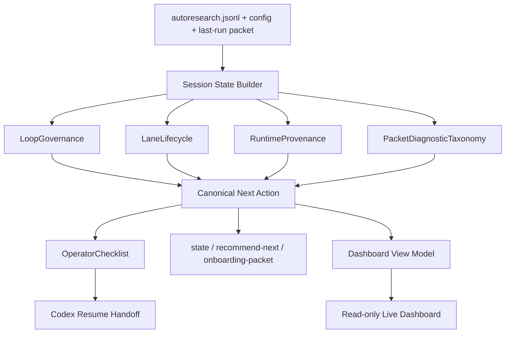

# Autoresearch 2 Loop Governance Full Implementation Plan

> **For agentic workers:** REQUIRED SUB-SKILL: Use superpowers:subagent-driven-development (recommended) or superpowers:executing-plans to implement this plan task-by-task. Steps use checkbox (`- [ ]`) syntax for tracking.

**Goal:** Make Codex Autoresearch 2.0 reliably govern long optimization loops so Codex cannot easily skip context distillation, stale lane cleanup, runtime provenance checks, evidence diagnostics, dashboard truth, or finalization pressure before running another packet.

**Architecture:** Add a single loop-governance layer that feeds CLI state, `recommend-next`, dashboard readouts, lane orchestration, and finalization guidance from the same decision inputs. Keep the existing `METRIC name=value`, ASI, evidence-status, JSONL ledger, and read-only dashboard contracts intact. Implement in phased vertical slices so every phase has tests and can ship independently.

**Tech Stack:** TypeScript/Node ESM, existing Autoresearch CLI, existing JSONL ledger, existing React dashboard, existing `node:test` suites, existing `npm run check` gate.

---

## Specification Summary

### Business Problem

Long Autoresearch loops can still drift under session pressure. The 2.0 surface records evidence, but it does not yet force Codex, subagents, dashboard state, runtime provenance, and finalization pressure into one operating contract that is harder to skip than to follow.

### Users

- Primary Codex operator supervising long loops.
- Future Codex agent resuming after compaction or a thread restart.
- Subagents running scout, verification, or implementation lanes.
- Reviewer consuming finalization branches and evidence summaries.

### Outcomes

- Fewer user corrections about skipped steps.
- Fewer stale subagents or unclosed lanes.
- Lower compaction-to-progress ratio before context distillation is recommended.
- Higher percentage of packets logged from fresh evidence.
- `state --compact`, `recommend-next --compact`, and dashboard agree on one safe next action.
- Version/source/cache drift is visible before conclusions are trusted.
- Packet failures identify where evidence was lost: retrieval, ranking, synthesis, citation carry, scoring, or sufficiency.

### Non-Negotiable Contracts

- Do not break `METRIC name=value`.
- Do not make dashboard a mutating control surface.
- Do not make rejected, provisional, superseded, or quarantined evidence promotable.
- Do not use broad Git cleanup as a hidden convenience.
- Do not hide source-vs-installed runtime drift.
- Keep root `CHANGELOG.md`, plugin skill, docs, tests, and tool schemas synchronized for user-facing changes.

## Architectural Blueprint

### Components

| Component | Responsibility |
|---|---|
| `LoopGovernance` | Build contract-gate signals from session state and choose whether the loop may run another packet. |
| `ContextDistillationPolicy` | Detect compaction, token/tool pressure, long elapsed sessions, and missing context capsules. |
| `LaneLifecycle` | Track fanout lanes, lane-runner results, stale lanes, cleanup state, and coordinator recommendations. |
| `RuntimeProvenance` | Surface source, dist, package, and installed cache version/path truth in CLI and dashboard. |
| `OperatorChecklist` | Produce one command, one safety reason, one blocker, and one evidence role for Codex-facing handoff. |
| `PacketDiagnosticTaxonomy` | Classify packet failures and partial successes into actionable loss stages. |
| `DashboardServerRegistry` | Persist live dashboard serve metadata so stale localhost URLs can be detected across processes. |
| `CommandSurfaceMap` | Generate and verify CLI/help/tool-registry/schema/docs command drift. |
| `AutoresearchMainModularization` | Extract high-risk logic from `scripts/autoresearch.ts` into focused command/policy modules. |

### Data Flow



## Requirements

### Requirement 1: Contract Gate Before Packet

1.1. WHEN context distillation is required, THE `LoopGovernance` SHALL choose `context-distillation` before `next-packet`.

1.2. WHEN lanes are stale or unclosed, THE `LoopGovernance` SHALL choose `lane-cleanup` before `next-packet`.

1.3. WHEN runtime provenance is stale or mismatched, THE `LoopGovernance` SHALL choose `runtime-provenance` before `next-packet`.

1.4. WHEN finalization pressure is high, THE `LoopGovernance` SHALL choose `finalization` before `next-packet`.

1.5. WHEN packet diagnostics show an unresolved loss stage, THE `LoopGovernance` SHALL choose `packet-diagnostic` before a fresh packet.

### Requirement 2: Operator Checklist

2.1. WHEN `recommend-next --compact --operator-checklist` runs, THE `OperatorChecklist` SHALL print JSON with exactly one command, one safety reason, one blocker, one evidence role, and one source label.

2.2. WHEN no blocker exists, THE `OperatorChecklist` SHALL set `blocker` to an empty string and keep the command actionable.

2.3. WHEN a canonical action has no command, THE `OperatorChecklist` SHALL provide the safest inspect command for that kind.

### Requirement 3: Session Forensics Auto-Resume

3.1. WHEN compactions, total token usage, tool count, elapsed time, or turn count exceed configured thresholds, THE `ContextDistillationPolicy` SHALL mark context distillation required.

3.2. WHEN a current capsule exists for the active session source, THE `ContextDistillationPolicy` SHALL not block packet work.

3.3. WHEN context distillation is required, THE canonical action command SHALL be a safe `session-forensics --dry-run` or `--apply` command with outside-workdir redaction preserved.

### Requirement 4: Durable Lane Lifecycle

4.1. WHEN `research-fanout --yes` records lanes, THE `LaneLifecycle` SHALL expose planned lanes with status `planned`.

4.2. WHEN `lane-runner --yes` records a result, THE `LaneLifecycle` SHALL expose the latest result by lane id.

4.3. WHEN a lane has no result after the stale threshold, THE `LaneLifecycle` SHALL expose status `stale`.

4.4. WHEN stale lanes exist, THE canonical action SHALL be `lane-cleanup` or `lane-runner` guidance before `next-packet`.

### Requirement 5: Runtime Provenance

5.1. WHEN `state --compact`, `recommend-next --compact`, `onboarding-packet --compact`, `export`, or dashboard view-model run, THE `RuntimeProvenance` SHALL include plugin version, source path, local version, installed version, installed path, and drift status when known.

5.2. WHEN local and installed versions disagree, THE canonical action SHALL recommend runtime inspection before promotion or public claims.

5.3. WHEN installed runtime cannot be inspected, THE readout SHALL say unavailable, not fresh.

### Requirement 6: Packet Diagnostic Taxonomy

6.1. WHEN a packet has retrieval hits but poor citation/claim/file recall, THE `PacketDiagnosticTaxonomy` SHALL classify `retrieved_but_not_cited`.

6.2. WHEN a packet has high symbol recall but low file or claim recall, THE taxonomy SHALL classify `lost_in_synthesis_or_citation`.

6.3. WHEN a packet exits without a quality score, THE taxonomy SHALL classify `missing_quality_score`.

6.4. WHEN a packet says sufficient but benchmark quality fails, THE taxonomy SHALL classify `marked_sufficient_but_failed`.

6.5. WHEN diagnostics are unresolved, THE canonical action SHALL prefer diagnostic inspection over another packet.

### Requirement 7: Dashboard Server Registry

7.1. WHEN `serve` starts, THE `DashboardServerRegistry` SHALL write a pid, port, cwd, started-at, version, and health URL record under `.git/autoresearch/serve-registry.json` in Git repos or `autoresearch.research/.runtime/serve-registry.json` outside Git.

7.2. WHEN `serve` starts and a previous registry entry exists, THE registry SHALL mark whether the prior pid is alive, stale, same cwd, or different cwd.

7.3. WHEN dashboard process hygiene renders, THE dashboard SHALL report stale live URLs from the registry.

### Requirement 8: Compact Command Latency

8.1. WHEN compact readout commands run against representative fixture sessions, THE p95 command runtime SHALL stay under 1500 ms on the local machine for non-dashboard paths.

8.2. WHEN finalization or drift scans are expensive, THE compact readout SHALL include a deferred/enrichment marker instead of blocking core next-action output.

### Requirement 9: Command Surface Map

9.1. WHEN `npm run check` runs, THE command map check SHALL verify CLI help, `cli-handlers`, `tool-registry`, `tool-schemas`, docs, and skill references agree for all public commands.

9.2. WHEN a command is intentionally hidden or internal, THE map SHALL list it as internal with the owning source file.

### Requirement 10: Modularization

10.1. WHEN new policy code is added, THE implementation SHALL avoid growing `scripts/autoresearch.ts` unless it is wiring existing modules.

10.2. WHEN existing logic is touched repeatedly, THE implementation SHALL extract focused modules with tests before adding more behavior.

## File Structure

### Create

- `plugins/codex-autoresearch/lib/loop-governance.ts`: canonical governance signal assembly and action prioritization helpers.
- `plugins/codex-autoresearch/lib/operator-checklist.ts`: compact Codex-facing checklist projection.
- `plugins/codex-autoresearch/lib/lane-lifecycle.ts`: lane status, stale lane detection, lane cleanup recommendation.
- `plugins/codex-autoresearch/lib/packet-diagnostics.ts`: packet diagnostic taxonomy and loss-stage classifier.
- `plugins/codex-autoresearch/lib/dashboard-server-registry.ts`: persisted live dashboard registry read/write helpers.
- `plugins/codex-autoresearch/scripts/command-surface-map.ts`: generated command map checker.
- `plugins/codex-autoresearch/tests/loop-governance.test.ts`: pure governance and checklist tests.
- `plugins/codex-autoresearch/tests/packet-diagnostics.test.ts`: taxonomy unit tests.
- `plugins/codex-autoresearch/tests/dashboard-server-registry.test.ts`: registry unit tests.

### Modify

- `plugins/codex-autoresearch/lib/session-core.ts`: delegate canonical decision rules to `loop-governance.ts`, include loop contract fields in decision envelope.
- `plugins/codex-autoresearch/scripts/autoresearch.ts`: wire new commands/options and pass provenance/governance/checklist output.
- `plugins/codex-autoresearch/lib/cli-handlers.ts`: expose new normalized arguments for operator checklist and runtime provenance.
- `plugins/codex-autoresearch/lib/tool-schemas.ts`: add schema fields for operator checklist and provenance arguments.
- `plugins/codex-autoresearch/lib/tool-contracts.ts`: document safety and output contracts.
- `plugins/codex-autoresearch/lib/dashboard-view-model.ts`: render loop governance, provenance, packet diagnostics, registry status, and checklist summary.
- `plugins/codex-autoresearch/lib/commands/dashboard.ts`: use server registry when serving/exporting.
- `plugins/codex-autoresearch/lib/live-server.ts`: expose serve metadata for registry.
- `plugins/codex-autoresearch/scripts/check.ts`: invoke command-surface map and compact latency fixture checks.
- `plugins/codex-autoresearch/tests/autoresearch-cli.test.ts`: CLI integration coverage.
- `plugins/codex-autoresearch/tests/dashboard-verification.test.ts`: dashboard readout coverage.
- `plugins/codex-autoresearch/tests/full-product.test.ts`: product command coverage.
- `plugins/codex-autoresearch/skills/codex-autoresearch/SKILL.md`: update Codex-facing workflow.
- `plugins/codex-autoresearch/docs/operate.md`: update operator loop guidance.
- `plugins/codex-autoresearch/docs/trust.md`: update provenance and evidence trust guidance.
- `plugins/codex-autoresearch/docs/architecture.md`: update data-flow diagram and module boundaries.
- `CHANGELOG.md`: add user-facing changes.

## Implementation Plan

### Task 1: Add LoopGovernance Policy Module

**Files:**
- Create: `plugins/codex-autoresearch/lib/loop-governance.ts`
- Modify: `plugins/codex-autoresearch/lib/session-core.ts`
- Test: `plugins/codex-autoresearch/tests/loop-governance.test.ts`

- [ ] **Step 1: Write failing governance tests**

Add `plugins/codex-autoresearch/tests/loop-governance.test.ts`:

```ts
import assert from "node:assert/strict";
import test from "node:test";

import {
  buildLoopContractStatus,
  canonicalNextActionForLoop,
} from "../lib/loop-governance.js";

test("context distillation outranks next packet", () => {
  const envelope = {
    latestPacketFreshness: { fresh: null },
    contextDistillation: {
      required: true,
      reason: "Compactions reached 89; refresh a context capsule before more packets.",
      command: "node scripts/autoresearch.mjs session-forensics --cwd . --dry-run",
    },
  };

  const action = canonicalNextActionForLoop(envelope);
  assert.equal(action.kind, "context-distillation");
  assert.match(action.reason, /Compactions reached 89/);
  assert.match(action.command, /session-forensics/);
});

test("stale lanes outrank next packet", () => {
  const envelope = {
    laneLifecycle: {
      staleLanes: [{ id: "scout-retrieval", status: "stale" }],
      recommendation: "Close or refresh stale lane scout-retrieval before another packet.",
    },
  };

  const action = canonicalNextActionForLoop(envelope);
  assert.equal(action.kind, "lane-cleanup");
  assert.match(action.reason, /scout-retrieval/);
});

test("runtime drift outranks finalization claims", () => {
  const envelope = {
    runtimeProvenance: {
      drifted: true,
      reason: "Source version 2.0.0 differs from installed version 1.5.1.",
      inspectCommand: "node scripts/autoresearch.mjs doctor --cwd . --explain",
    },
    finalizationReadiness: { ready: true, nextAction: "Finalize reviewable kept work." },
  };

  const action = canonicalNextActionForLoop(envelope);
  assert.equal(action.kind, "runtime-provenance");
  assert.match(action.command, /doctor/);
});

test("loop contract summarizes blockers and warnings", () => {
  const status = buildLoopContractStatus({
    contextDistillation: { required: true, reason: "Session is too large." },
    laneLifecycle: { staleLanes: [{ id: "a" }] },
    runtimeProvenance: { drifted: false },
  });

  assert.equal(status.ok, false);
  assert.deepEqual(
    status.blockers.map((item: any) => item.kind),
    ["context-distillation", "lane-cleanup"],
  );
});
```

- [ ] **Step 2: Run the failing test**

Run:

```powershell
cd plugins/codex-autoresearch
npm run build:node
node --test dist/tests/loop-governance.test.mjs
```

Expected: FAIL because `dist/tests/loop-governance.test.mjs` or exported functions do not exist.

- [ ] **Step 3: Implement `loop-governance.ts`**

Create `plugins/codex-autoresearch/lib/loop-governance.ts`:

```ts
type LooseObject = Record<string, any>;

export interface LoopAction {
  kind: string;
  priority: number;
  reason: string;
  command: string;
  triggeredBy: string[];
}

function action(kind: string, priority: number, reason: string, command = "", triggeredBy = [kind]) {
  return { kind, priority, reason, command, triggeredBy };
}

export function buildLoopContractStatus(envelope: LooseObject) {
  const blockers: LoopAction[] = [];
  const warnings: LoopAction[] = [];

  if (envelope.contextDistillation?.required === true) {
    blockers.push(
      action(
        "context-distillation",
        2,
        envelope.contextDistillation.reason || "Refresh a context capsule before more packets.",
        envelope.contextDistillation.command || "",
        envelope.contextDistillation.triggeredBy || ["contextDistillation"],
      ),
    );
  }

  const staleLanes = Array.isArray(envelope.laneLifecycle?.staleLanes)
    ? envelope.laneLifecycle.staleLanes
    : [];
  if (staleLanes.length > 0) {
    blockers.push(
      action(
        "lane-cleanup",
        2,
        envelope.laneLifecycle.recommendation ||
          `Close or refresh stale lane ${staleLanes[0].id || staleLanes[0].label}.`,
        envelope.laneLifecycle.command || "",
        ["laneLifecycle"],
      ),
    );
  }

  if (envelope.runtimeProvenance?.drifted === true) {
    blockers.push(
      action(
        "runtime-provenance",
        3,
        envelope.runtimeProvenance.reason || "Inspect runtime/source drift before continuing.",
        envelope.runtimeProvenance.inspectCommand || "",
        ["runtimeProvenance"],
      ),
    );
  }

  if (envelope.packetDiagnostics?.unresolved === true) {
    blockers.push(
      action(
        "packet-diagnostic",
        4,
        envelope.packetDiagnostics.recommendation ||
          "Inspect unresolved packet diagnostics before another packet.",
        envelope.packetDiagnostics.command || "",
        ["packetDiagnostics"],
      ),
    );
  }

  if (envelope.finalizationReadiness?.ready === true) {
    warnings.push(
      action(
        "finalization",
        8,
        envelope.finalizationReadiness.nextAction || "Finalize reviewable kept work.",
        envelope.finalizationReadiness.command || "",
        ["finalizationReadiness"],
      ),
    );
  }

  return {
    ok: blockers.length === 0,
    blockers,
    warnings,
    strongestAction: blockers[0] || warnings[0] || null,
  };
}

export function canonicalNextActionForLoop(envelope: LooseObject): LoopAction {
  const contract = buildLoopContractStatus(envelope);
  if (contract.strongestAction) return contract.strongestAction;
  return action(
    "next-packet",
    20,
    envelope.nextAction || "Run the next measured packet.",
    envelope.nextCommand || "",
    ["default"],
  );
}
```

- [ ] **Step 4: Wire `session-core.ts` without changing legacy priorities yet**

Modify `plugins/codex-autoresearch/lib/session-core.ts`:

```ts
import { buildLoopContractStatus, canonicalNextActionForLoop } from "./loop-governance.js";
```

Inside `buildDecisionEnvelope`, include:

```ts
const governanceInputs = {
  ...envelope,
  contextDistillation,
  laneLifecycle: state?.laneLifecycle || null,
  runtimeProvenance: state?.runtimeProvenance || null,
  packetDiagnostics: state?.packetDiagnostics || null,
};
const loopContract = buildLoopContractStatus(governanceInputs);
const governanceAction = canonicalNextActionForLoop({
  ...governanceInputs,
  nextAction: nextAction || "Run doctor, then next.",
});
```

Return:

```ts
return {
  ...envelope,
  loopContract,
  canonicalNextAction:
    governanceAction.kind === "next-packet"
      ? canonicalNextActionForEnvelope({
          ...envelope,
          contextDistillation,
          nextAction: nextAction || "Run doctor, then next.",
        })
      : governanceAction,
};
```

- [ ] **Step 5: Run focused test**

Run:

```powershell
cd plugins/codex-autoresearch
npm run build:node
node --test dist/tests/loop-governance.test.mjs
node --test dist/tests/evidence-core.test.mjs
```

Expected: PASS.

- [ ] **Step 6: Commit**

```powershell
git add plugins/codex-autoresearch/lib/loop-governance.ts plugins/codex-autoresearch/lib/session-core.ts plugins/codex-autoresearch/tests/loop-governance.test.ts
git commit -m "feat: add loop governance contract policy"
```

### Task 2: Add Operator Checklist Mode

**Files:**
- Create: `plugins/codex-autoresearch/lib/operator-checklist.ts`
- Modify: `plugins/codex-autoresearch/scripts/autoresearch.ts`
- Modify: `plugins/codex-autoresearch/lib/tool-schemas.ts`
- Modify: `plugins/codex-autoresearch/lib/tool-contracts.ts`
- Test: `plugins/codex-autoresearch/tests/autoresearch-cli.test.ts`

- [ ] **Step 1: Add failing CLI test**

Append to `plugins/codex-autoresearch/tests/autoresearch-cli.test.ts`:

```ts
test("recommend-next operator checklist returns one command, safety reason, blocker, evidence role, and source", async () => {
  await withTempDir("operator-checklist", async (dir) => {
    await runCli(["init", "--cwd", dir, "--name", "checklist", "--metric-name", "seconds"]);

    const result = await runCli([
      "recommend-next",
      "--cwd",
      dir,
      "--compact",
      "--operator-checklist",
    ]);
    assert.equal(result.code, 0, result.stderr);
    const payload = JSON.parse(result.stdout);
    assert.equal(payload.ok, true);
    assert.equal(typeof payload.operatorChecklist.command, "string");
    assert.equal(typeof payload.operatorChecklist.safetyReason, "string");
    assert.equal(typeof payload.operatorChecklist.blocker, "string");
    assert.equal(typeof payload.operatorChecklist.evidenceRole, "string");
    assert.equal(typeof payload.operatorChecklist.source, "string");
    assert.ok(Object.keys(payload.operatorChecklist).includes("command"));
    assert.deepEqual(Object.keys(payload.operatorChecklist).sort(), [
      "blocker",
      "command",
      "evidenceRole",
      "safetyReason",
      "source",
    ]);
  });
});
```

- [ ] **Step 2: Run failing test**

```powershell
cd plugins/codex-autoresearch
npm run build:node
node --test dist/tests/autoresearch-cli.test.mjs --test-name-pattern "operator checklist"
```

Expected: FAIL because the option and projection do not exist.

- [ ] **Step 3: Implement checklist projection**

Create `plugins/codex-autoresearch/lib/operator-checklist.ts`:

```ts
type LooseObject = Record<string, any>;

export function buildOperatorChecklist(input: {
  canonicalNextAction?: LooseObject | null;
  loopContract?: LooseObject | null;
  commands?: LooseObject | null;
}) {
  const action = input.canonicalNextAction || {};
  const blocker = Array.isArray(input.loopContract?.blockers) && input.loopContract.blockers[0]
    ? String(input.loopContract.blockers[0].reason || "")
    : "";
  const command = String(action.command || input.commands?.state || input.commands?.doctor || "");
  return {
    command,
    safetyReason: String(action.reason || "Decision envelope is the authoritative next-action source."),
    blocker,
    evidenceRole: evidenceRoleForAction(String(action.kind || "")),
    source: "decision-envelope",
  };
}

function evidenceRoleForAction(kind: string) {
  if (kind === "log-decision") return "fresh-packet";
  if (kind === "finalization") return "accepted-current-keeps";
  if (kind === "context-distillation") return "context-capsule";
  if (kind === "packet-diagnostic") return "diagnostic-measure";
  if (kind === "next-packet") return "new-measurement";
  return "safety-repair";
}
```

- [ ] **Step 4: Wire CLI option**

In `plugins/codex-autoresearch/scripts/autoresearch.ts`, import:

```ts
import { buildOperatorChecklist } from "../lib/operator-checklist.js";
```

In `recommend-next` argument parsing, accept `operator_checklist` and `operatorChecklist` as boolean aliases. In the recommend-next response object, add:

```ts
operatorChecklist: boolOption(args.operator_checklist ?? args.operatorChecklist, false)
  ? buildOperatorChecklist({
      canonicalNextAction: decisionEnvelope?.canonicalNextAction || null,
      loopContract: decisionEnvelope?.loopContract || null,
      commands,
    })
  : undefined,
```

- [ ] **Step 5: Update schema and contracts**

In `plugins/codex-autoresearch/lib/tool-schemas.ts`, add:

```ts
operator_checklist: { type: "boolean" },
operatorChecklist: { type: "boolean" },
```

In `plugins/codex-autoresearch/lib/tool-contracts.ts`, include `operatorChecklist` in `recommend_next` output schema fields.

- [ ] **Step 6: Run tests**

```powershell
cd plugins/codex-autoresearch
npm run build:node
node --test dist/tests/autoresearch-cli.test.mjs --test-name-pattern "operator checklist"
node --test dist/tests/autoresearch-cli.test.mjs --test-name-pattern "CLI and tool argument normalization"
```

Expected: PASS.

- [ ] **Step 7: Commit**

```powershell
git add plugins/codex-autoresearch/lib/operator-checklist.ts plugins/codex-autoresearch/scripts/autoresearch.ts plugins/codex-autoresearch/lib/tool-schemas.ts plugins/codex-autoresearch/lib/tool-contracts.ts plugins/codex-autoresearch/tests/autoresearch-cli.test.ts
git commit -m "feat: add operator checklist readout"
```

### Task 3: Add ContextDistillationPolicy Thresholds

**Files:**
- Modify: `plugins/codex-autoresearch/lib/session-forensics.ts`
- Modify: `plugins/codex-autoresearch/lib/commands/session-forensics.ts`
- Modify: `plugins/codex-autoresearch/scripts/autoresearch.ts`
- Test: `plugins/codex-autoresearch/tests/evidence-core.test.ts`
- Test: `plugins/codex-autoresearch/tests/autoresearch-cli.test.ts`

- [ ] **Step 1: Add failing unit test for pressure summary**

In `plugins/codex-autoresearch/tests/evidence-core.test.ts`, add:

```ts
test("session forensics exposes context pressure thresholds", async () => {
  await withTempDir("forensics-pressure", async (dir) => {
    const sessionPath = path.join(dir, "rollout.jsonl");
    const lines = [
      { timestamp: "2026-05-31T00:00:00.000Z", type: "session_meta", payload: { id: "s1" } },
      ...Array.from({ length: 12 }, (_, index) => ({
        timestamp: "2026-05-31T00:00:01.000Z",
        type: "compacted",
        payload: { index },
      })),
    ];
    await writeFile(sessionPath, `${lines.map((line) => JSON.stringify(line)).join("\n")}\n`);

    const result = await parseSessionForensics({
      sessionPath,
      workDir: dir,
      thresholds: { contextCompactionThreshold: 10 },
    } as any);

    assert.equal("ok" in result ? result.ok : false, true);
    assert.equal((result as any).contextPressure?.distillationRequired, true);
    assert.match((result as any).contextPressure?.reason || "", /Compactions/);
  });
});
```

- [ ] **Step 2: Implement pressure calculation**

In `plugins/codex-autoresearch/lib/session-forensics.ts`, add a `contextPressure` field to `SessionForensicsSummary`:

```ts
contextPressure: {
  distillationRequired: boolean;
  reason: string;
  compactions: number;
  toolCalls: number;
  responseItems: number;
};
```

In `finalizeSummary`, compute:

```ts
const compactionThreshold = Number(state.thresholds?.contextCompactionThreshold ?? 10);
const distillationRequired = state.counts.compacted >= compactionThreshold;
const contextPressure = {
  distillationRequired,
  reason: distillationRequired
    ? `Compactions reached ${state.counts.compacted}; refresh a context capsule before more packets.`
    : "",
  compactions: state.counts.compacted,
  toolCalls: Object.values(state.toolCounts).reduce((sum, value) => sum + Number(value || 0), 0),
  responseItems: state.counts.response_item || 0,
};
```

- [ ] **Step 3: Feed pressure into canonical action**

In `plugins/codex-autoresearch/lib/commands/session-forensics.ts`, when `distillationRequired` is true, set:

```ts
canonicalNextAction: {
  kind: "context-distillation",
  priority: 2,
  reason: parsed.contextPressure.reason,
  command: applyCommand,
  triggeredBy: ["sessionForensics", "contextPressure"],
}
```

- [ ] **Step 4: Add CLI pressure fixture test**

In `plugins/codex-autoresearch/tests/autoresearch-cli.test.ts`, add:

```ts
test("session-forensics context pressure recommends context distillation", async () => {
  await withTempDir("session-pressure-action", async (dir) => {
    const sessionPath = path.join(dir, "rollout.jsonl");
    const lines = Array.from({ length: 12 }, (_, index) =>
      JSON.stringify({
        timestamp: "2026-05-31T00:00:00.000Z",
        type: "compacted",
        payload: { index },
      }),
    );
    await writeFile(sessionPath, `${lines.join("\n")}\n`);
    const result = await runCli([
      "session-forensics",
      "--cwd",
      dir,
      "--session-jsonl",
      sessionPath,
      "--research-slug",
      "pressure",
      "--dry-run",
    ]);
    assert.equal(result.code, 0, result.stderr);
    const payload = JSON.parse(result.stdout);
    assert.equal(payload.contextPressure.distillationRequired, true);
    assert.equal(payload.canonicalNextAction.kind, "context-distillation");
  });
});
```

- [ ] **Step 5: Run tests and commit**

```powershell
cd plugins/codex-autoresearch
npm run build:node
node --test dist/tests/evidence-core.test.mjs --test-name-pattern "context pressure"
node --test dist/tests/autoresearch-cli.test.mjs --test-name-pattern "context pressure"
git add plugins/codex-autoresearch/lib/session-forensics.ts plugins/codex-autoresearch/lib/commands/session-forensics.ts plugins/codex-autoresearch/scripts/autoresearch.ts plugins/codex-autoresearch/tests/evidence-core.test.ts plugins/codex-autoresearch/tests/autoresearch-cli.test.ts
git commit -m "feat: recommend context distillation under session pressure"
```

### Task 4: Add Durable LaneLifecycle Status

**Files:**
- Create: `plugins/codex-autoresearch/lib/lane-lifecycle.ts`
- Modify: `plugins/codex-autoresearch/scripts/autoresearch.ts`
- Modify: `plugins/codex-autoresearch/lib/dashboard-view-model.ts`
- Test: `plugins/codex-autoresearch/tests/autoresearch-cli.test.ts`
- Test: `plugins/codex-autoresearch/tests/dashboard-verification.test.ts`

- [ ] **Step 1: Add failing stale lane test**

In `plugins/codex-autoresearch/tests/autoresearch-cli.test.ts`, add:

```ts
test("stale lanes become canonical lane cleanup before next packet", async () => {
  await withTempDir("stale-lane-cleanup", async (dir) => {
    await runCli(["init", "--cwd", dir, "--name", "lane cleanup", "--metric-name", "seconds"]);
    const fanout = await runCli(["research-fanout", "--cwd", dir, "--lanes", "2", "--yes"]);
    assert.equal(fanout.code, 0, fanout.stderr);

    const ledgerPath = path.join(dir, "autoresearch.jsonl");
    const lines = (await readFile(ledgerPath, "utf8"))
      .trim()
      .split("\n")
      .map((line) => JSON.parse(line));
    for (const entry of lines) {
      if (entry.type === "research_fanout") entry.timestamp = Date.now() - 4 * 60 * 60 * 1000;
    }
    await writeFile(ledgerPath, `${lines.map((line) => JSON.stringify(line)).join("\n")}\n`);

    const state = await runCli(["state", "--cwd", dir, "--compact"]);
    assert.equal(state.code, 0, state.stderr);
    const payload = JSON.parse(state.stdout);
    assert.equal(payload.laneLifecycle.staleLanes.length > 0, true);
    assert.equal(payload.canonicalNextAction.kind, "lane-cleanup");
  });
});
```

- [ ] **Step 2: Implement lifecycle helper**

Create `plugins/codex-autoresearch/lib/lane-lifecycle.ts`:

```ts
type LooseObject = Record<string, any>;

export function buildLaneLifecycle({
  fanoutPlan,
  parallelLanes,
  nowMs = Date.now(),
  staleAfterMs = 2 * 60 * 60 * 1000,
}: {
  fanoutPlan?: LooseObject | null;
  parallelLanes?: LooseObject[];
  nowMs?: number;
  staleAfterMs?: number;
}) {
  const lanes = Array.isArray(parallelLanes) ? parallelLanes : [];
  const planTimestamp = Date.parse(String(fanoutPlan?.createdAt || fanoutPlan?.timestamp || ""));
  const planAgeMs = Number.isFinite(planTimestamp) ? nowMs - planTimestamp : 0;
  const staleLanes = lanes.filter((lane) => {
    const status = String(lane.status || lane.evidenceStatus || "");
    const completed = /accepted|completed|done/i.test(status);
    return !completed && planAgeMs > staleAfterMs;
  });
  return {
    stale: staleLanes.length > 0,
    staleLanes,
    openLanes: lanes.filter((lane) => !staleLanes.includes(lane)),
    recommendation:
      staleLanes.length > 0
        ? `Close or refresh stale lane ${staleLanes[0].id || staleLanes[0].label}.`
        : "",
  };
}
```

- [ ] **Step 3: Wire state and governance**

In `plugins/codex-autoresearch/scripts/autoresearch.ts`, import and use `buildLaneLifecycle` after `parallelLanes` are built:

```ts
const laneLifecycle = buildLaneLifecycle({
  fanoutPlan,
  parallelLanes,
  staleAfterMs: numberOption(config.laneStaleSeconds, 7200) * 1000,
});
state.laneLifecycle = laneLifecycle;
```

Pass `laneLifecycle` into decision envelope state before calling `buildDecisionEnvelope`.

- [ ] **Step 4: Add dashboard assertion**

In `plugins/codex-autoresearch/tests/dashboard-verification.test.ts`, add a view-model test asserting `viewModel.strategyLanes` or `viewModel.processHygiene` includes stale lane language when `state.laneLifecycle.stale` is true.

- [ ] **Step 5: Run tests and commit**

```powershell
cd plugins/codex-autoresearch
npm run build:node
node --test dist/tests/autoresearch-cli.test.mjs --test-name-pattern "stale lanes"
node --test dist/tests/dashboard-verification.test.mjs --test-name-pattern "stale lane"
git add plugins/codex-autoresearch/lib/lane-lifecycle.ts plugins/codex-autoresearch/scripts/autoresearch.ts plugins/codex-autoresearch/lib/dashboard-view-model.ts plugins/codex-autoresearch/tests/autoresearch-cli.test.ts plugins/codex-autoresearch/tests/dashboard-verification.test.ts
git commit -m "feat: surface stale lane lifecycle before packets"
```

### Task 5: Add Runtime Provenance to Compact Readouts

**Files:**
- Modify: `plugins/codex-autoresearch/lib/drift-doctor.ts`
- Modify: `plugins/codex-autoresearch/scripts/autoresearch.ts`
- Modify: `plugins/codex-autoresearch/lib/dashboard-view-model.ts`
- Test: `plugins/codex-autoresearch/tests/autoresearch-cli.test.ts`
- Test: `plugins/codex-autoresearch/tests/dashboard-verification.test.ts`

- [ ] **Step 1: Add failing compact state test**

In `plugins/codex-autoresearch/tests/autoresearch-cli.test.ts`, add:

```ts
test("compact state includes runtime provenance", async () => {
  await withTempDir("runtime-provenance-state", async (dir) => {
    await runCli(["init", "--cwd", dir, "--name", "runtime", "--metric-name", "seconds"]);
    const state = await runCli(["state", "--cwd", dir, "--compact"]);
    assert.equal(state.code, 0, state.stderr);
    const payload = JSON.parse(state.stdout);
    assert.equal(payload.runtimeProvenance.pluginVersion, PLUGIN_VERSION);
    assert.equal(typeof payload.runtimeProvenance.sourcePath, "string");
    assert.equal(typeof payload.runtimeProvenance.driftStatus, "string");
  });
});
```

- [ ] **Step 2: Implement provenance projection**

In `plugins/codex-autoresearch/scripts/autoresearch.ts`, build:

```ts
const runtimeProvenance = {
  pluginVersion: PLUGIN_VERSION,
  sourcePath: resolvePackageRoot(import.meta.url),
  driftStatus: drift?.local?.version && drift?.installed?.version
    ? drift.local.version === drift.installed.version
      ? "matched"
      : "drifted"
    : "unavailable",
  sourceVersion: drift?.local?.version || PLUGIN_VERSION,
  installedVersion: drift?.installed?.version || "",
  installedPath: drift?.installed?.path || "",
  drifted:
    Boolean(drift?.local?.version && drift?.installed?.version) &&
    drift.local.version !== drift.installed.version,
  reason:
    drift?.local?.version && drift?.installed?.version && drift.local.version !== drift.installed.version
      ? `Source version ${drift.local.version} differs from installed version ${drift.installed.version}.`
      : "",
};
```

Attach it to compact `state`, `recommend-next`, `onboarding-packet`, and dashboard settings.

- [ ] **Step 3: Make drift affect governance**

When `runtimeProvenance.drifted === true`, pass it to `buildDecisionEnvelope` through `state.runtimeProvenance`.

- [ ] **Step 4: Run tests and commit**

```powershell
cd plugins/codex-autoresearch
npm run build:node
node --test dist/tests/autoresearch-cli.test.mjs --test-name-pattern "runtime provenance"
node --test dist/tests/dashboard-verification.test.mjs --test-name-pattern "runtime"
git add plugins/codex-autoresearch/scripts/autoresearch.ts plugins/codex-autoresearch/lib/drift-doctor.ts plugins/codex-autoresearch/lib/dashboard-view-model.ts plugins/codex-autoresearch/tests/autoresearch-cli.test.ts plugins/codex-autoresearch/tests/dashboard-verification.test.ts
git commit -m "feat: expose runtime provenance in compact readouts"
```

### Task 6: Add PacketDiagnosticTaxonomy

**Files:**
- Create: `plugins/codex-autoresearch/lib/packet-diagnostics.ts`
- Modify: `plugins/codex-autoresearch/lib/runner.ts`
- Modify: `plugins/codex-autoresearch/scripts/autoresearch.ts`
- Modify: `plugins/codex-autoresearch/lib/dashboard-view-model.ts`
- Test: `plugins/codex-autoresearch/tests/packet-diagnostics.test.ts`
- Test: `plugins/codex-autoresearch/tests/autoresearch-cli.test.ts`

- [ ] **Step 1: Add taxonomy tests**

Create `plugins/codex-autoresearch/tests/packet-diagnostics.test.ts`:

```ts
import assert from "node:assert/strict";
import test from "node:test";

import { classifyPacketDiagnostics } from "../lib/packet-diagnostics.js";

test("classifies retrieved evidence that was not cited", () => {
  const result = classifyPacketDiagnostics({
    metrics: {
      observed_symbol_recall: 0.875,
      expected_file_recall: 0.222,
      citation_coverage: 0.222,
    },
    packetEvidence: { exitStatus: 0 },
  });
  assert.equal(result.primaryStage, "retrieved_but_not_cited");
  assert.equal(result.unresolved, true);
});

test("classifies missing quality score", () => {
  const result = classifyPacketDiagnostics({
    metrics: {},
    packetEvidence: { exitStatus: 1, stderrTail: "missing_quality_score" },
  });
  assert.equal(result.primaryStage, "missing_quality_score");
  assert.equal(result.unresolved, true);
});

test("classifies sufficient mismatch", () => {
  const result = classifyPacketDiagnostics({
    metrics: { quality_pass: false, sufficient_quality_mismatch: true },
    packetEvidence: { exitStatus: 0 },
  });
  assert.equal(result.primaryStage, "marked_sufficient_but_failed");
});
```

- [ ] **Step 2: Implement classifier**

Create `plugins/codex-autoresearch/lib/packet-diagnostics.ts`:

```ts
type LooseObject = Record<string, any>;

function num(value: unknown) {
  const parsed = Number(value);
  return Number.isFinite(parsed) ? parsed : null;
}

export function classifyPacketDiagnostics(input: LooseObject) {
  const metrics = input.metrics || {};
  const evidence = input.packetEvidence || {};
  const stderr = String(evidence.stderrTail || evidence.stderr || "");
  const symbolRecall = num(metrics.observed_symbol_recall ?? metrics.symbol_recall);
  const fileRecall = num(metrics.expected_file_recall ?? metrics.file_recall);
  const citationCoverage = num(metrics.citation_coverage);

  let primaryStage = "";
  const reasons: string[] = [];

  if (/missing_quality_score/i.test(stderr)) {
    primaryStage = "missing_quality_score";
    reasons.push("Packet exited before producing a quality score.");
  } else if (metrics.sufficient_quality_mismatch === true || metrics.quality_pass === false) {
    primaryStage = "marked_sufficient_but_failed";
    reasons.push("Packet sufficiency disagreed with quality outcome.");
  } else if (
    symbolRecall != null &&
    symbolRecall >= 0.75 &&
    ((fileRecall != null && fileRecall < 0.5) ||
      (citationCoverage != null && citationCoverage < 0.5))
  ) {
    primaryStage = "retrieved_but_not_cited";
    reasons.push("Retrieval found symbols but answer/citation carry dropped evidence.");
  }

  return {
    primaryStage: primaryStage || "none",
    unresolved: primaryStage !== "",
    reasons,
    recommendation: primaryStage
      ? `Inspect packet diagnostic stage ${primaryStage} before another packet.`
      : "",
  };
}
```

- [ ] **Step 3: Attach diagnostics to packet/log state**

In `plugins/codex-autoresearch/scripts/autoresearch.ts`, after last-run packet parsing and before compact output:

```ts
const packetDiagnostics = classifyPacketDiagnostics({
  metrics: lastRun?.metrics || lastRun?.decision?.metrics || {},
  packetEvidence: lastRun?.packetEvidence || {},
});
state.packetDiagnostics = packetDiagnostics;
```

- [ ] **Step 4: Run tests and commit**

```powershell
cd plugins/codex-autoresearch
npm run build:node
node --test dist/tests/packet-diagnostics.test.mjs
node --test dist/tests/autoresearch-cli.test.mjs --test-name-pattern "packet"
git add plugins/codex-autoresearch/lib/packet-diagnostics.ts plugins/codex-autoresearch/scripts/autoresearch.ts plugins/codex-autoresearch/lib/runner.ts plugins/codex-autoresearch/lib/dashboard-view-model.ts plugins/codex-autoresearch/tests/packet-diagnostics.test.ts plugins/codex-autoresearch/tests/autoresearch-cli.test.ts
git commit -m "feat: classify packet diagnostic loss stages"
```

### Task 7: Add Dashboard Server Registry

**Files:**
- Create: `plugins/codex-autoresearch/lib/dashboard-server-registry.ts`
- Modify: `plugins/codex-autoresearch/lib/commands/dashboard.ts`
- Modify: `plugins/codex-autoresearch/lib/live-server.ts`
- Modify: `plugins/codex-autoresearch/lib/dashboard-view-model.ts`
- Test: `plugins/codex-autoresearch/tests/dashboard-server-registry.test.ts`
- Test: `plugins/codex-autoresearch/tests/dashboard-verification.test.ts`

- [ ] **Step 1: Add registry tests**

Create `plugins/codex-autoresearch/tests/dashboard-server-registry.test.ts`:

```ts
import assert from "node:assert/strict";
import { mkdir, readFile } from "node:fs/promises";
import path from "node:path";
import test from "node:test";

import {
  registryPathForWorkDir,
  writeServeRegistry,
} from "../lib/dashboard-server-registry.js";
import { withTempDir } from "./helpers/process.js";

test("serve registry writes pid port cwd and version", async () => {
  await withTempDir("autoresearch", "serve-registry", async (dir) => {
    await mkdir(path.join(dir, ".git"), { recursive: true });
    const registryPath = registryPathForWorkDir(dir);
    await writeServeRegistry(dir, {
      pid: 123,
      port: 60123,
      cwd: dir,
      startedAt: "2026-05-31T00:00:00.000Z",
      version: "2.0.0",
      healthUrl: "http://127.0.0.1:60123/health",
    });
    const parsed = JSON.parse(await readFile(registryPath, "utf8"));
    assert.equal(parsed.pid, 123);
    assert.equal(parsed.port, 60123);
    assert.equal(parsed.version, "2.0.0");
  });
});
```

- [ ] **Step 2: Implement registry**

Create `plugins/codex-autoresearch/lib/dashboard-server-registry.ts`:

```ts
import { mkdir, readFile, writeFile } from "node:fs/promises";
import path from "node:path";

type LooseObject = Record<string, any>;

export function registryPathForWorkDir(workDir: string) {
  return path.join(workDir, ".git", "autoresearch", "serve-registry.json");
}

export async function readServeRegistry(workDir: string): Promise<LooseObject | null> {
  try {
    return JSON.parse(await readFile(registryPathForWorkDir(workDir), "utf8"));
  } catch {
    return null;
  }
}

export async function writeServeRegistry(workDir: string, record: LooseObject) {
  const filePath = registryPathForWorkDir(workDir);
  await mkdir(path.dirname(filePath), { recursive: true });
  await writeFile(filePath, `${JSON.stringify(record, null, 2)}\n`, "utf8");
  return filePath;
}

export function summarizeServeRegistry(record: LooseObject | null, currentPid = process.pid) {
  if (!record) return { available: false, stale: null, message: "No prior dashboard serve record." };
  const stale = Number(record.pid) !== currentPid;
  return {
    available: true,
    stale,
    message: stale
      ? `Previous dashboard serve pid ${record.pid} is not the current process.`
      : "Dashboard serve registry matches current process.",
    record,
  };
}
```

- [ ] **Step 3: Wire serve and dashboard model**

In `plugins/codex-autoresearch/lib/commands/dashboard.ts`, write registry after server starts with `pid`, `port`, `cwd`, `startedAt`, `version`, and `healthUrl`.

In `plugins/codex-autoresearch/lib/dashboard-view-model.ts`, include `processHygiene.dashboardServerRegistry` and render a warning when `stale === true`.

- [ ] **Step 4: Run tests and commit**

```powershell
cd plugins/codex-autoresearch
npm run build:node
node --test dist/tests/dashboard-server-registry.test.mjs
node --test dist/tests/dashboard-verification.test.mjs --test-name-pattern "dashboard"
git add plugins/codex-autoresearch/lib/dashboard-server-registry.ts plugins/codex-autoresearch/lib/commands/dashboard.ts plugins/codex-autoresearch/lib/live-server.ts plugins/codex-autoresearch/lib/dashboard-view-model.ts plugins/codex-autoresearch/tests/dashboard-server-registry.test.ts plugins/codex-autoresearch/tests/dashboard-verification.test.ts
git commit -m "feat: record dashboard serve registry"
```

### Task 8: Add Compact Command Latency Budget

**Files:**
- Modify: `plugins/codex-autoresearch/scripts/check.ts`
- Create: `plugins/codex-autoresearch/tests/compact-latency.test.ts`
- Modify: `plugins/codex-autoresearch/package.json`

- [ ] **Step 1: Add latency fixture test**

Create `plugins/codex-autoresearch/tests/compact-latency.test.ts`:

```ts
import assert from "node:assert/strict";
import { performance } from "node:perf_hooks";
import test from "node:test";

import { createCliRunner, withTempDir } from "./helpers/process.js";
import { resolvePackageRoot } from "../lib/runtime-paths.js";
import path from "node:path";

const pluginRoot = resolvePackageRoot(import.meta.url);
const cli = path.join(pluginRoot, "scripts", "autoresearch.mjs");
const runCli = createCliRunner(cli, pluginRoot);

test("compact readouts stay within latency budget on a small fixture", async () => {
  await withTempDir("autoresearch", "compact-latency", async (dir) => {
    await runCli(["init", "--cwd", dir, "--name", "latency", "--metric-name", "seconds"]);
    for (const args of [
      ["state", "--cwd", dir, "--compact"],
      ["recommend-next", "--cwd", dir, "--compact"],
      ["onboarding-packet", "--cwd", dir, "--compact"],
    ]) {
      const started = performance.now();
      const result = await runCli(args);
      const elapsed = performance.now() - started;
      assert.equal(result.code, 0, result.stderr);
      assert.ok(elapsed < 1500, `${args[0]} took ${elapsed}ms`);
    }
  });
});
```

- [ ] **Step 2: Add script**

In `plugins/codex-autoresearch/package.json`:

```json
"test:compiled:latency": "node --test --test-concurrency=1 dist/tests/compact-latency.test.mjs"
```

Add it to `test:compiled`.

- [ ] **Step 3: Defer expensive enrichments if needed**

If the test fails, move expensive dashboard/finalization/drift enrichments behind compact output flags. Preserve core `canonicalNextAction`, `operatorChecklist`, and `runtimeProvenance`.

- [ ] **Step 4: Run tests and commit**

```powershell
cd plugins/codex-autoresearch
npm run build:node
npm run test:compiled:latency
git add plugins/codex-autoresearch/scripts/check.ts plugins/codex-autoresearch/package.json plugins/codex-autoresearch/tests/compact-latency.test.ts
git commit -m "test: enforce compact readout latency budget"
```

### Task 9: Add Command Surface Map Check

**Files:**
- Create: `plugins/codex-autoresearch/scripts/command-surface-map.ts`
- Modify: `plugins/codex-autoresearch/scripts/check.ts`
- Modify: `plugins/codex-autoresearch/package.json`
- Test: `plugins/codex-autoresearch/tests/full-product.test.ts`

- [ ] **Step 1: Add command map script**

Create `plugins/codex-autoresearch/scripts/command-surface-map.ts`:

```ts
import { readFile } from "node:fs/promises";
import path from "node:path";
import { resolvePackageRoot } from "../lib/runtime-paths.js";
import { TOOL_REGISTRY } from "../lib/tool-registry.js";

const root = resolvePackageRoot(import.meta.url);

const help = await readFile(path.join(root, "scripts", "autoresearch.ts"), "utf8");
const handlers = await readFile(path.join(root, "lib", "cli-handlers.ts"), "utf8");
const schemas = await readFile(path.join(root, "lib", "tool-schemas.ts"), "utf8");

const missing: string[] = [];
for (const item of TOOL_REGISTRY) {
  if (!help.includes(item.cliCommand)) missing.push(`${item.cliCommand}: help`);
  if (!handlers.includes(`"${item.cliCommand}"`)) missing.push(`${item.cliCommand}: handler`);
  if (!schemas.includes(`"${item.cliCommand}"`)) missing.push(`${item.cliCommand}: schema`);
}

if (missing.length) {
  console.error(`Command surface drift:\n${missing.join("\n")}`);
  process.exit(1);
}

console.log(`ok command-surface-map ${TOOL_REGISTRY.length}`);
```

- [ ] **Step 2: Wire check**

In `plugins/codex-autoresearch/scripts/check.ts`, add a check step:

```ts
await runNodeScript("scripts/command-surface-map.ts", "command-surface-map");
```

Use the existing check-runner helper style in `scripts/check.ts`.

- [ ] **Step 3: Run tests and commit**

```powershell
cd plugins/codex-autoresearch
npm run build:node
node dist/scripts/command-surface-map.mjs
npm run check:product
git add plugins/codex-autoresearch/scripts/command-surface-map.ts plugins/codex-autoresearch/scripts/check.ts plugins/codex-autoresearch/package.json plugins/codex-autoresearch/tests/full-product.test.ts
git commit -m "test: verify command surface map"
```

### Task 10: Modularize New Autoresearch Wiring

**Files:**
- Modify: `plugins/codex-autoresearch/scripts/autoresearch.ts`
- Create: `plugins/codex-autoresearch/lib/commands/recommend-next.ts`
- Create: `plugins/codex-autoresearch/lib/commands/state.ts`
- Modify: `plugins/codex-autoresearch/lib/cli-handlers.ts`
- Test: `plugins/codex-autoresearch/tests/autoresearch-cli.test.ts`

- [ ] **Step 1: Extract recommend-next response builder**

Create `plugins/codex-autoresearch/lib/commands/recommend-next.ts` with a pure response builder:

```ts
type LooseObject = Record<string, any>;

export function buildRecommendNextResponse(input: LooseObject) {
  return {
    ok: true,
    workDir: input.workDir,
    nextAction: input.nextAction,
    canonicalNextAction: input.canonicalNextAction,
    decisionEnvelope: input.decisionEnvelope,
    operatorChecklist: input.operatorChecklist,
    runtimeProvenance: input.runtimeProvenance,
    loopContract: input.loopContract,
  };
}
```

- [ ] **Step 2: Extract state compact response builder**

Create `plugins/codex-autoresearch/lib/commands/state.ts`:

```ts
type LooseObject = Record<string, any>;

export function buildCompactStateResponse(state: LooseObject) {
  return {
    ok: true,
    workDir: state.workDir,
    segment: state.segment,
    runs: state.current?.length || 0,
    canonicalNextAction: state.decisionEnvelope?.canonicalNextAction || null,
    decisionEnvelope: state.decisionEnvelope || null,
    runtimeProvenance: state.runtimeProvenance || null,
    loopContract: state.decisionEnvelope?.loopContract || null,
    laneLifecycle: state.laneLifecycle || null,
    packetDiagnostics: state.packetDiagnostics || null,
    watchdogSummary: state.watchdogSummary || null,
  };
}
```

- [ ] **Step 3: Wire without changing output shape**

Replace local object assembly in `scripts/autoresearch.ts` with calls to these builders. Keep every existing public field unless the new builder intentionally adds fields.

- [ ] **Step 4: Run regression subset and commit**

```powershell
cd plugins/codex-autoresearch
npm run build:node
node --test dist/tests/autoresearch-cli.test.mjs --test-name-pattern "state|recommend-next|onboarding"
git add plugins/codex-autoresearch/scripts/autoresearch.ts plugins/codex-autoresearch/lib/commands/recommend-next.ts plugins/codex-autoresearch/lib/commands/state.ts plugins/codex-autoresearch/lib/cli-handlers.ts plugins/codex-autoresearch/tests/autoresearch-cli.test.ts
git commit -m "refactor: isolate compact state and recommendation builders"
```

### Task 11: Update Dashboard As Brake

**Files:**
- Modify: `plugins/codex-autoresearch/lib/dashboard-view-model.ts`
- Modify: `plugins/codex-autoresearch/dashboard/src/components/SignalStrip.tsx`
- Modify: `plugins/codex-autoresearch/dashboard/src/components/ContextPanels.tsx`
- Modify: `plugins/codex-autoresearch/dashboard/src/styles.css`
- Test: `plugins/codex-autoresearch/tests/dashboard-verification.test.ts`

- [ ] **Step 1: Add dashboard verification test**

In `plugins/codex-autoresearch/tests/dashboard-verification.test.ts`, add a fixture where `decisionEnvelope.canonicalNextAction.kind = "lane-cleanup"` and assert the rendered dashboard text includes `Do not run another packet` and `lane-cleanup`.

- [ ] **Step 2: Add brake wording to view model**

In `dashboard-view-model.ts`, add:

```ts
const packetBrakeKinds = new Set([
  "context-distillation",
  "lane-cleanup",
  "runtime-provenance",
  "packet-diagnostic",
  "workflow-friction",
  "finalization",
]);
```

Set `viewModel.nextBestAction.packetBrake = packetBrakeKinds.has(kind)`.

- [ ] **Step 3: Render brake state**

In `SignalStrip.tsx`, render compact text:

```tsx
{nextBestAction.packetBrake ? (
  <span className="signal-strip__brake">Do not run another packet</span>
) : null}
```

- [ ] **Step 4: Run dashboard tests and commit**

```powershell
cd plugins/codex-autoresearch
npm run build
node --test dist/tests/dashboard-verification.test.mjs --test-name-pattern "packet"
git add plugins/codex-autoresearch/lib/dashboard-view-model.ts plugins/codex-autoresearch/dashboard/src/components/SignalStrip.tsx plugins/codex-autoresearch/dashboard/src/components/ContextPanels.tsx plugins/codex-autoresearch/dashboard/src/styles.css plugins/codex-autoresearch/tests/dashboard-verification.test.ts
git commit -m "feat: show dashboard packet brake state"
```

### Task 12: Update Docs, Skill, Changelog, and Validation Matrix

**Files:**
- Modify: `plugins/codex-autoresearch/skills/codex-autoresearch/SKILL.md`
- Modify: `plugins/codex-autoresearch/docs/operate.md`
- Modify: `plugins/codex-autoresearch/docs/trust.md`
- Modify: `plugins/codex-autoresearch/docs/architecture.md`
- Modify: `CHANGELOG.md`
- Modify: `plugins/codex-autoresearch/scripts/perfection-benchmark.ts`

- [ ] **Step 1: Update skill workflow**

Add to the `Start Or Resume` section:

```md
Before running another packet, read `operatorChecklist`, `loopContract`, `runtimeProvenance`, `laneLifecycle`, and `packetDiagnostics` when present. If the checklist says context distillation, lane cleanup, runtime provenance, packet diagnostic, or finalization, do that action before `next`.
```

- [ ] **Step 2: Update operate docs**

Add an `Operator Checklist` section explaining:

```md
`recommend-next --compact --operator-checklist` is the Codex resume handoff. It returns one command, one safety reason, one blocker, one evidence role, and one source. Treat it as the shortest safe continuation path after compaction or long-running work.
```

- [ ] **Step 3: Update trust docs**

Document runtime provenance and packet diagnostics as trust gates:

```md
Runtime provenance is not decorative. If source and installed runtime disagree, source-only changes are not live evidence. Packet diagnostics explain where a packet lost evidence; a packet that retrieved evidence but failed citation carry is diagnostic, not a product win.
```

- [ ] **Step 4: Update architecture docs**

Add a Mermaid diagram matching the blueprint in this plan.

- [ ] **Step 5: Update changelog**

Under `2.0.0` or a new dated entry matching repo convention, add:

```md
- Added loop-governance readouts, operator checklist mode, stale lane lifecycle, runtime provenance, packet diagnostic taxonomy, and dashboard packet-brake status so long Codex loops are harder to continue unsafely.
```

- [ ] **Step 6: Update perfection benchmark**

In `scripts/perfection-benchmark.ts`, add assertions that docs or skill mention:

- `operatorChecklist`
- `loopContract`
- `runtimeProvenance`
- `laneLifecycle`
- `packetDiagnostics`

- [ ] **Step 7: Run docs/product checks and commit**

```powershell
cd plugins/codex-autoresearch
npm run build:node
npm run check:product
git add plugins/codex-autoresearch/skills/codex-autoresearch/SKILL.md plugins/codex-autoresearch/docs/operate.md plugins/codex-autoresearch/docs/trust.md plugins/codex-autoresearch/docs/architecture.md CHANGELOG.md plugins/codex-autoresearch/scripts/perfection-benchmark.ts
git commit -m "docs: document loop governance workflow"
```

### Task 13: Full Verification Gate

**Files:**
- No source edits unless failures expose plan misses.

- [ ] **Step 1: Run narrow compiled tests**

```powershell
cd plugins/codex-autoresearch
npm run build:node
node --test dist/tests/loop-governance.test.mjs
node --test dist/tests/packet-diagnostics.test.mjs
node --test dist/tests/dashboard-server-registry.test.mjs
node --test dist/tests/compact-latency.test.mjs
```

Expected: PASS.

- [ ] **Step 2: Run integration slices**

```powershell
cd plugins/codex-autoresearch
npm run test:cli
npm run test:dashboard
npm run test:core
npm run test:finalize
```

Expected: PASS.

- [ ] **Step 3: Run full gate**

```powershell
cd plugins/codex-autoresearch
npm run check
npm test
git diff --check
```

Expected: PASS.

- [ ] **Step 4: Record verification result**

Add a short verification note to the PR description or final answer:

```md
Verification:
- npm run check
- npm test
- git diff --check
```

## Traceability Matrix

| Requirement | Tasks |
|---|---|
| 1.1 Context distillation before packet | Task 1, Task 3, Task 12 |
| 1.2 Stale lanes before packet | Task 1, Task 4, Task 11 |
| 1.3 Runtime drift before packet | Task 1, Task 5, Task 12 |
| 1.4 Finalization pressure before packet | Task 1, Task 11, Task 12 |
| 1.5 Packet diagnostics before packet | Task 1, Task 6, Task 11 |
| 2.1 Operator checklist exact fields | Task 2 |
| 2.2 Empty blocker when safe | Task 2 |
| 2.3 Safe fallback command | Task 2 |
| 3.1 Context pressure thresholds | Task 3 |
| 3.2 Current capsule does not block | Task 3 |
| 3.3 Safe forensics command | Task 3 |
| 4.1 Planned lanes visible | Task 4 |
| 4.2 Latest lane result visible | Task 4 |
| 4.3 Stale lane detection | Task 4 |
| 4.4 Lane cleanup canonical action | Task 1, Task 4 |
| 5.1 Provenance in compact outputs | Task 5 |
| 5.2 Drift affects canonical action | Task 1, Task 5 |
| 5.3 Unavailable is not fresh | Task 5 |
| 6.1 Retrieved but not cited | Task 6 |
| 6.2 Lost in synthesis/citation | Task 6 |
| 6.3 Missing quality score | Task 6 |
| 6.4 Sufficient mismatch | Task 6 |
| 6.5 Diagnostics block packet | Task 1, Task 6 |
| 7.1 Serve registry write | Task 7 |
| 7.2 Previous registry status | Task 7 |
| 7.3 Dashboard stale URL warning | Task 7, Task 11 |
| 8.1 Compact latency budget | Task 8 |
| 8.2 Deferred expensive enrichment | Task 8 |
| 9.1 Command map check | Task 9 |
| 9.2 Internal command mapping | Task 9 |
| 10.1 Avoid growing autoresearch.ts | Task 10 |
| 10.2 Extract touched logic | Task 10 |

## Execution Order

1. Task 1: Loop governance policy.
2. Task 2: Operator checklist mode.
3. Task 3: Context distillation thresholds.
4. Task 4: Lane lifecycle.
5. Task 5: Runtime provenance.
6. Task 6: Packet diagnostics.
7. Task 7: Dashboard server registry.
8. Task 8: Compact latency budget.
9. Task 9: Command surface map.
10. Task 10: Modularization.
11. Task 11: Dashboard brake.
12. Task 12: Docs, skill, changelog, benchmark.
13. Task 13: Full verification.

## Validation Checklist

- [ ] Every new public field appears in CLI JSON, dashboard model tests, and docs.
- [ ] `recommend-next --compact --operator-checklist` returns exactly five checklist keys.
- [ ] Context pressure fixture chooses `context-distillation`.
- [ ] Stale lane fixture chooses `lane-cleanup`.
- [ ] Runtime drift fixture chooses `runtime-provenance`.
- [ ] Packet diagnostic fixture chooses `packet-diagnostic`.
- [ ] Dashboard shows packet brake for non-packet governance actions.
- [ ] Command map check passes.
- [ ] Compact latency test passes.
- [ ] `npm run check` passes.
- [ ] `npm test` passes.
- [ ] `git diff --check` passes.

