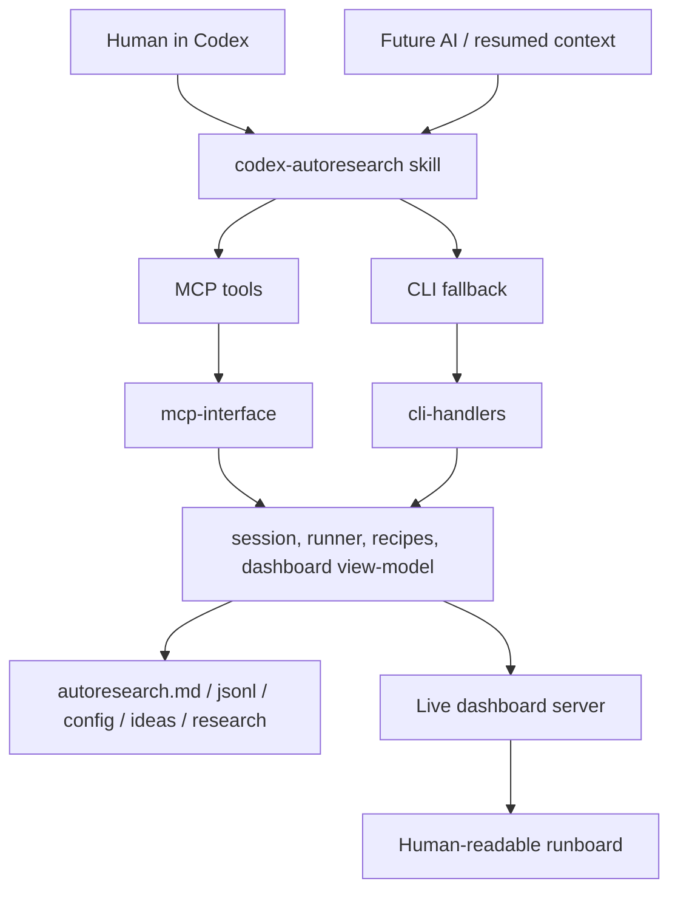
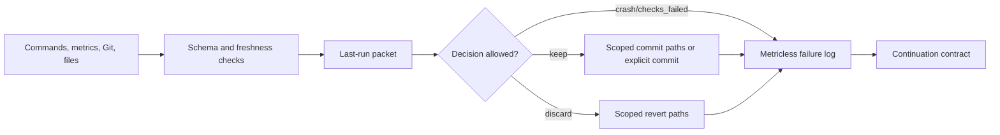
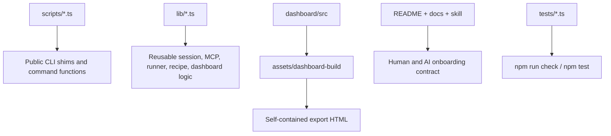
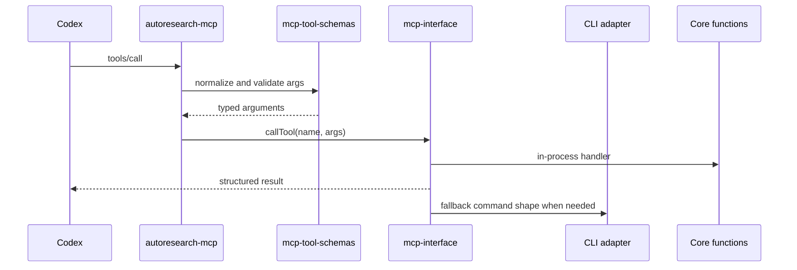
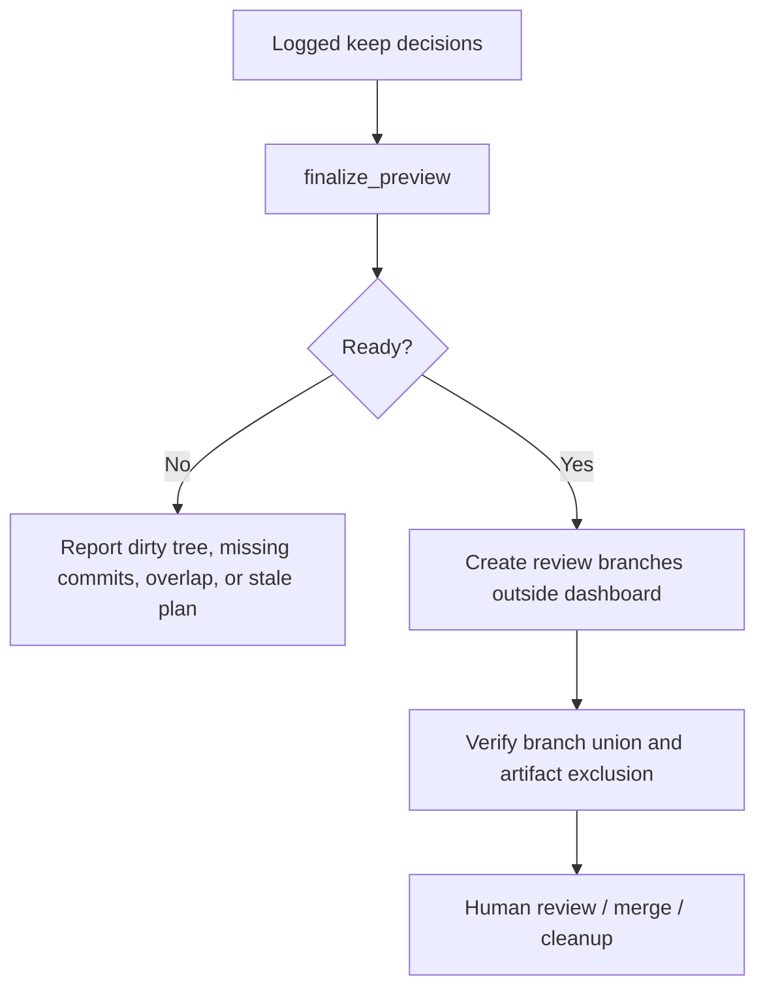

# Architecture Diagrams

Autoresearch has one product surface and several implementation paths. The rule of thumb: the skill tells Codex how to behave, MCP/CLI execute bounded operations, and durable session files remain the source of truth.

## Runtime Surfaces

## Trust Boundary

## Source Layout

## MCP Tool Path

## Finalization

