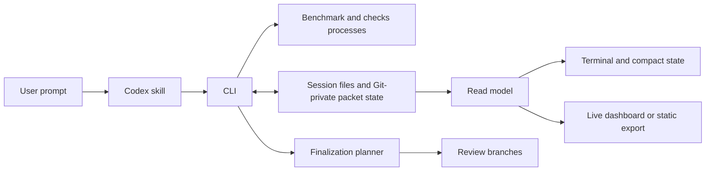
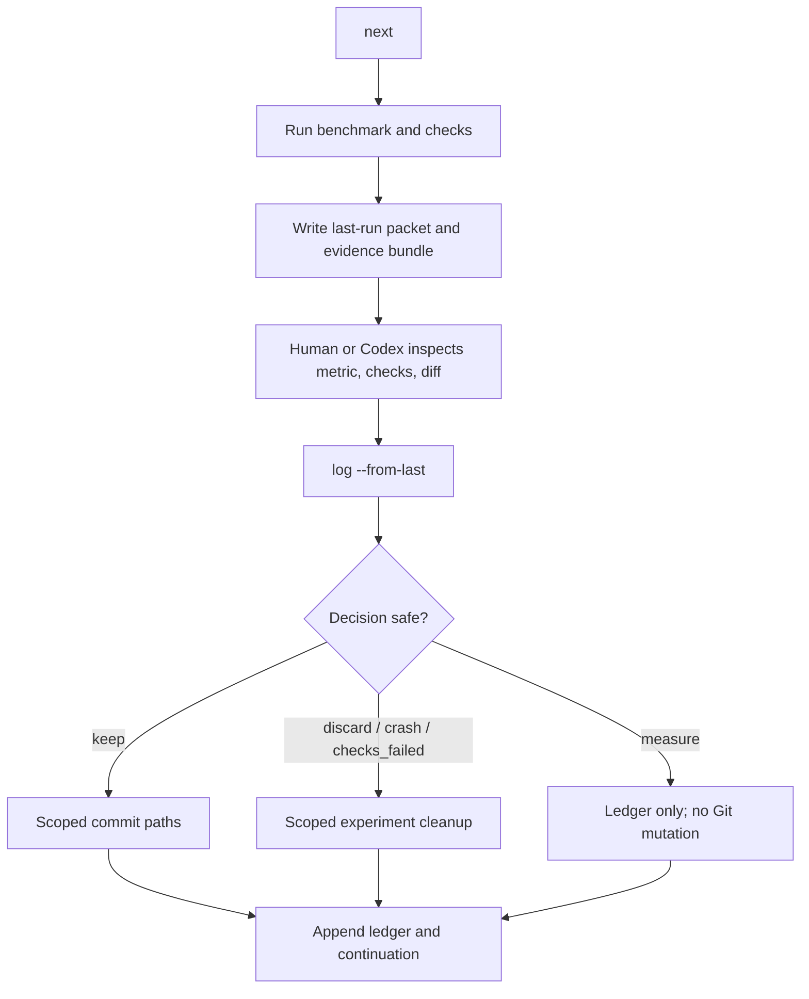
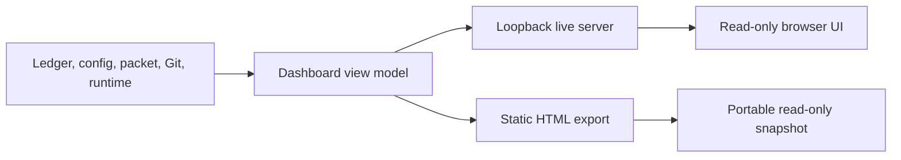
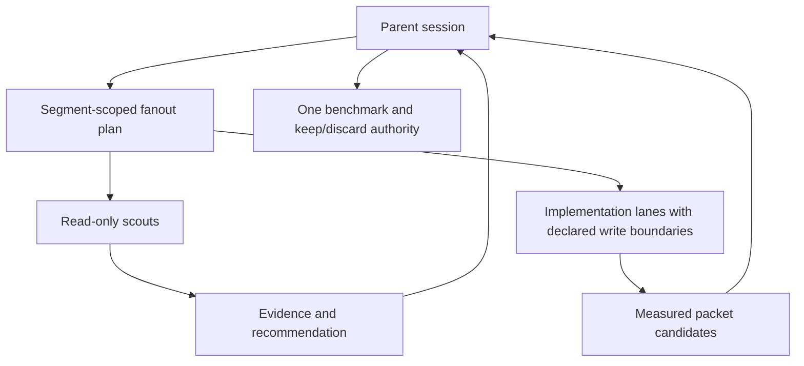
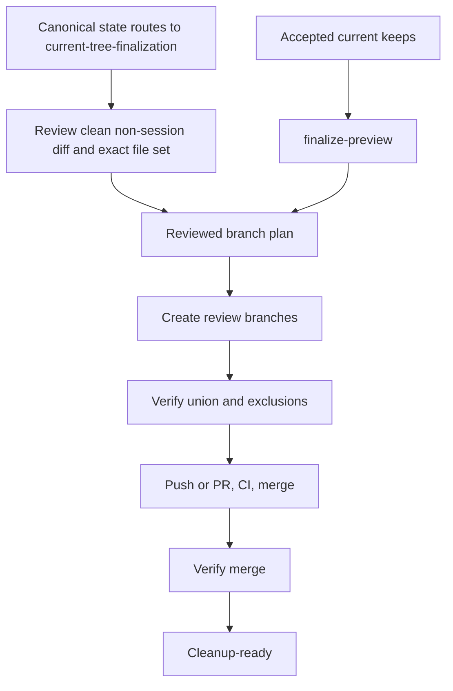

# Architecture

Autoresearch has three visible surfaces and one source of truth:

- the **Codex skill** tells Codex how to run the workflow
- the **CLI** reads, writes, validates, and executes session work
- the **dashboard** renders current state without mutating it
- the **session files** hold the durable record all three must agree on

## Runtime flow

```mermaid
flowchart LR
  U["User prompt"] --> S["Codex skill"]
  S --> CLI["CLI"]
  CLI --> Run["Benchmark and checks processes"]
  CLI <--> State["Session files and Git-private packet state"]
  State --> VM["Read model"]
  VM --> Report["Terminal and compact state"]
  VM --> Dash["Live dashboard or static export"]
  CLI --> Final["Finalization planner"]
  Final --> Git["Review branches"]
```

The skill does not own another database. The CLI and dashboard rebuild their answers from the target project's ledger, config, packet snapshots, research files, Git state, and runtime provenance.

## State ownership

| Area | Main owner |
| --- | --- |
| Public command dispatch | `scripts/autoresearch.ts`, `lib/cli-handlers.ts`, `lib/commands/*` |
| Command help and tool contracts | `lib/cli/help.ts`, `lib/tool-schemas.ts`, `lib/tool-registry.ts` |
| JSONL parsing | `lib/session-records.ts` |
| Session state and packet decisions | `lib/session-core.ts`, `lib/session-read-model.ts` |
| Benchmark execution | `lib/runner.ts`, `scripts/autoresearch.ts` |
| Evidence and artifact indexing | `lib/evidence-*`, `lib/task-artifact-indexer.ts` |
| Next-action governance | `lib/loop-governance.ts`, `lib/decision-guidance.ts`, `lib/operator-checklist.ts` |
| Runtime and source trust | `lib/runtime-drift-doctor.ts`, `lib/source-cleanliness.ts`, `lib/gate-quality.ts` |
| Parallel lanes | `lib/lane-lifecycle.ts`, `lib/portfolio-advisor.ts` |
| Dashboard projection and server | `lib/dashboard-view-model.ts`, `lib/live-server.ts`, `lib/dashboard-health.ts` |
| Finalization | `lib/finalize-preview.ts`, `lib/finalization-plan.ts`, `scripts/finalize-autoresearch.ts` |

`scripts/autoresearch.ts` still owns the heavy `run`, `next`, and much of `log` because those paths share process execution, redaction, Git receipts, packet persistence, and structured experiment notes. New read-only projection logic belongs in focused command and read-model modules.

## Packet write path

```mermaid
flowchart TD
  Next["next"] --> Proc["Run benchmark and checks"]
  Proc --> Packet["Write last-run packet and evidence bundle"]
  Packet --> Inspect["Human or Codex inspects metric, checks, diff"]
  Inspect --> Log["log --from-last"]
  Log --> Gate{"Decision safe?"}
  Gate -- "keep" --> Commit["Scoped commit paths"]
  Gate -- "discard / crash / checks_failed" --> Revert["Scoped experiment cleanup"]
  Gate -- "measure" --> NoGit["Ledger only; no Git mutation"]
  Commit --> Ledger["Append ledger and continuation"]
  Revert --> Ledger
  NoGit --> Ledger
```

Pending transaction receipts make interrupted Git mutations visible. The next write is blocked until the ledger and worktree can be reconciled.

## Dashboard boundary

```mermaid
flowchart LR
  Files["Ledger, config, packet, Git, runtime"] --> Model["Dashboard view model"]
  Model --> Live["Loopback live server"]
  Model --> Export["Static HTML export"]
  Live --> Browser["Read-only browser UI"]
  Export --> Snapshot["Portable read-only snapshot"]
```

The dashboard may show the canonical next action, blockers, metrics, lanes, packet diagnostics, runtime provenance, and finalization pressure. It does not expose setup, packet, logging, gap, or finalization mutation routes.

The live server is loopback-only and validates Host headers. Static exports are snapshots; they cannot prove current packet freshness.

## Codex Goal boundary

Codex owns task-level Goal state. Autoresearch owns its benchmark contract, ledger, continuation, and completion audit.

`codex-goal-brief` converts current Autoresearch state into an objective or completion-audit packet. It does not update Codex Goal state itself and does not read private Codex databases.

## Parallel work

```mermaid
flowchart TD
  Parent["Parent session"] --> Fanout["Segment-scoped fanout plan"]
  Fanout --> Scout["Read-only scouts"]
  Fanout --> Impl["Implementation lanes with declared write boundaries"]
  Scout --> Evidence["Evidence and recommendation"]
  Impl --> Packets["Measured packet candidates"]
  Evidence --> Parent
  Packets --> Parent
  Parent --> Decision["One benchmark and keep/discard authority"]
```

Scout command safety is a pre-execution Git argv allowlist. Porcelain and write-scope checks are best-effort mutation detection, not filesystem or process containment; implementation lanes therefore use disposable worktrees when possible.

Lanes do not get independent finalization authority. The parent session owns the benchmark, accepted evidence, and branch plan.

## Source and package shape

| Path | Role |
| --- | --- |
| `scripts/*.ts` | Authored command entrypoints |
| `scripts/*.mjs` | Small public launchers and runtime hydration shims |
| `lib/**/*.ts` | Reusable CLI, session, evidence, dashboard, and finalization logic |
| `dashboard/src/` | React dashboard source |
| `assets/dashboard-build/` | Generated dashboard assets; ignored in source, included in packages |
| `dist/` | Generated Node runtime; ignored in source, included in release artifacts |
| `skills/`, `docs/` | Codex contract and user/maintainer guidance |
| `tests/`, `scripts/check.ts` | Product and packaging gates |

The launcher calls `bootstrap-runtime.mjs` when a source-shaped install lacks `dist/`. Release packages already contain the built runtime.

## Finalization path

```mermaid
flowchart TD
  Keeps["Accepted current keeps"] --> Preview["finalize-preview"]
  Tree["Canonical state routes to current-tree-finalization"] --> TreeReview["Review clean non-session diff and exact file set"]
  TreeReview --> Plan
  Preview --> Plan["Reviewed branch plan"]
  Plan --> Branches["Create review branches"]
  Branches --> Verify["Verify union and exclusions"]
  Verify --> Publish["Push or PR, CI, merge"]
  Publish --> MergeCheck["Verify merge"]
  MergeCheck --> Cleanup["Cleanup-ready"]
```

Normal finalization is backed only by accepted, current keeps. Rejected, provisional, superseded, quarantined, invalidated, later-discarded, and reverted evidence stays in the audit history but cannot enter those review branches.

Current-tree finalization is a separate recovery contract. It packages an explicitly reviewed clean non-session branch diff when commit-level keep evidence no longer describes the work. The whole diff becomes the review unit, so its plan, file set, exclusions, claim evidence, and approval must be checked directly.

The contracts shared by these surfaces are listed in [Control plane](control-plane.md).
