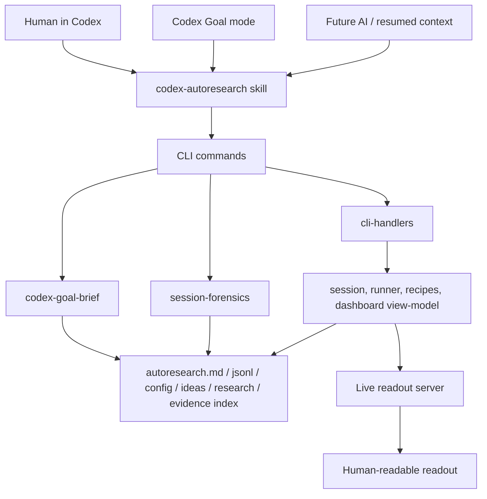
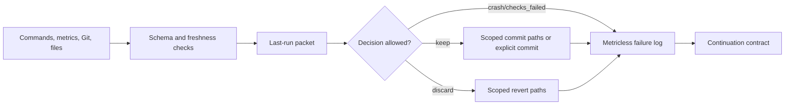
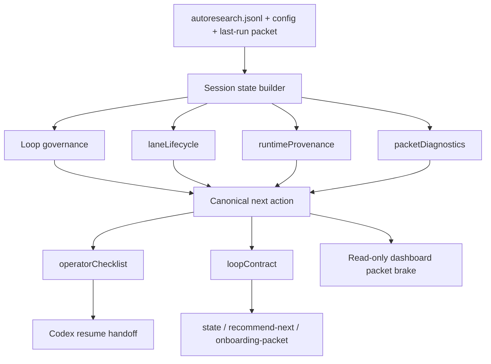
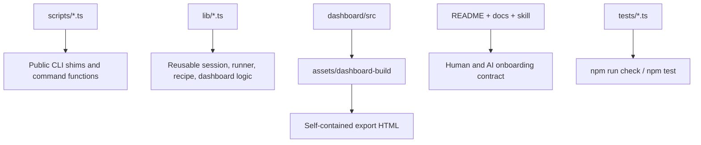
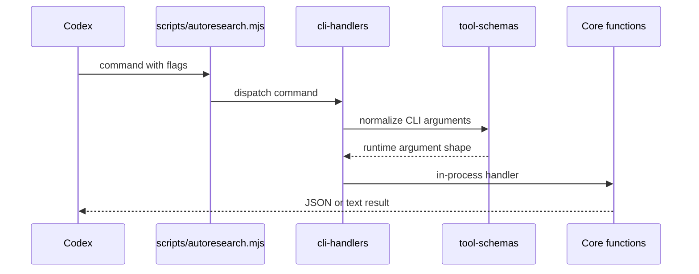
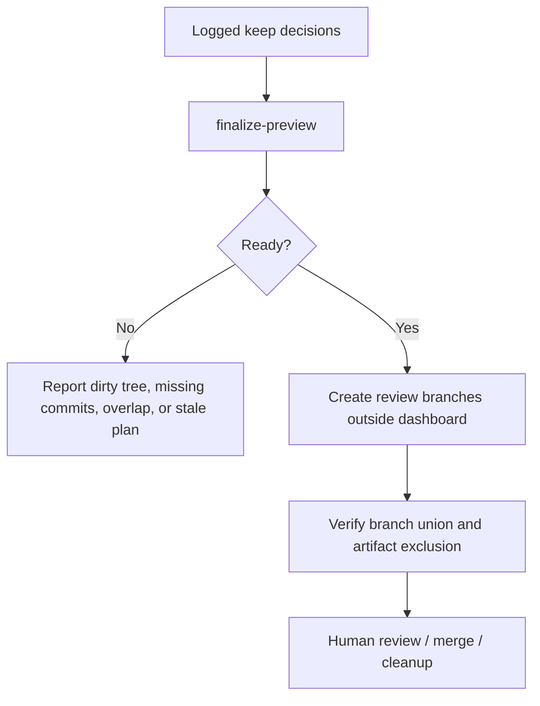

# Architecture Diagrams

Autoresearch has one product surface and a CLI execution path. The rule of thumb: the skill tells Codex how to behave, the CLI executes bounded operations, and durable session files remain the source of truth. Everything else is plumbing, and plumbing only matters when it leaks.

## Runtime Surfaces

```mermaid
flowchart TD
  U["Human in Codex"] --> S["codex-autoresearch skill"]
  Goal["Codex Goal mode"] --> S
  A["Future AI / resumed context"] --> S
  S --> CLI["CLI commands"]
  CLI --> GoalBridge["codex-goal-brief"]
  CLI --> Forensics["session-forensics"]
  CLI --> H["cli-handlers"]
  GoalBridge --> Files
  Forensics --> Files
  H --> Core["session, runner, recipes, dashboard view-model"]
  Core --> Files["autoresearch.md / jsonl / config / ideas / research / evidence index"]
  Core --> Dash["Live readout server"]
  Dash --> Browser["Human-readable readout"]
```

## Codex Goal Boundary

`codex-goal-brief` is a bridge, not a second goal engine. Codex owns thread-level Goal lifecycle, pause/resume/clear controls, token accounting, and `update_goal`. Autoresearch owns benchmark contracts, packet evidence, ASI, dashboard/state readouts, and Git safety. The bridge turns Autoresearch state into a Goal objective draft and completion audit so a parent Codex thread can use Goal mode without reading private Codex state or pretending the plugin controls it.

## Trust Boundary

```mermaid
flowchart LR
  Inputs["Commands, metrics, Git, files"] --> Validate["Schema and freshness checks"]
  Validate --> Packet["Last-run packet"]
  Packet --> Decision{"Decision allowed?"}
  Decision -- "keep" --> ScopedGit["Scoped commit paths or explicit commit"]
  Decision -- "discard" --> ScopedRevert["Scoped revert paths"]
  Decision -- "crash/checks_failed" --> Ledger["Metricless failure log"]
  ScopedGit --> Ledger
  ScopedRevert --> Ledger
  Ledger --> Continuation["Continuation contract"]
```

## Loop Governance Flow

```mermaid
flowchart TD
  Inputs["autoresearch.jsonl + config + last-run packet"] --> State["Session state builder"]
  State --> Governance["Loop governance"]
  State --> Lanes["laneLifecycle"]
  State --> Runtime["runtimeProvenance"]
  State --> Diagnostics["packetDiagnostics"]
  Governance --> Action["Canonical next action"]
  Lanes --> Action
  Runtime --> Action
  Diagnostics --> Action
  Action --> Checklist["operatorChecklist"]
  Action --> Contract["loopContract"]
  Checklist --> Handoff["Codex resume handoff"]
  Contract --> Compact["state / recommend-next / onboarding-packet"]
  Action --> Dashboard["Read-only dashboard packet brake"]
```

The governance boundary is deliberately narrow. Session state collects durable ledger, config, packet, lane, runtime, and diagnostic facts; loop governance chooses whether another packet is allowed; `operatorChecklist` compresses that choice into one command, one safety reason, one blocker, one evidence role, and one source for Codex handoff.

Module ownership follows that boundary: session-core builds the state envelope, lane lifecycle owns stale lane status, runtime provenance owns source-vs-installed truth, packet diagnostics owns evidence-loss classification, CLI handlers expose compact readouts, and the dashboard renders the same packet brake without becoming a mutating control surface.

## Source Layout

```mermaid
flowchart TD
  Scripts["scripts/*.ts"] --> CLI["Public CLI shims and command functions"]
  Lib["lib/*.ts"] --> Core["Reusable session, runner, recipe, dashboard logic"]
  Dashboard["dashboard/src"] --> Assets["assets/dashboard-build"]
  Assets --> Export["Self-contained export HTML"]
  Docs["README + docs + skill"] --> Product["Human and AI onboarding contract"]
  Tests["tests/*.ts"] --> Gate["npm run check / npm test"]
```

## CLI Command Path

```mermaid
sequenceDiagram
  participant Codex
  participant CLI as scripts/autoresearch.mjs
  participant Handlers as cli-handlers
  participant Schema as tool-schemas
  participant Core as Core functions

  Codex->>CLI: command with flags
  CLI->>Handlers: dispatch command
  Handlers->>Schema: normalize CLI arguments
  Schema-->>Handlers: runtime argument shape
  Handlers->>Core: in-process handler
  Core-->>Codex: JSON or text result
```

## Finalization

```mermaid
flowchart TD
  A["Logged keep decisions"] --> B["finalize-preview"]
  B --> C{"Ready?"}
  C -- "No" --> D["Report dirty tree, missing commits, overlap, or stale plan"]
  C -- "Yes" --> E["Create review branches outside dashboard"]
  E --> F["Verify branch union and artifact exclusion"]
  F --> G["Human review / merge / cleanup"]
```
