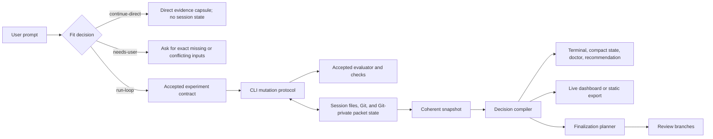
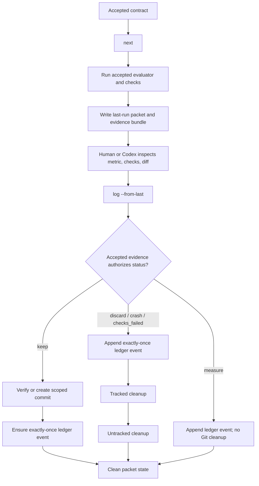
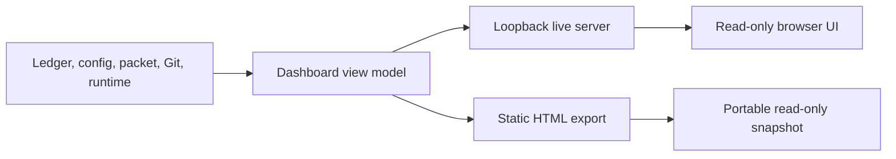
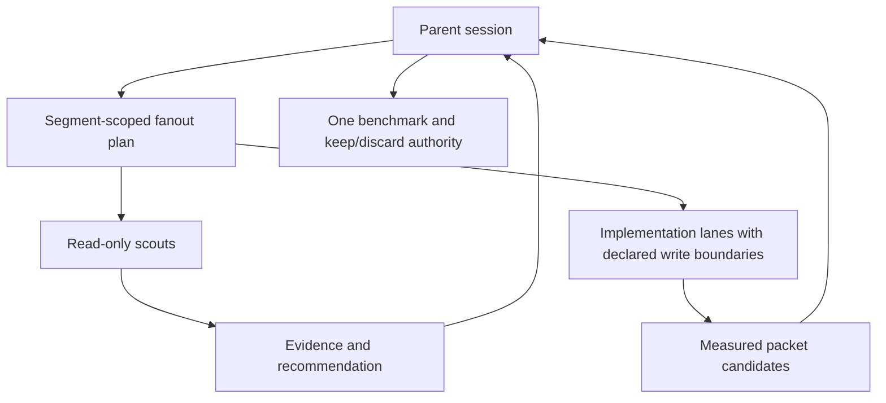
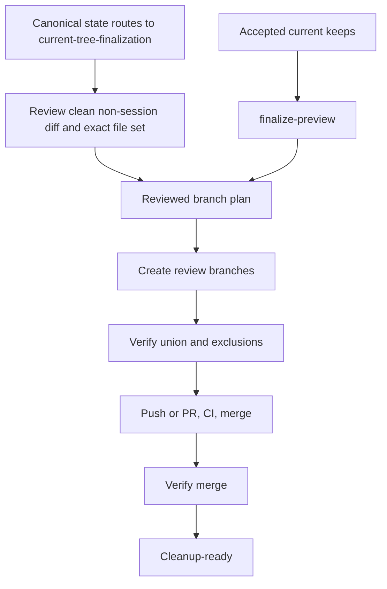

# Architecture

Autoresearch has three visible surfaces, three domain boundaries, and one durable file-based record:

- the **Codex skill** tells Codex how to run the workflow
- the **CLI** reads, writes, validates, and executes session work
- the **dashboard** renders current state without mutating it
- the **session files** hold the durable record all three must agree on

The boundaries are:

1. `FitDecision` decides whether Codex continues directly, needs contract input, or enters a measured loop.
2. `ExperimentContract` is the sole evaluator and checks execution authority.
3. A coherent session snapshot compiles into one `DecisionPlan` projected by every read surface.

The bridge deliberately keeps file persistence. It does not wrap the old policy ladders in new types or treat compatibility fields as compiler inputs.

## Runtime flow

```mermaid
flowchart LR
  U["User prompt"] --> Fit{"Fit decision"}
  Fit -- "continue-direct" --> Direct["Direct evidence capsule; no session state"]
  Fit -- "needs-user" --> Ask["Ask for exact missing or conflicting inputs"]
  Fit -- "run-loop" --> Contract["Accepted experiment contract"]
  Contract --> CLI["CLI mutation protocol"]
  CLI --> Run["Accepted evaluator and checks"]
  CLI <--> State["Session files, Git, and Git-private packet state"]
  State --> Snapshot["Coherent snapshot"]
  Snapshot --> Plan["Decision compiler"]
  Plan --> Report["Terminal, compact state, doctor, recommendation"]
  Plan --> Dash["Live dashboard or static export"]
  Plan --> Final["Finalization planner"]
  Final --> Git["Review branches"]
```

Fit routing returns before repository discovery or setup unless it selects `run-loop`. Assist-only work therefore creates no Autoresearch files, packets, commits, dashboards, research folders, or finalization state. An unrelated active session is read only enough to classify its relation and remains untouched.

The skill does not own another database. Read-only commands compare version vectors before and after loading the ledger, config, packet, transaction receipt, process state, and Git identity. They retry a race up to three times. Mutating commands acquire the mutation lock before their first snapshot, validate a precondition decision, mutate, then return a resulting decision.

## State ownership

| Area | Main owner |
| --- | --- |
| Prompt fit and unrelated-session protection | `lib/fit-gate.ts`, `lib/commands/prompt-plan.ts` |
| Accepted contract, legacy derivation, execution identity, and migration event | `lib/experiment-contract.ts` |
| Command identity, schema, policy, help, and handler binding | `lib/command-table.ts` |
| Public command dispatch | `scripts/autoresearch.ts`, `lib/cli-handlers.ts`, `lib/commands/*` |
| Tool contracts and compatibility facades | `lib/tool-schemas.ts`, `lib/tool-registry.ts` |
| JSONL parsing | `lib/session-records.ts` |
| Coherent source loading and version identity | `lib/coherent-session-snapshot.ts` |
| Canonical policy and semantic decision identity | `lib/decision-compiler.ts`, `lib/session-decision.ts` |
| One-way compatibility and surface projections | `lib/decision-projection.ts`, `lib/session-read-model.ts`, `lib/terminal-report.ts` |
| Benchmark and checks execution | `lib/runner.ts`, `lib/commands/run.ts` |
| Evidence authority, provenance, keep eligibility, and artifact indexing | `lib/evidence-axes.ts`, `lib/experiment-contract.ts`, `lib/evidence-*` |
| Exactly-once logging and cleanup recovery | `lib/commands/log.ts`, `lib/pending-log-transaction-store.ts` |
| Runtime and source trust | `lib/runtime-drift-doctor.ts`, `lib/source-cleanliness.ts`, `lib/gate-quality.ts` |
| Diagnostic and candidate inputs | `lib/loop-governance.ts`, `lib/decision-guidance.ts`, `lib/operator-checklist.ts`, `lib/portfolio-advisor.ts` |
| Parallel lane lifecycle | `lib/lane-lifecycle.ts` |
| Dashboard projection and server | `lib/dashboard-view-model.ts`, `lib/live-server.ts`, `lib/dashboard-health.ts` |
| Finalization | `lib/finalize-preview.ts`, `lib/finalization-plan.ts`, `scripts/finalize-autoresearch.ts` |

`lib/command-table.ts` is the one-edit authority for a command's CLI/tool names, arguments, mutation policy, help, handler binding, and compatibility lifecycle. CLI parsing, tool schemas, dashboard safety, dispatch, and surface parity derive from it. Compatibility fields such as `resolvedDecision`, `loopContract`, and `nextAction` are projections from `DecisionPlan`; they never feed the compiler.

## Packet write path

```mermaid
flowchart TD
  Contract["Accepted contract"] --> Next["next"]
  Next --> Proc["Run accepted evaluator and checks"]
  Proc --> Packet["Write last-run packet and evidence bundle"]
  Packet --> Inspect["Human or Codex inspects metric, checks, diff"]
  Inspect --> Log["log --from-last"]
  Log --> Gate{"Accepted evidence authorizes status?"}
  Gate -- "keep" --> Commit["Verify or create scoped commit"]
  Gate -- "discard / crash / checks_failed" --> LedgerFirst["Append exactly-once ledger event"]
  Gate -- "measure" --> LedgerOnly["Append ledger event; no Git cleanup"]
  Commit --> KeepLedger["Ensure exactly-once ledger event"]
  KeepLedger --> PacketCleanup["Clean packet state"]
  LedgerFirst --> Tracked["Tracked cleanup"]
  Tracked --> Untracked["Untracked cleanup"]
  Untracked --> PacketCleanup
  LedgerOnly --> PacketCleanup
```

The version-2 receipt stores the input, packet, contract, evidence, pre-Git identity, expected commit and ledger event, completed stages, cleanup plan, and failures. Retrying the same `log` verifies completed stages and resumes the rest. Different arguments reject while a receipt is pending. Repeated logging converges to at most one commit and one ledger event.

## Dashboard boundary

```mermaid
flowchart LR
  Files["Ledger, config, packet, Git, runtime"] --> Model["Dashboard view model"]
  Model --> Live["Loopback live server"]
  Model --> Export["Static HTML export"]
  Live --> Browser["Read-only browser UI"]
  Export --> Snapshot["Portable read-only snapshot"]
```

The dashboard shows the same semantic decision ID, phase, action kind, blocker code, parent disposition, contract digest, and evaluator identity as the terminal. It may also show metrics, lanes, packet diagnostics, runtime provenance, and finalization pressure. It redacts executable commands and does not expose setup, packet, logging, gap, or finalization mutation routes.

The live server is loopback-only and validates Host headers. Static exports are snapshots; they cannot prove current packet freshness.

## Codex Goal boundary

Codex owns task-level Goal state. Autoresearch owns its benchmark contract, ledger, continuation, and completion audit.

`codex-goal-brief` converts current Autoresearch state into an objective or completion-audit packet. It does not update Codex Goal state itself and does not read private Codex databases.

## Parallel work

```mermaid
flowchart TD
  Parent["Parent session"] --> Fanout["Segment-scoped fanout plan"]
  Fanout --> Scout["Read-only scouts"]
  Fanout --> Impl["Implementation lanes with declared write boundaries"]
  Scout --> Evidence["Evidence and recommendation"]
  Impl --> Packets["Measured packet candidates"]
  Evidence --> Parent
  Packets --> Parent
  Parent --> Decision["One benchmark and keep/discard authority"]
```

Scout command safety is a pre-execution Git argv allowlist. Porcelain and write-scope checks are best-effort mutation detection, not filesystem or process containment; implementation lanes therefore use disposable worktrees when possible.

Lanes do not get independent finalization authority. The parent session owns the benchmark, accepted evidence, and branch plan.

## Source and package shape

| Path | Role |
| --- | --- |
| `scripts/*.ts` | Authored command entrypoints |
| `scripts/*.mjs` | Small public launchers and runtime hydration shims |
| `lib/**/*.ts` | Reusable CLI, session, evidence, dashboard, and finalization logic |
| `dashboard/src/` | React dashboard source |
| `assets/dashboard-build/` | Generated dashboard assets; ignored in source, included in packages |
| `dist/` | Generated Node runtime; ignored in source, included in release artifacts |
| `skills/`, `docs/` | Codex contract and user/maintainer guidance |
| `tests/`, `scripts/check.ts` | Product and packaging gates |

The launcher calls `bootstrap-runtime.mjs` when a source-shaped install lacks `dist/`. Release packages already contain the built runtime.

## Finalization path

```mermaid
flowchart TD
  Keeps["Accepted current keeps"] --> Preview["finalize-preview"]
  Tree["Canonical state routes to current-tree-finalization"] --> TreeReview["Review clean non-session diff and exact file set"]
  TreeReview --> Plan
  Preview --> Plan["Reviewed branch plan"]
  Plan --> Branches["Create review branches"]
  Branches --> Verify["Verify union and exclusions"]
  Verify --> Publish["Push or PR, CI, merge"]
  Publish --> MergeCheck["Verify merge"]
  MergeCheck --> Cleanup["Cleanup-ready"]
```

Normal finalization is backed only by accepted, current keeps. Rejected, provisional, superseded, quarantined, invalidated, later-discarded, and reverted evidence stays in the audit history but cannot enter those review branches.

Current-tree finalization is a separate recovery contract. It packages an explicitly reviewed clean non-session branch diff when commit-level keep evidence no longer describes the work. The whole diff becomes the review unit, so its plan, file set, exclusions, claim evidence, and approval must be checked directly.

The contracts shared by these surfaces are listed in [Control plane](control-plane.md).
