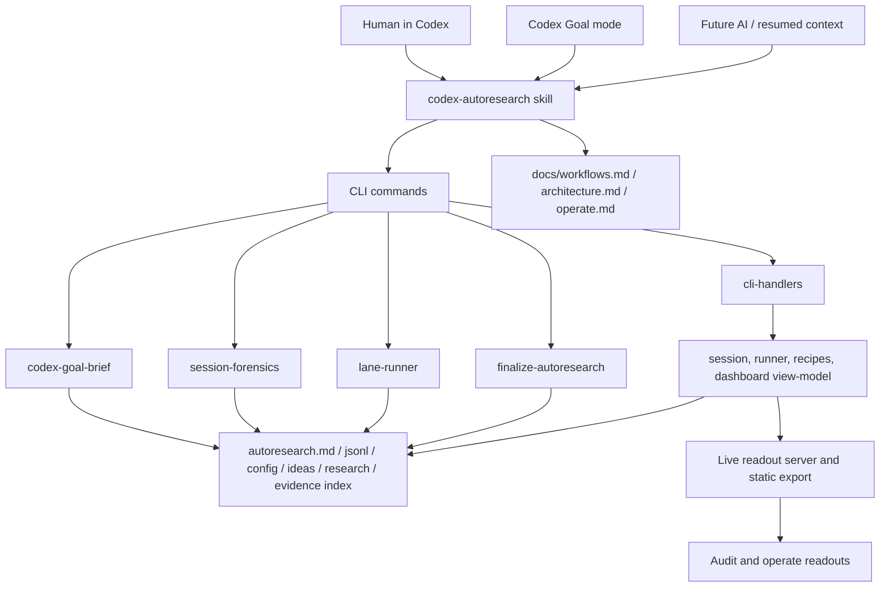
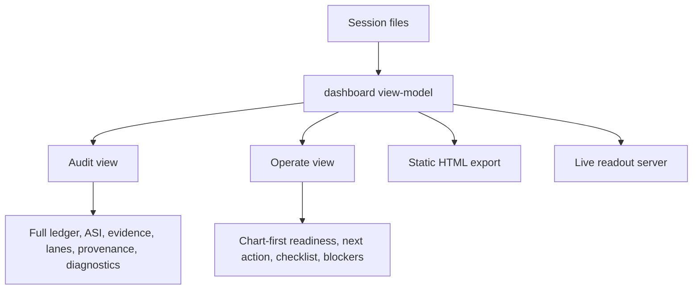
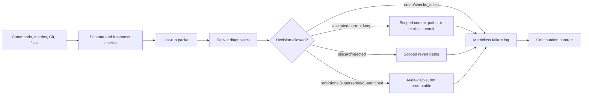
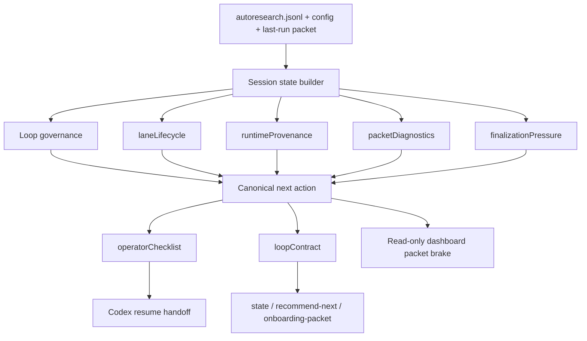
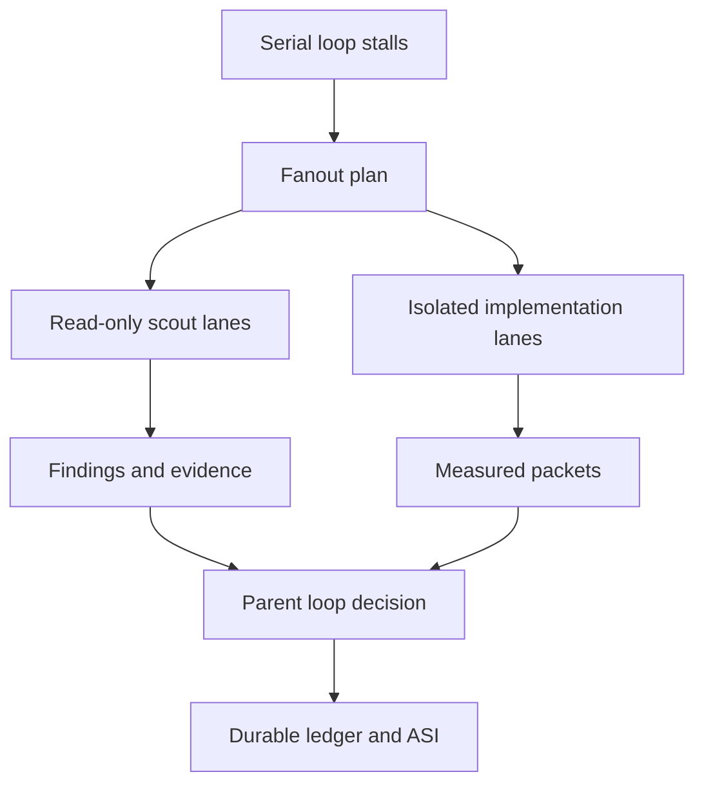
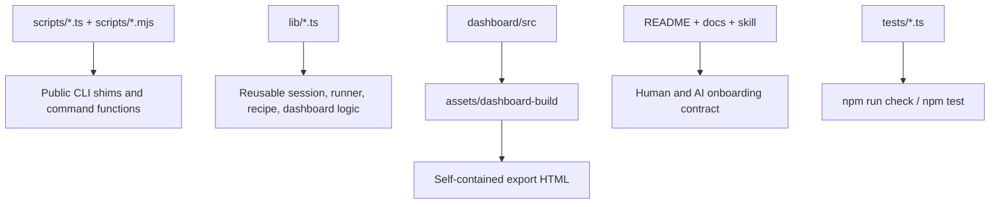
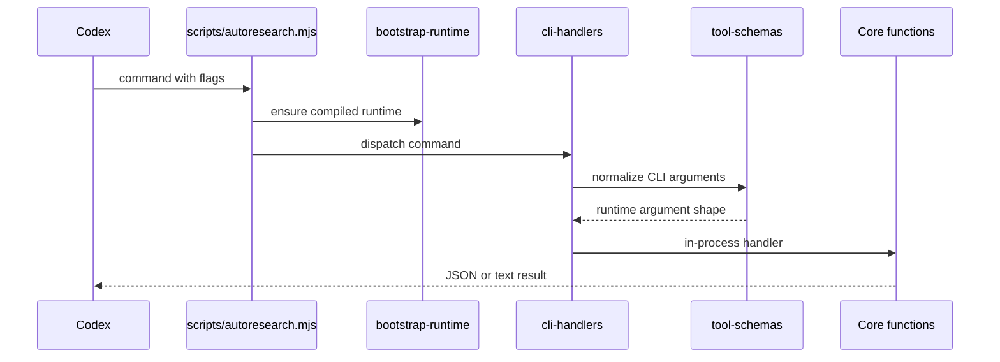
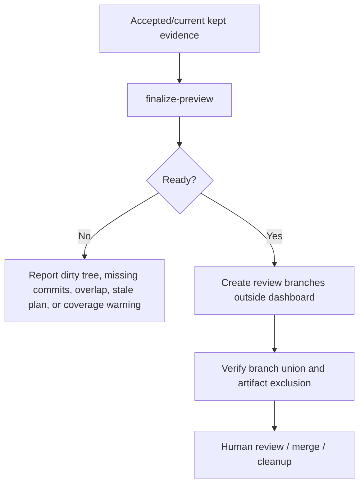

# Architecture Diagrams

Autoresearch has three user-visible surfaces: the Codex skill, the CLI, and the read-only dashboard. The skill tells Codex how to run the loop, the CLI performs bounded operations, and durable session files remain the source of truth.

## Runtime Surfaces

```mermaid
flowchart TD
  U["Human in Codex"] --> S["codex-autoresearch skill"]
  Goal["Codex Goal mode"] --> S
  A["Future AI / resumed context"] --> S
  S --> CLI["CLI commands"]
  S --> SkillDocs["docs/workflows.md / architecture.md / operate.md"]
  CLI --> GoalBridge["codex-goal-brief"]
  CLI --> Forensics["session-forensics"]
  CLI --> LaneRunner["lane-runner"]
  CLI --> Finalizer["finalize-autoresearch"]
  CLI --> H["cli-handlers"]
  GoalBridge --> Files
  Forensics --> Files
  LaneRunner --> Files
  Finalizer --> Files
  H --> Core["session, runner, recipes, dashboard view-model"]
  Core --> Files["autoresearch.md / jsonl / config / ideas / research / evidence index"]
  Core --> Dash["Live readout server and static export"]
  Dash --> Browser["Audit and operate readouts"]
```

## Codex Goal Boundary

`codex-goal-brief` is a bridge, not a second goal engine. Codex owns thread-level Goal lifecycle, pause/resume/clear controls, token accounting, and `update_goal`. Autoresearch owns benchmark contracts, packet evidence, ASI, dashboard/state readouts, and Git safety. The bridge turns Autoresearch state into a Goal objective draft and completion audit so a parent Codex thread can use Goal mode without reading private Codex state or pretending the plugin controls it.

## Dashboard Boundary

```mermaid
flowchart TD
  Files["Session files"] --> ViewModel["dashboard view-model"]
  ViewModel --> Audit["Audit view"]
  ViewModel --> Operate["Operate view"]
  Audit --> Trace["Full ledger, ASI, evidence, lanes, provenance, diagnostics"]
  Operate --> Monitor["Chart-first readiness, next action, checklist, blockers"]
  ViewModel --> Export["Static HTML export"]
  ViewModel --> Server["Live readout server"]
```

The dashboard is a readout, not a control plane. It can show the operator checklist, loop contract, watchdog, fanout lanes, runtime provenance, packet diagnostics, and finalization pressure, but setup, packets, logging, and finalization stay in the CLI.

## Trust Boundary

```mermaid
flowchart LR
  Inputs["Commands, metrics, Git, files"] --> Validate["Schema and freshness checks"]
  Validate --> Packet["Last-run packet"]
  Packet --> Diagnostics["Packet diagnostics"]
  Diagnostics --> Decision{"Decision allowed?"}
  Decision -- "accepted/current keep" --> ScopedGit["Scoped commit paths or explicit commit"]
  Decision -- "discard/rejected" --> ScopedRevert["Scoped revert paths"]
  Decision -- "provisional/superseded/quarantined" --> AuditOnly["Audit-visible, not promotable"]
  Decision -- "crash/checks_failed" --> Ledger["Metricless failure log"]
  ScopedGit --> Ledger
  ScopedRevert --> Ledger
  AuditOnly --> Ledger
  Ledger --> Continuation["Continuation contract"]
```

`--evidence-status` accepts `accepted`, `rejected`, `provisional`, and `superseded`. Quarantined evidence can appear in diagnostics and audit readouts, but it is not a CLI evidence-status value and must not become finalizer input.

## Loop Governance Flow

```mermaid
flowchart TD
  Inputs["autoresearch.jsonl + config + last-run packet"] --> State["Session state builder"]
  State --> Governance["Loop governance"]
  State --> Lanes["laneLifecycle"]
  State --> Runtime["runtimeProvenance"]
  State --> Diagnostics["packetDiagnostics"]
  State --> Pressure["finalizationPressure"]
  Governance --> Action["Canonical next action"]
  Lanes --> Action
  Runtime --> Action
  Diagnostics --> Action
  Pressure --> Action
  Action --> Checklist["operatorChecklist"]
  Action --> Contract["loopContract"]
  Checklist --> Handoff["Codex resume handoff"]
  Contract --> Compact["state / recommend-next / onboarding-packet"]
  Action --> Dashboard["Read-only dashboard packet brake"]
```

The governance boundary is deliberately narrow. Session state collects durable ledger, config, packet, lane, runtime, diagnostic, and finalization facts; loop governance chooses whether another packet is allowed; `operatorChecklist` compresses that choice into one command, one safety reason, one blocker, one evidence role, and one source for Codex handoff.

Module ownership follows that boundary: `session-records` owns durable JSONL parsing and per-invocation record caching, `session-core` builds the state envelope, `session-read-model` owns shared readout/control-plane projection, lane lifecycle owns stale lane status, runtime provenance owns source-vs-installed truth, packet diagnostics owns evidence-loss classification, CLI handlers expose compact readouts, and the dashboard renders the same packet brake without becoming a mutating control surface.

The migration is still intentionally incomplete in one place: `scripts/autoresearch.ts` remains the owner for the heavy `run`, `next`, and most `log` command flow because they share packet execution, redaction, progress snapshots, Git mutation receipts, and ASI persistence. `lib/commands/log.ts` now owns the pending-receipt cleanup helper, but the mutation orchestration has not moved wholesale. New read-only projection work should avoid adding more policy to the script; move it through `lib/commands/*`, `lib/session-core.ts`, `lib/session-records.ts`, or focused read-model helpers. Split the remaining mutating command flows only in small slices with command-surface tests, because behavior drift in those commands can lose or mislabel evidence.

## Parallel Lane Boundary

```mermaid
flowchart TD
  Stuck["Serial loop stalls"] --> Fanout["Fanout plan"]
  Fanout --> Scout["Read-only scout lanes"]
  Fanout --> Impl["Isolated implementation lanes"]
  Scout --> Findings["Findings and evidence"]
  Impl --> Packets["Measured packets"]
  Findings --> Parent["Parent loop decision"]
  Packets --> Parent
  Parent --> Ledger["Durable ledger and ASI"]
```

Fanout lanes are bounded helpers for evidence gathering or isolated implementation. The parent session remains responsible for benchmark contracts, keep/discard decisions, promotion status, and finalization.

## Source Layout

```mermaid
flowchart TD
  Scripts["scripts/*.ts + scripts/*.mjs"] --> CLI["Public CLI shims and command functions"]
  Lib["lib/*.ts"] --> Core["Reusable session, runner, recipe, dashboard logic"]
  Dashboard["dashboard/src"] --> Assets["assets/dashboard-build"]
  Assets --> Export["Self-contained export HTML"]
  Docs["README + docs + skill"] --> Product["Human and AI onboarding contract"]
  Tests["tests/*.ts"] --> Gate["npm run check / npm test"]
```

The `.mjs` launchers bootstrap the packaged runtime before loading compiled code. That keeps source checkouts, packed artifacts, and installed plugin caches on the same command surface.

## CLI Command Path

The default help view keeps the happy path short: `setup -> doctor -> next -> log -> state -> finalize-preview`. Advanced diagnostics and maintainer commands remain on the same CLI surface behind `--help --all`.

```mermaid
sequenceDiagram
  participant Codex
  participant CLI as scripts/autoresearch.mjs
  participant Bootstrap as bootstrap-runtime
  participant Handlers as cli-handlers
  participant Schema as tool-schemas
  participant Core as Core functions

  Codex->>CLI: command with flags
  CLI->>Bootstrap: ensure compiled runtime
  CLI->>Handlers: dispatch command
  Handlers->>Schema: normalize CLI arguments
  Schema-->>Handlers: runtime argument shape
  Handlers->>Core: in-process handler
  Core-->>Codex: JSON or text result
```

## Finalization

```mermaid
flowchart TD
  A["Accepted/current kept evidence"] --> B["finalize-preview"]
  B --> C{"Ready?"}
  C -- "No" --> D["Report dirty tree, missing commits, overlap, stale plan, or coverage warning"]
  C -- "Yes" --> E["Create review branches outside dashboard"]
  E --> F["Verify branch union and artifact exclusion"]
  F --> G["Human review / merge / cleanup"]
```

Finalization reads from the durable ledger and evidence index. Rejected, provisional, superseded, quarantined, invalidated, later-discarded, and reverted evidence stays visible for audit but must not be promoted into review branches.
