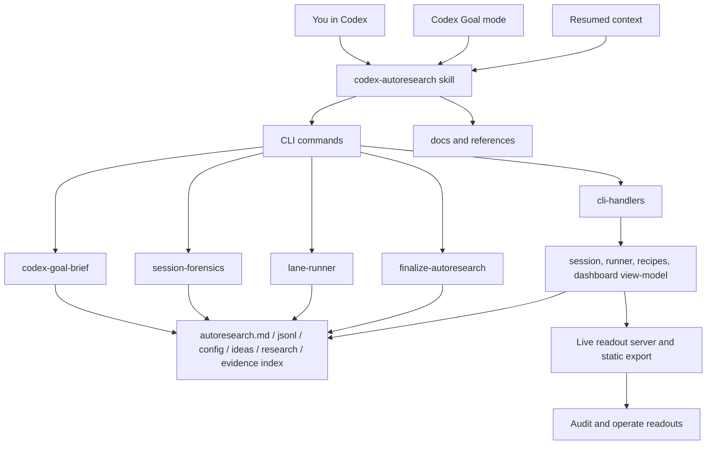
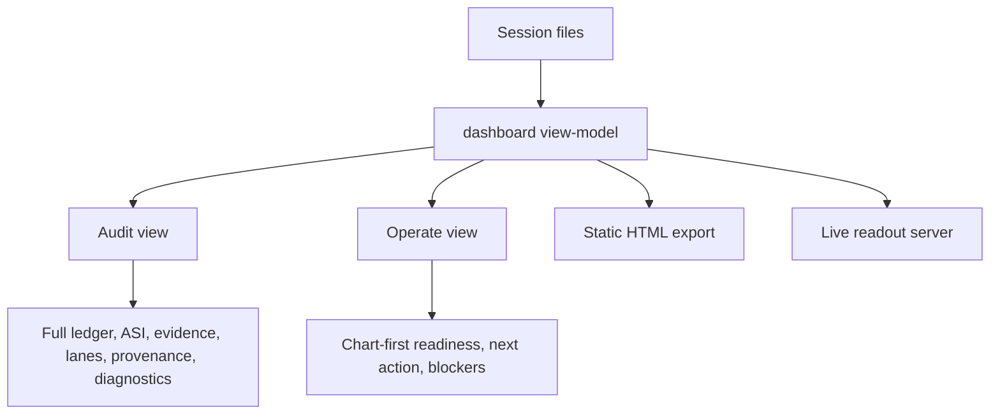
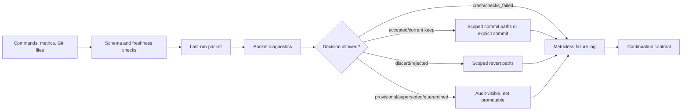
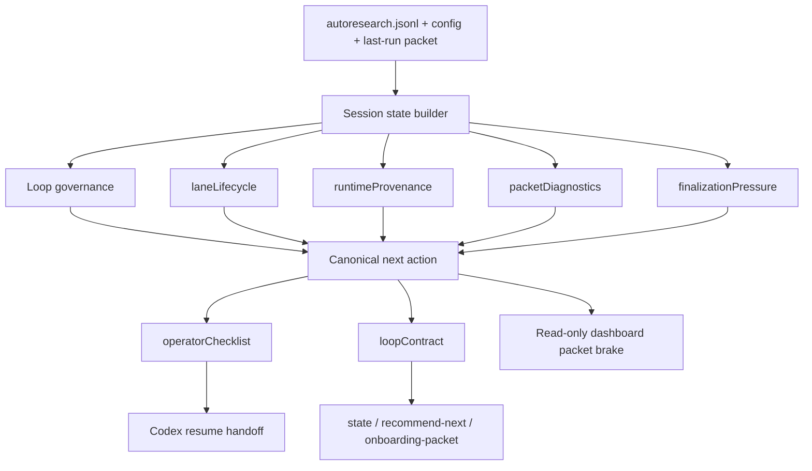
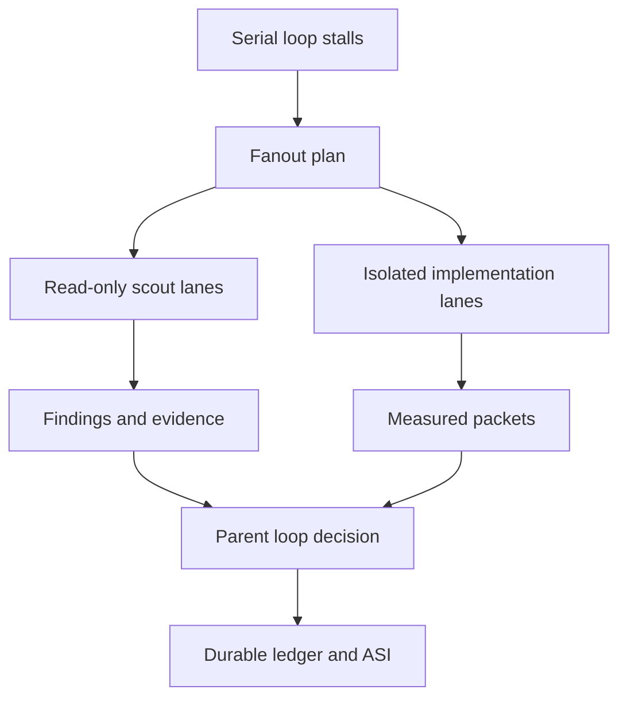
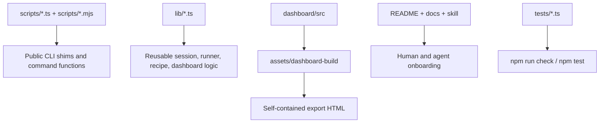
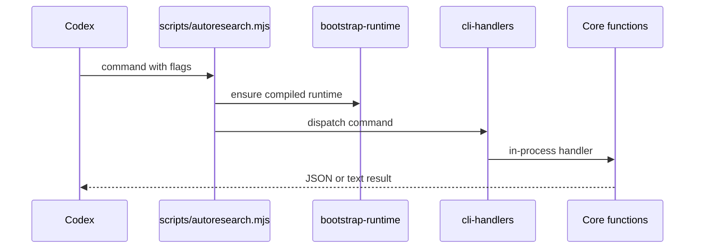
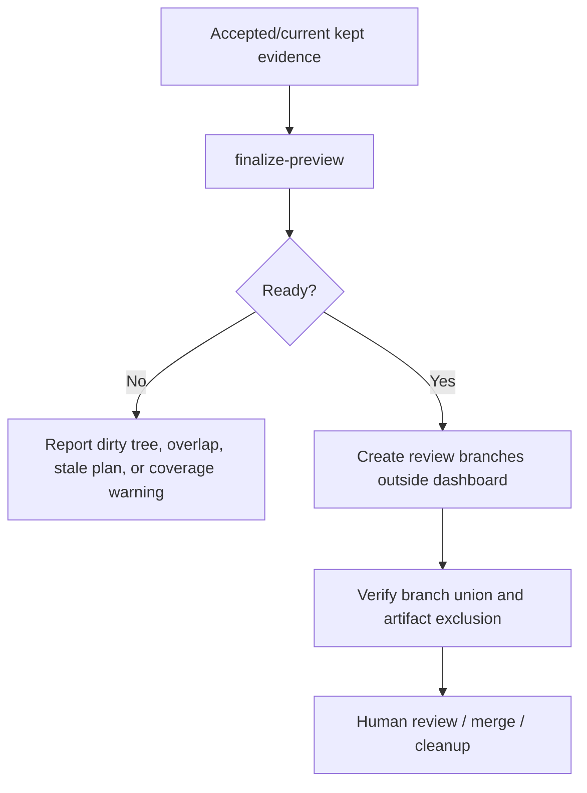

# Architecture Diagrams

Autoresearch has three user-visible surfaces: the Codex skill, the CLI, and the read-only dashboard. The skill tells Codex how to run the loop, the CLI performs bounded operations, and durable session files remain the source of truth.

## Runtime surfaces

```mermaid
flowchart TD
  U["You in Codex"] --> S["codex-autoresearch skill"]
  Goal["Codex Goal mode"] --> S
  A["Resumed context"] --> S
  S --> CLI["CLI commands"]
  S --> SkillDocs["docs and references"]
  CLI --> GoalBridge["codex-goal-brief"]
  CLI --> Forensics["session-forensics"]
  CLI --> LaneRunner["lane-runner"]
  CLI --> Finalizer["finalize-autoresearch"]
  CLI --> H["cli-handlers"]
  GoalBridge --> Files
  Forensics --> Files
  LaneRunner --> Files
  Finalizer --> Files
  H --> Core["session, runner, recipes, dashboard view-model"]
  Core --> Files["autoresearch.md / jsonl / config / ideas / research / evidence index"]
  Core --> Dash["Live readout server and static export"]
  Dash --> Browser["Audit and operate readouts"]
```

## Codex Goal boundary

`codex-goal-brief` is a bridge, not a second goal engine. Codex owns thread-level Goal lifecycle; Autoresearch owns benchmark contracts, packet evidence, ASI, dashboard/state readouts, and Git safety. The bridge turns Autoresearch state into a Goal objective draft and completion audit.

## Dashboard boundary

```mermaid
flowchart TD
  Files["Session files"] --> ViewModel["dashboard view-model"]
  ViewModel --> Audit["Audit view"]
  ViewModel --> Operate["Operate view"]
  Audit --> Trace["Full ledger, ASI, evidence, lanes, provenance, diagnostics"]
  Operate --> Monitor["Chart-first readiness, next action, blockers"]
  ViewModel --> Export["Static HTML export"]
  ViewModel --> Server["Live readout server"]
```

The dashboard is a readout, not a control plane. It shows next action, blockers, lanes, runtime provenance, packet diagnostics, and finalization pressure — but setup, packets, logging, and finalization stay in the CLI.

## Trust boundary

```mermaid
flowchart LR
  Inputs["Commands, metrics, Git, files"] --> Validate["Schema and freshness checks"]
  Validate --> Packet["Last-run packet"]
  Packet --> Diagnostics["Packet diagnostics"]
  Diagnostics --> Decision{"Decision allowed?"}
  Decision -- "accepted/current keep" --> ScopedGit["Scoped commit paths or explicit commit"]
  Decision -- "discard/rejected" --> ScopedRevert["Scoped revert paths"]
  Decision -- "provisional/superseded/quarantined" --> AuditOnly["Audit-visible, not promotable"]
  Decision -- "crash/checks_failed" --> Ledger["Metricless failure log"]
  ScopedGit --> Ledger
  ScopedRevert --> Ledger
  AuditOnly --> Ledger
  Ledger --> Continuation["Continuation contract"]
```

## Loop governance flow

```mermaid
flowchart TD
  Inputs["autoresearch.jsonl + config + last-run packet"] --> State["Session state builder"]
  State --> Governance["Loop governance"]
  State --> Lanes["laneLifecycle"]
  State --> Runtime["runtimeProvenance"]
  State --> Diagnostics["packetDiagnostics"]
  State --> Pressure["finalizationPressure"]
  Governance --> Action["Canonical next action"]
  Lanes --> Action
  Runtime --> Action
  Diagnostics --> Action
  Pressure --> Action
  Action --> Checklist["operatorChecklist"]
  Action --> Contract["loopContract"]
  Checklist --> Handoff["Codex resume handoff"]
  Contract --> Compact["state / recommend-next / onboarding-packet"]
  Action --> Dashboard["Read-only dashboard packet brake"]
```

Session state collects durable ledger, config, packet, lane, runtime, diagnostic, and finalization facts. Loop governance chooses whether another packet is allowed. The checklist compresses that choice into one command, one safety reason, one blocker, one evidence role, and one source.

Field names: [state-fields](concepts.md#state-fields). Cross-surface contracts: [control-plane](control-plane.md).

Module ownership: `session-records` owns JSONL parsing; `session-core` builds the state envelope; `session-read-model` owns readout projection; CLI handlers expose compact readouts; the dashboard renders the same packet brake without mutation controls.

`scripts/autoresearch.ts` still owns heavy `run`, `next`, and most `log` flow because they share packet execution, redaction, Git mutation receipts, and ASI persistence. New read-only projection work should go through `lib/commands/*` and focused read-model helpers.

## Parallel lane boundary

```mermaid
flowchart TD
  Stuck["Serial loop stalls"] --> Fanout["Fanout plan"]
  Fanout --> Scout["Read-only scout lanes"]
  Fanout --> Impl["Isolated implementation lanes"]
  Scout --> Findings["Findings and evidence"]
  Impl --> Packets["Measured packets"]
  Findings --> Parent["Parent loop decision"]
  Packets --> Parent
  Parent --> Ledger["Durable ledger and ASI"]
```

Fanout lanes are bounded helpers. The parent session remains responsible for benchmark contracts, keep/discard decisions, promotion status, and finalization.

## Source layout

```mermaid
flowchart TD
  Scripts["scripts/*.ts + scripts/*.mjs"] --> CLI["Public CLI shims and command functions"]
  Lib["lib/*.ts"] --> Core["Reusable session, runner, recipe, dashboard logic"]
  Dashboard["dashboard/src"] --> Assets["assets/dashboard-build"]
  Assets --> Export["Self-contained export HTML"]
  Docs["README + docs + skill"] --> Product["Human and agent onboarding"]
  Tests["tests/*.ts"] --> Gate["npm run check / npm test"]
```

The `.mjs` launchers bootstrap the packaged runtime before loading compiled code.

## CLI command path

Default help keeps the happy path short: `setup -> doctor -> next -> log -> state -> finalize-preview`. Advanced diagnostics are on `--help --all`.

```mermaid
sequenceDiagram
  participant Codex
  participant CLI as scripts/autoresearch.mjs
  participant Bootstrap as bootstrap-runtime
  participant Handlers as cli-handlers
  participant Core as Core functions

  Codex->>CLI: command with flags
  CLI->>Bootstrap: ensure compiled runtime
  CLI->>Handlers: dispatch command
  Handlers->>Core: in-process handler
  Core-->>Codex: JSON or text result
```

## Finalization

```mermaid
flowchart TD
  A["Accepted/current kept evidence"] --> B["finalize-preview"]
  B --> C{"Ready?"}
  C -- "No" --> D["Report dirty tree, overlap, stale plan, or coverage warning"]
  C -- "Yes" --> E["Create review branches outside dashboard"]
  E --> F["Verify branch union and artifact exclusion"]
  F --> G["Human review / merge / cleanup"]
```

Rejected, provisional, superseded, quarantined, invalidated, later-discarded, and reverted evidence stays visible for audit but must not be promoted into review branches.

---

Previous: [Workflows](workflows.md) · Next: [Control plane](control-plane.md).
