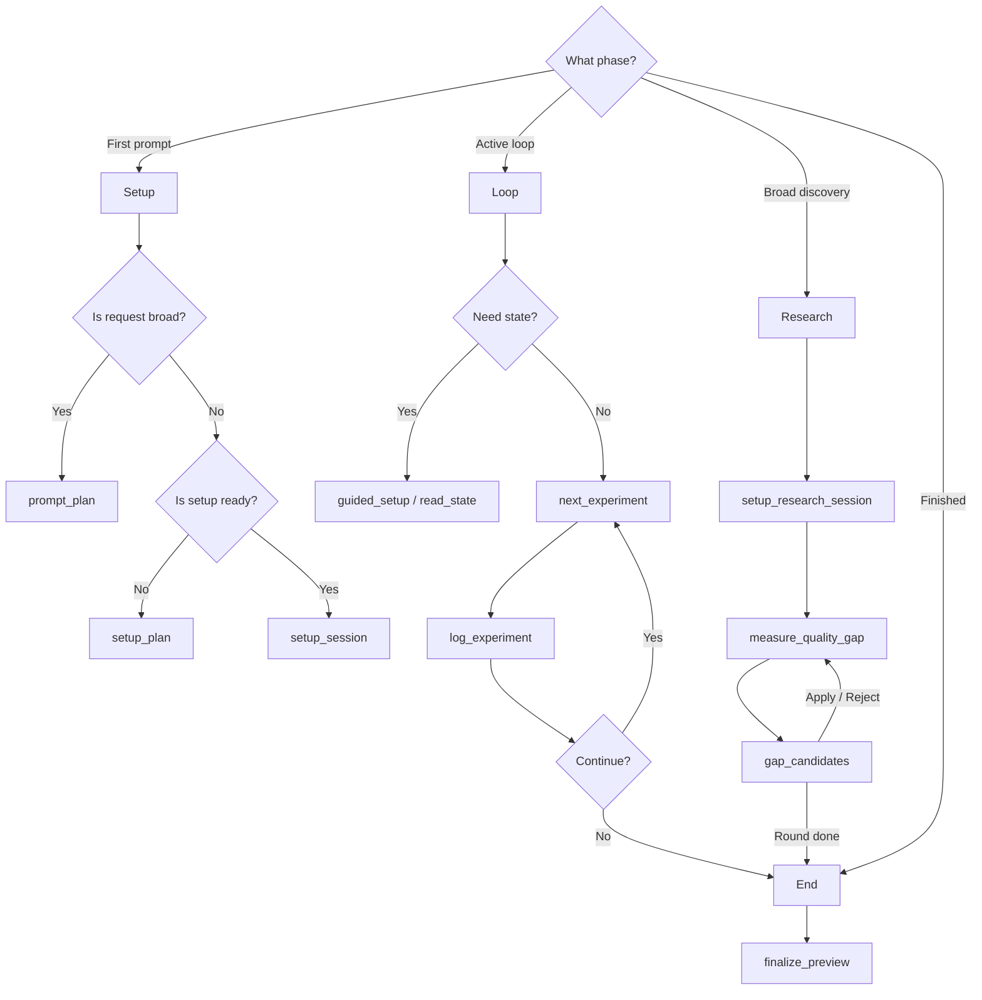

# MCP Tools

The `codex-autoresearch` skill is the user-facing entrypoint. MCP tools are the deterministic hands behind it. Prefer MCP tools when available; use the CLI as the fallback.

## Tool Surface

| Tool | Use |
| --- | --- |
| `setup_plan` | Return a read-only setup readiness plan with missing fields, recipe suggestion, and next commands. |
| `guided_setup` | Return a guided first-run or resume packet with setup, doctor, baseline, log, and dashboard readout guidance. |
| `prompt_plan` | Convert a natural-language request into inferred metric defaults, experiment lanes, missing essentials, and setup commands. |
| `onboarding_packet` | Return a compact human-and-agent onboarding packet with state, hazards, templates, and commands. |
| `recommend_next` | Return the single safest next action with evidence and commands. |
| `list_recipes` | List or recommend built-in and optional catalog recipes. |
| `setup_session` | Create session files and append the initial config header. |
| `setup_research_session` | Create a deep-research scratchpad and initialize a `quality_gap` session. |
| `configure_session` | Update autonomy mode, checks policy, keep policy, dashboard refresh, commit paths, or iteration limit. |
| `init_experiment` | Append an autoresearch config header to `autoresearch.jsonl`. |
| `run_experiment` | Run a benchmark command, parse `METRIC` lines, and optionally run checks. |
| `next_experiment` | Run preflight and benchmark as one decision packet, with log options, ASI template, and continuation data. |
| `log_experiment` | Append a decision, keep/commit or discard/revert scoped changes, and return continuation state. |
| `read_state` | Summarize baseline, best, run counts, confidence, limits, settings, and commands. |
| `measure_quality_gap` | Count open and closed checklist items in `autoresearch.research/<slug>/quality-gaps.md`. |
| `gap_candidates` | Extract or apply validated gap candidates from synthesis and optional model output. |
| `finalize_preview` | Return finalization readiness without creating branches. |
| `integrations` | List, doctor, or sync external recipe/catalog integration surfaces. |
| `benchmark_lint` | Validate sample benchmark output or a command for `METRIC` parsing without starting a loop. |
| `new_segment` | Start a fresh run segment while preserving old ledger history; confirmed use appends a config entry. |
| `export_dashboard` | Write a self-contained fallback HTML snapshot. |
| `serve_dashboard` | Start a local live dashboard and return the operator URL. |
| `doctor_session` | Run setup/Git/benchmark preflight checks and optional installed-runtime checks. |
| `clear_session` | Delete runtime artifacts only after explicit confirmation; use dry-run first. |

## Adjacent Tool Choices



- **Starting out**: Use `prompt_plan` for broad requests ("improve speed"). Use `setup_plan` for read-only readiness. Use `setup_session` only when files should be created.
- **Resuming**: Use `onboarding_packet` or `guided_setup` to catch up on state before editing files.
- **The Loop**: `next_experiment` packages preflight, benchmark, log options, and ASI. `log_experiment` commits or reverts.
- **Research**: `measure_quality_gap` counts the checklist. `gap_candidates` proposes or applies new items.
- **Finish**: `finalize_preview` reports readiness. Branch creation stays in the finalizer CLI.

## Argument Safety

Tool arguments are validated before dispatch. Unknown arguments fail loudly so misspelled options do not become silent no-ops. Silent no-ops are where confidence goes to rot.

The public `tools/list` response includes `name`, `description`, `inputSchema`, `outputSchema`, and standard safety annotations. Those annotations use `readOnlyHint`, `destructiveHint`, and `openWorldHint` so models and MCP hosts can reason about lookup tools, mutating tools, local process-starting tools, and destructive cleanup tools before calling them.

Tool calls return structured content for programmatic clients and the same payload as text JSON for older clients. Keep those two surfaces aligned when adding a tool.

Operational metadata such as CLI command name, mutation status, and command-bearing argument fields lives in the shared tool registry. When adding a tool, update the schema, contract, registry, dispatch handler, CLI fallback, docs, and parity tests together.

Command-bearing fields require `allow_unsafe_command: true` over MCP:

- `command`
- `benchmark_command`
- `checks_command`
- `model_command`
- setup guidance that materializes commands from an external recipe catalog

Prefer project-local benchmark scripts over inline shell commands. If a custom command is necessary, keep it narrow and explain why the gate is being opened.

## CLI Fallbacks

From `plugins/codex-autoresearch`, the common CLI equivalents are:

```bash
node scripts/autoresearch.mjs setup-plan --cwd <project>
node scripts/autoresearch.mjs guide --cwd <project>
node scripts/autoresearch.mjs prompt-plan --cwd <project> --prompt "Use Codex Autoresearch to improve test speed without deleting tests"
node scripts/autoresearch.mjs onboarding-packet --cwd <project> --compact
node scripts/autoresearch.mjs recommend-next --cwd <project> --compact
node scripts/autoresearch.mjs benchmark-lint --cwd <project> --sample "METRIC seconds=1.23" --metric-name seconds
node scripts/autoresearch.mjs next --cwd <project>
node scripts/autoresearch.mjs log --cwd <project> --from-last --status keep --description "Describe the kept change"
node scripts/autoresearch.mjs state --cwd <project>
node scripts/autoresearch.mjs serve --cwd <project>
node scripts/autoresearch.mjs export --cwd <project>
node scripts/autoresearch.mjs doctor --cwd <project> --check-benchmark
node scripts/autoresearch.mjs new-segment --cwd <project> --dry-run
node scripts/autoresearch.mjs finalize-preview --cwd <project>
```

Verify MCP startup with:

```bash
node scripts/autoresearch.mjs mcp-smoke
```
