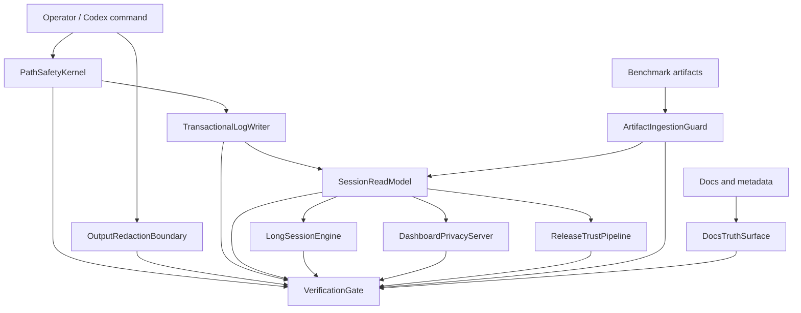

# Architectural Blueprint

## 1. Core Objective

Make Codex Autoresearch boringly trustworthy: every command that mutates state is scoped and literal, every output surface is redacted consistently, every readout agrees on the same control-plane decision, long sessions stay fast, release artifacts are reproducible and provenance-aware, and public/operator documentation matches the actual product contract.

## 2. System Scope and Boundaries

### In Scope

- Fix command, Git, and filesystem safety bugs found by the audit.
- Fix redaction gaps across immediate CLI output, dashboard export, and public showcase artifacts.
- Make `log` durable-state semantics transactional from the operator's point of view.
- Unify compact state, full state, dashboard, and recommendation read-model decisions.
- Restore and preserve the package verification gate, including the warm startup performance budget.
- Add bounded artifact parsing for partial-results salvage.
- Harden release workflow provenance and privileged workflow dependencies.
- Correct README, metadata, changelog, and docs truth gaps.
- Reduce architectural coupling in the CLI/read-model/session-core surfaces.

### Out of Scope

- Adding a default MCP server or changing the plugin from CLI/skill-only.
- Replacing the current Node/TypeScript runtime.
- Adding dashboard mutation controls or making the dashboard a control plane.
- Rewriting the whole CLI at once.
- Shipping a release tag from this specification branch.
- Treating benchmark results as product-grade proof without holdout/repeat/breadth/promotion evidence.

## 3. Core System Components

| Component Name | Single Responsibility |
|---|---|
| **PathSafetyKernel** | Normalize and enforce literal, realpath-contained project paths before Git or filesystem mutation. |
| **OutputRedactionBoundary** | Apply one response-level redaction policy to every command and export surface that can print or embed benchmark, checks, ledger, or path data. |
| **TransactionalLogWriter** | Persist run decisions so successful durable writes do not surface as failed logs, and secondary note failures become recoverable warnings. |
| **SessionReadModel** | Build one authoritative decision/readout model used by state, recommend-next, dashboard, finalization pressure, and operator handoff. |
| **LongSessionEngine** | Keep ledger parsing, experiment memory, dashboard freshness, chart data, and exports bounded for large sessions. |
| **DashboardPrivacyServer** | Serve and export dashboard data with Host validation, defensive headers, debug-ledger boundaries, and public-export scrubbing. |
| **ArtifactIngestionGuard** | Bound partial-results and benchmark artifact parsing by size, row count, containment, and explicit truncation notices. |
| **ReleaseTrustPipeline** | Verify package contents, pin privileged workflow dependencies, smoke all shipped launchers, and attach/check release provenance. |
| **DocsTruthSurface** | Keep README, docs, skill, metadata, changelog, and help text synchronized with actual runtime behavior. |
| **VerificationGate** | Prove fixes with targeted regressions, package gate checks, audit probes, and dashboard/runtime evidence. |

## 4. High-Level Data Flow

## 5. Key Integration Points

- **PathSafetyKernel to Git commands**: argv-style Git calls receive only literal pathspecs or rejected inputs.
- **PathSafetyKernel to filesystem deletion**: recursive delete paths must pass lexical and realpath containment before `fs.rm`.
- **OutputRedactionBoundary to CLI dispatch**: `runCliCommand` results pass through a response redactor before JSON printing.
- **TransactionalLogWriter to session files**: JSONL is the durable source of truth; Markdown note updates are secondary and warning-bearing.
- **SessionReadModel to state/recommend/dashboard**: full and compact outputs derive from one model, then apply format-specific projection.
- **LongSessionEngine to ledger parsing**: command invocations reuse parsed records and derived model data within one process.
- **DashboardPrivacyServer to browser**: live server validates Host and emits defensive headers before serving HTML or JSON.
- **ArtifactIngestionGuard to partial-results**: artifacts are statted, contained, size-limited, row-limited, and surfaced with explicit notices.
- **ReleaseTrustPipeline to GitHub Actions**: workflows pin external actions, smoke shipped launchers, and publish/verifiably check provenance.
- **DocsTruthSurface to release gate**: docs and metadata drift is covered by tests or source hygiene checks when repeatable.

