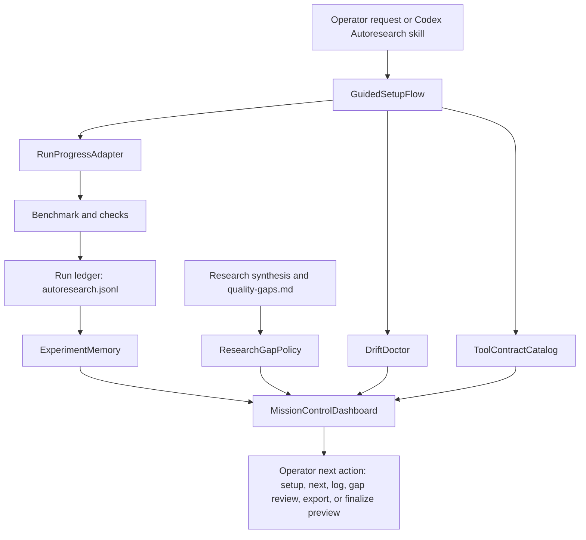

# Architectural Blueprint

## 1. Core Objective

Make Codex Autoresearch delightful by turning its existing measured-loop primitives into a guided, inspectable, resumable operator experience. Success means a new or returning operator can understand the current loop state, safely run a baseline, log the last packet, review evidence, avoid repeated dead ends, trust the installed plugin version, and monitor slow work without stitching together README prose, raw JSON, and terminal commands.

## 2. System Scope and Boundaries

### In Scope

- Guided setup and resume flow built on existing `setup-plan`, recipes, `doctor`, `next`, `log --from-last`, `state`, and dashboard commands.
- Mission-control dashboard improvements that preserve the current self-contained static export.
- ASI-backed experiment memory that summarizes hypotheses, evidence, rollback reasons, and next-action hints.
- Optional long-running task/progress adapters for slow benchmark and preflight operations.
- MCP tool contract improvements for adjacent-tool clarity and structured output validation.
- Doctor diagnostics for source, manifest, MCP server, lightweight entrypoint, and installed cache drift.
- Small quality fixes for recipe tags, quality-gap slug detection, canonical candidate sections, and resume command blocks.

### Out of Scope

- Replacing the current CLI-first workflow with a hosted web service.
- Removing the static dashboard export fallback.
- Creating real review branches from dashboard live actions.
- Changing benchmark semantics away from `METRIC name=value`.
- Publishing to the marketplace or mutating the installed plugin cache as part of this roadmap.
- Broad source rewrites unrelated to the delight roadmap.

## 3. Core System Components

| Component Name | Single Responsibility |
|---|---|
| **GuidedSetupFlow** | Produce a single first-run or resume packet that combines setup readiness, recipe choice, doctor status, baseline command, and log-next action. |
| **MissionControlDashboard** | Render the operator cockpit for setup, run state, experiment memory, quality gaps, safe actions, and finalization readiness while preserving static export. |
| **ExperimentMemory** | Summarize ASI and run ledger evidence into durable hypotheses, dead ends, next actions, and resume guidance. |
| **RunProgressAdapter** | Expose progress, task, output-tail, and cancellation state for slow operations without corrupting the run ledger. |
| **ToolContractCatalog** | Define compact MCP tool guidance, adjacent-tool contrast, and output contracts for the tool surface. |
| **DriftDoctor** | Detect and report source/manifest/MCP/cache version drift during doctor and status workflows. |
| **ResearchGapPolicy** | Keep quality-gap recipes, candidate application, and research artifact behavior predictable. |

## 4. High-Level Data Flow

## 5. Key Integration Points

- **GuidedSetupFlow <-> CLI**: Adds a read-only guided packet or command path in `scripts/autoresearch.mjs`; output remains JSON for MCP and CLI callers.
- **GuidedSetupFlow <-> MissionControlDashboard**: Extends `buildDashboardViewModel` with setup guidance, resume guidance, and safe next actions.
- **MissionControlDashboard <-> Live server**: Uses existing local-only safe endpoints and adds only non-destructive actions unless separately approved.
- **RunProgressAdapter <-> Runner**: Wraps benchmark/check execution to expose progress and cancellation while keeping final metrics parsed through the current runner.
- **RunProgressAdapter <-> MCP**: Adds optional task/progress metadata only when host/server capability support exists; otherwise returns the existing synchronous result.
- **ToolContractCatalog <-> MCP interface**: Generates or validates tool descriptions, input schemas, output schemas, and adjacent-tool guidance in `lib/mcp-interface.mjs`.
- **DriftDoctor <-> Doctor session**: Reads local version surfaces and optionally probes installed MCP routing; diagnostics are warnings unless they contradict the active runtime.
- **ResearchGapPolicy <-> Research gaps and recipes**: Normalizes quality-gap slug selection and candidate-section application.
- **Authentication**: No new remote authentication is introduced; all live actions remain local process calls.
- **Data Format**: JSON remains the public tool/CLI contract; markdown remains the durable human-readable research and specification format.
