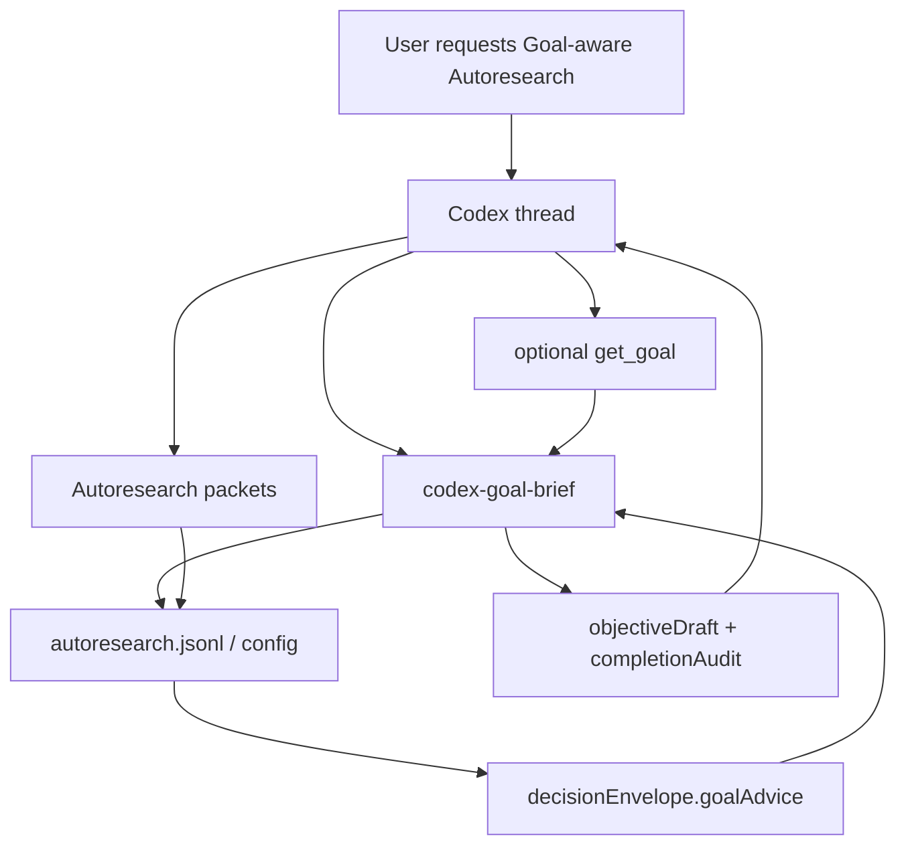

# Codex Goal Bridge Blueprint

## 1. Research Base

OpenAI describes Codex Goals as persistent thread objectives with a completion condition, success checks, constraints, pause/resume/clear controls, and budget stops. Sources: [Using Goals in Codex](https://developers.openai.com/cookbook/examples/codex/using_goals_in_codex), [Goal mode](https://developers.openai.com/codex/prompting#goal-mode), [CLI /goal](https://developers.openai.com/codex/cli/slash-commands#set-or-view-a-task-goal-with-goal), and [App Server goal API](https://developers.openai.com/codex/app-server#manage-a-thread-goal).

The useful lesson for Autoresearch is not "build another goal system." It is "keep the objective durable, visible, evidence-checked, and impossible to confuse with budget exhaustion."

## 2. Core Objective

Autoresearch shall expose a read-only Goal bridge that converts session state into a Codex Goal objective draft and completion audit, while preserving a hard boundary between Codex-owned thread Goal state and Autoresearch-owned benchmark evidence.

## 3. System Scope and Boundaries

### In Scope

- Persist the Autoresearch goal in JSONL config and `state --compact`.
- Expose `codex-goal-brief` / `codex_goal_bridge` as a read-only objective-and-audit surface.
- Accept imported Codex Goal fields explicitly from a parent agent.
- Include `goalAdvice` in the decision envelope.
- Document that limits and budgets are stop signals, not completion evidence.

### Out of Scope

- Reading Codex private SQLite state.
- Mutating Codex Goals from the Node CLI.
- Adding dashboard mutation controls.
- Treating `quality_gap=0`, local best, or max iterations as automatic success.

## 4. Core System Components

| Component Name | Single Responsibility |
|---|---|
| Codex Goal | Own thread-level objective lifecycle and budget accounting. |
| Goal Bridge | Convert Autoresearch evidence into Goal-ready objective and audit text. |
| Session Ledger | Persist benchmark config, goal, packets, ASI, and decisions. |
| Decision Envelope | Name the next safe action and goal advice from current evidence. |
| Skill Guidance | Tell Codex when to call `get_goal`, `codex-goal-brief`, and `update_goal`. |

## 5. High-Level Data Flow

## 6. Key Integration Points

- **Codex Goal -> Goal Bridge**: imported objective/status/budget fields passed as CLI or MCP arguments.
- **Goal Bridge -> Session Ledger**: read-only state inspection through existing `currentState` / `publicState`.
- **Session Ledger -> Decision Envelope**: persisted `config.goal` drives `goalAdvice`.
- **Skill Guidance -> Codex Goal**: parent agent may call `update_goal(status="complete")` only after a real completion audit.
