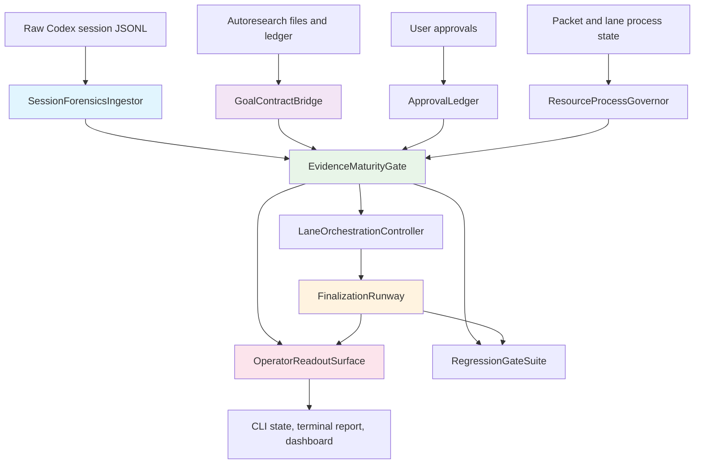

# Architectural Blueprint

> Status: historical implementation spec. The first implementation landed in commit `fa80d8d`; current behavior is defined by source code and `plugins/codex-autoresearch/docs/control-plane.md`.

## 1. Core Objective

Create a session-control-plane remediation for Codex Autoresearch so long-running Codex sessions cannot drift from the active user goal, overclaim benchmark evidence, stall on already-granted approvals, exhaust local resources without a stop signal, confuse local finalization with PR-visible completion, or bury the operator under unbounded output. Success meant `state`, `recommend-next`, `session-forensics`, `lane-runner`, finalization preview, terminal reports, and the read-only dashboard all agreeing on one canonical next action and one auditable evidence maturity state in the implementation plan.

## 2. System Scope and Boundaries

### In Scope

- Import real Codex session JSONL evidence into a compact decision capsule and regression fixture.
- Bind live Codex goal text, Autoresearch goal text, benchmark contract, and finalization claim into one visible goal contract.
- Record scoped approvals durably and consume them in lane, packet, and finalization gates.
- Govern packet, lane, process, output, and stale-process budgets before more work runs.
- Separate diagnostic, development, holdout, breadth, repeat, and promotion-grade evidence.
- Make finalization idempotent across existing branches, stale worktrees, local commits, pushed branches, and PR state.
- Keep dashboard and terminal readouts read-only while requiring them to agree with CLI governance.
- Add traceability, tests, docs, and package checks for the remediation.

### Out of Scope

- Changing CodeStory itself or rerunning the CodeStory benchmark campaign.
- Adding live mutation controls to the dashboard.
- Adding a default MCP server declaration or new plugin distribution channel.
- Automating credentials, GitHub authentication, or user account setup.
- Replacing Autoresearch's existing measured loop command family.
- Treating this historical specification as the current behavior contract; current behavior is defined by source code and `plugins/codex-autoresearch/docs/control-plane.md`.

## 3. Core System Components

| Component Name | Single Responsibility |
|---|---|
| **GoalContractBridge** | Owns the visible relationship between the active Codex goal, durable Autoresearch goal, benchmark goal, and finalization claim. |
| **SessionForensicsIngestor** | Converts raw Codex session JSONL into compact signals, decision capsules, and real-session regression evidence. |
| **ApprovalLedger** | Records scoped human approvals with source, timestamp, scope, expiry, and consuming gate. |
| **ResourceProcessGovernor** | Enforces process, wall-clock, output, polling, and stale-process budgets before packet or lane execution. |
| **LaneOrchestrationController** | Plans and reconciles read-only, implementation, and review lanes as accountable bounded work streams. |
| **EvidenceMaturityGate** | Classifies evidence maturity and blocks promotion/finalization when proof is only diagnostic or row-specific. |
| **FinalizationRunway** | Models finalization as resumable state from preview through branch, push, PR, merge, and cleanup. |
| **OperatorReadoutSurface** | Renders one canonical next action consistently in CLI, terminal report, and dashboard readout. |
| **RegressionGateSuite** | Proves the session-control-plane contracts through real-session fixtures, focused tests, and package checks. |

## 4. High-Level Data Flow

## 5. Key Integration Points

- **SessionForensicsIngestor to GoalContractBridge**: TypeScript function call using parsed session summary and optional `codexGoalObjective` input.
- **GoalContractBridge to EvidenceMaturityGate**: JSON-compatible goal frame embedded in session state, decision envelope, and compact readouts.
- **ApprovalLedger to LaneOrchestrationController**: JSONL approval records keyed by gate type, scope, and consuming action.
- **ResourceProcessGovernor to LaneOrchestrationController**: preflight result object with `canStart`, `blockers`, `warnings`, and resource-budget fields.
- **EvidenceMaturityGate to FinalizationRunway**: finalization-blocking capsule and claim coverage object.
- **FinalizationRunway to OperatorReadoutSurface**: finalization status packet with local branch, pushed branch, PR, CI, merge, and cleanup state.
- **RegressionGateSuite to all components**: Node tests and package checks using fixture JSONL, generated capsules, and golden compact readouts.
- **Authentication**: No new authentication; GitHub status uses the existing local `gh` authentication state when available and reports unavailable state without pretending success.
- **Data Format**: JSON-compatible TypeScript objects persisted through `autoresearch.jsonl`, capsule JSON files, and compact CLI/dashboard payloads.

## 6. Historical Quality Gate Results

- Component responsibilities are clear and non-overlapping.
- The data flow shows the journey from raw session evidence and live loop state to operator readouts and regression gates.
- Integration points specify protocols and data formats.
- In-scope and out-of-scope boundaries are explicit.

The architectural blueprint recorded clear component mapping, data flow visualization, and integration points for the implementation that followed. This file is archived evidence, not an active instruction to generate new requirements.
