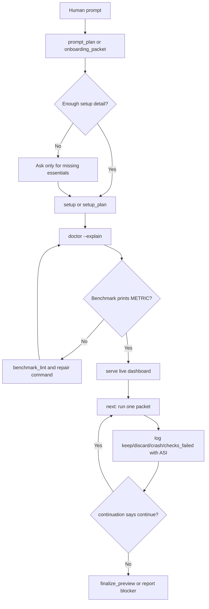
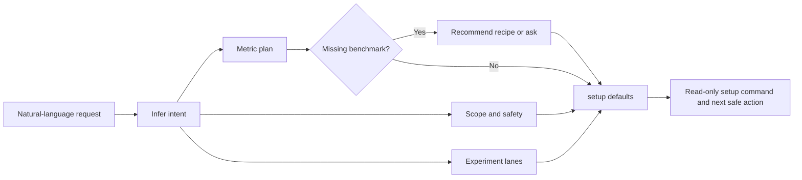
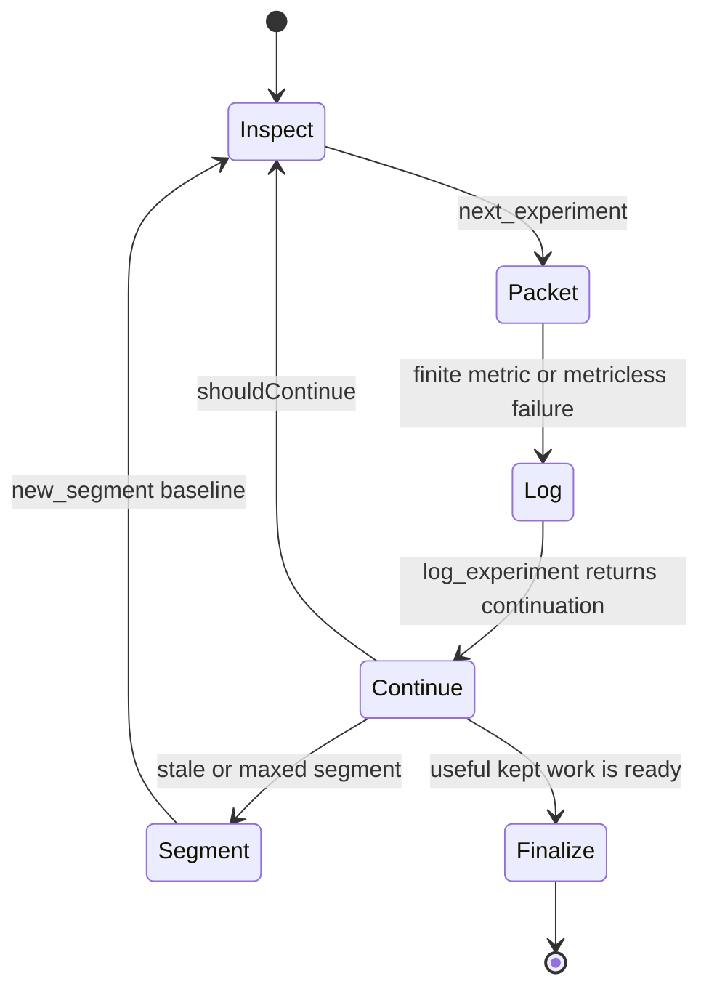
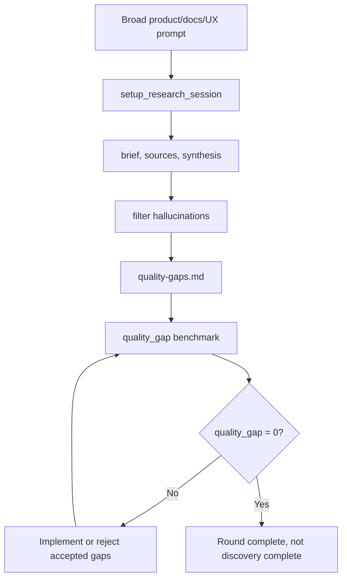
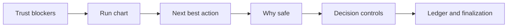

# Workflow Diagrams

Codex Autoresearch is easiest to understand as a few small loops. Use this page when words start hiding the actual motion and everything starts sounding like a product manager whispered into a blender.

## First Five Minutes

## Prompt To Loop

## Active Packet Loop

## Quality-Gap Research

## Dashboard Reading Order

