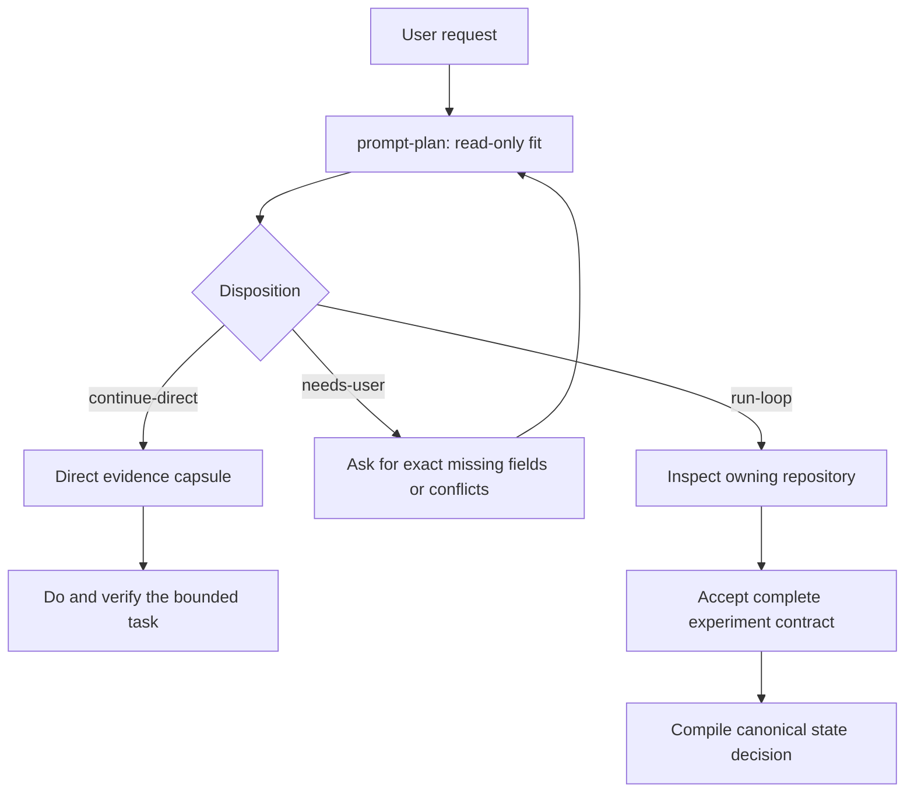
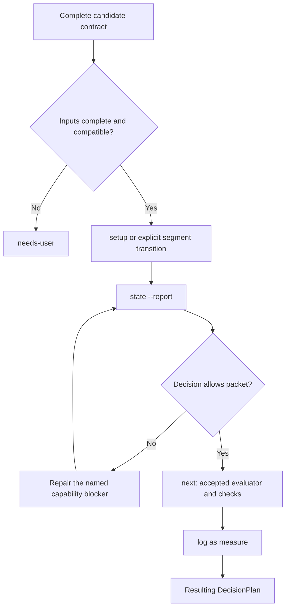
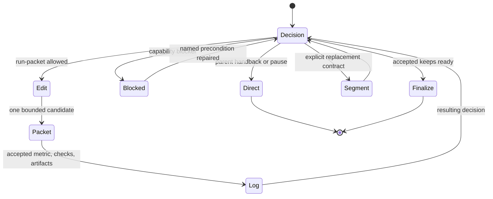
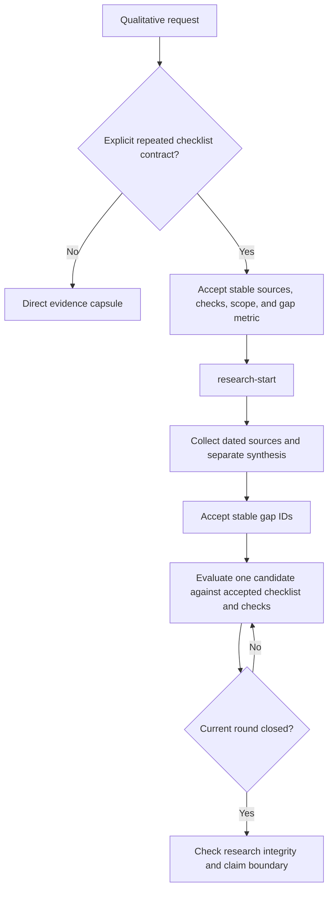
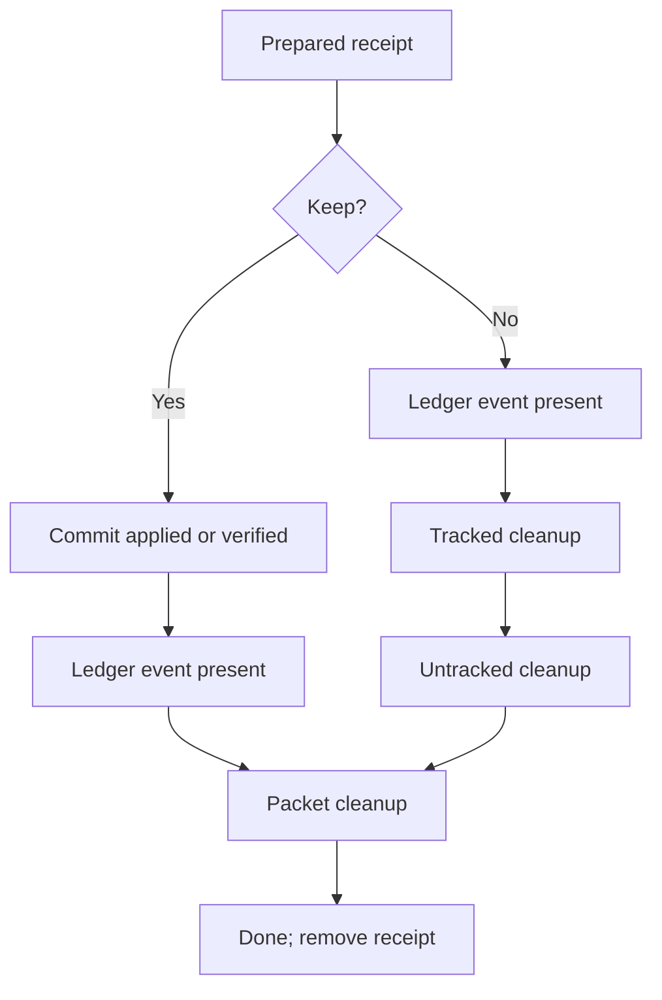
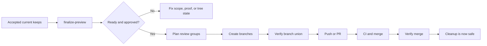

# Workflow diagrams

These diagrams show the normal route and the points where Autoresearch deliberately hands control back.

## Fit before setup

```mermaid
flowchart TD
  A["User request"] --> B["prompt-plan: read-only fit"]
  B --> C{"Disposition"}
  C -- "continue-direct" --> D["Direct evidence capsule"]
  D --> E["Do and verify the bounded task"]
  C -- "needs-user" --> F["Ask for exact missing fields or conflicts"]
  F --> B
  C -- "run-loop" --> G["Inspect owning repository"]
  G --> H["Accept complete experiment contract"]
  H --> I["Compile canonical state decision"]
```

The direct path creates no Autoresearch files, packets, commits, dashboard, or finalization state. Architecture, documentation, UX, product study, open-ended research, taste, and one-shot fixes take this path unless repeated evaluation is explicit and complete. An unrelated active session remains untouched.

## First accepted baseline

```mermaid
flowchart TD
  A["Complete candidate contract"] --> B{"Inputs complete and compatible?"}
  B -- "No" --> C["needs-user"]
  B -- "Yes" --> D["setup or explicit segment transition"]
  D --> E["state --report"]
  E --> F{"Decision allows packet?"}
  F -- "No" --> G["Repair the named capability blocker"]
  G --> E
  F -- "Yes" --> H["next: accepted evaluator and checks"]
  H --> I["log as measure"]
  I --> J["Resulting DecisionPlan"]
```

Unknown noise permits qualification baselines but blocks a keep until the required repeats establish a valid comparison.

## Active packet loop

```mermaid
stateDiagram-v2
  [*] --> Decision
  Decision --> Direct: parent handback or pause
  Decision --> Blocked: capability blocker
  Blocked --> Decision: named precondition repaired
  Decision --> Edit: run-packet allowed
  Edit --> Packet: one bounded candidate
  Packet --> Log: accepted metric, checks, artifacts
  Log --> Decision: resulting decision
  Decision --> Segment: explicit replacement contract
  Decision --> Finalize: accepted keeps ready
  Direct --> [*]
  Segment --> Decision
  Finalize --> [*]
```

Two eligible no-learning candidates or two same-layer failures pause packet work unless that failure class's relevant preconditions changed. A remaining budget does not authorize another packet. Pausing never triggers automatic fanout, diversification, or a segment transition.

## Explicit qualitative loop

```mermaid
flowchart TD
  A["Qualitative request"] --> B{"Explicit repeated checklist contract?"}
  B -- "No" --> C["Direct evidence capsule"]
  B -- "Yes" --> D["Accept stable sources, checks, scope, and gap metric"]
  D --> E["research-start"]
  E --> F["Collect dated sources and separate synthesis"]
  F --> G["Accept stable gap IDs"]
  G --> H["Evaluate one candidate against accepted checklist and checks"]
  H --> I{"Current round closed?"}
  I -- "No" --> H
  I -- "Yes" --> J["Check research integrity and claim boundary"]
```

Use `gap-candidates` to preview source-backed checklist changes and `gap-decide` to accept evidence-bearing outcomes. `quality_gap=0` closes one accepted round; it does not prove the larger subject is exhausted.

## Exactly-once logging

```mermaid
flowchart TD
  A["Prepared receipt"] --> B{"Keep?"}
  B -- "Yes" --> C["Commit applied or verified"]
  C --> D["Ledger event present"]
  B -- "No" --> E["Ledger event present"]
  E --> F["Tracked cleanup"]
  F --> G["Untracked cleanup"]
  D --> H["Packet cleanup"]
  G --> H
  H --> I["Done; remove receipt"]
```

An interrupted command resumes only with the same arguments. Completed stages are verified rather than repeated, so retries converge to at most one commit and one ledger event.

## Review branches

```mermaid
flowchart LR
  A["Accepted current keeps"] --> B["finalize-preview"]
  B --> C{"Ready and approved?"}
  C -- "No" --> D["Fix scope, proof, or tree state"]
  C -- "Yes" --> E["Plan review groups"]
  E --> F["Create branches"]
  F --> G["Verify branch union"]
  G --> H["Push or PR"]
  H --> I["CI and merge"]
  I --> J["Verify merge"]
  J --> K["Cleanup is now safe"]
```

Use the CLI for setup, packets, logging, gap review, export, and finalization. The dashboard is a read-only projection of the same decision and may redact executable commands.
