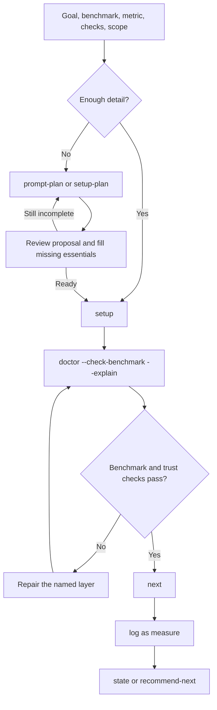
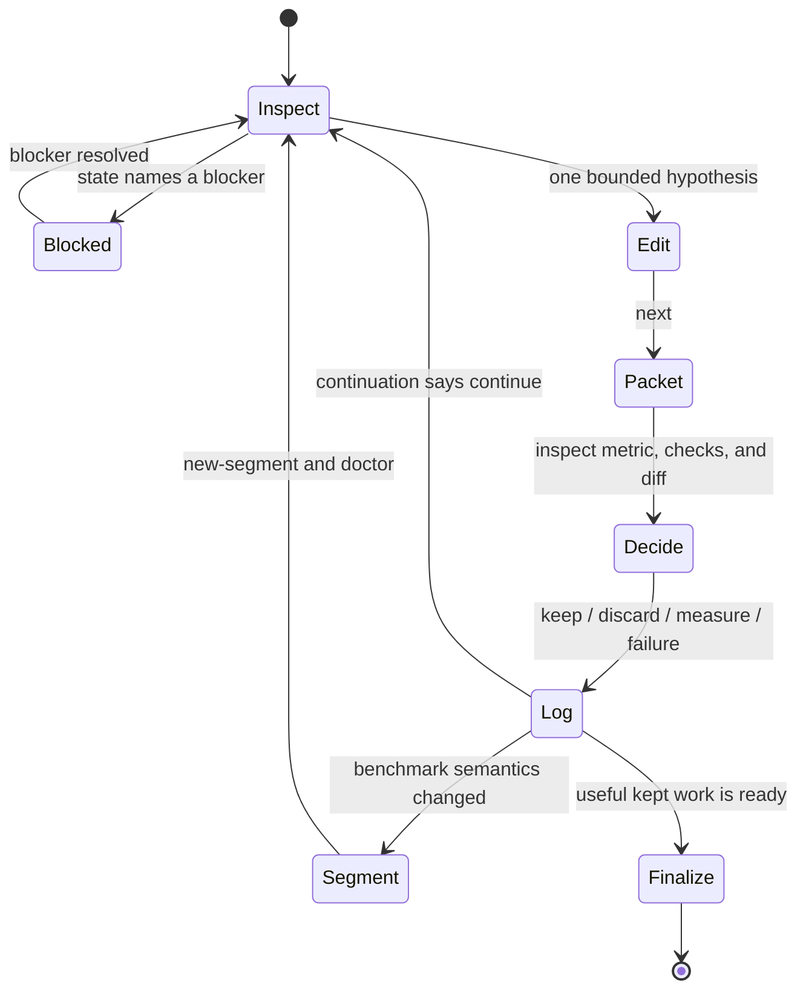
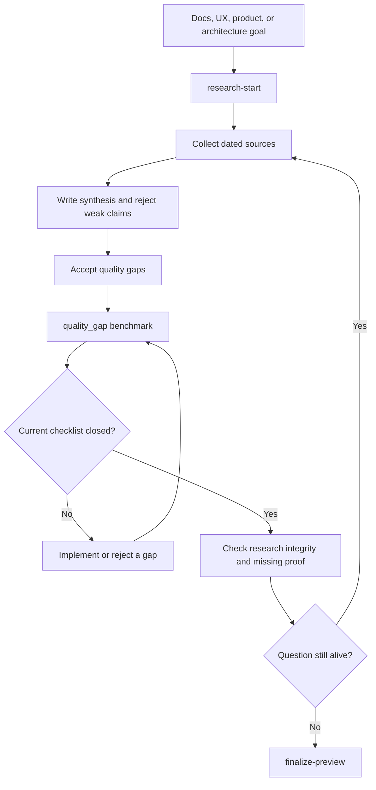
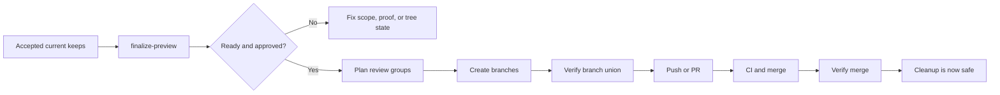

# Workflow diagrams

These diagrams show the normal route and the points where Autoresearch deliberately stops.

## First baseline

```mermaid
flowchart TD
  A["Goal, benchmark, metric, checks, scope"] --> B{"Enough detail?"}
  B -- "No" --> C["prompt-plan or setup-plan"]
  B -- "Yes" --> D["setup"]
  C --> R["Review proposal and fill missing essentials"]
  R -- "Still incomplete" --> C
  R -- "Ready" --> D
  D --> E["doctor --check-benchmark --explain"]
  E --> F{"Benchmark and trust checks pass?"}
  F -- "No" --> G["Repair the named layer"]
  G --> E
  F -- "Yes" --> H["next"]
  H --> I["log as measure"]
  I --> J["state or recommend-next"]
```

## Active packet loop

```mermaid
stateDiagram-v2
  [*] --> Inspect
  Inspect --> Blocked: state names a blocker
  Blocked --> Inspect: blocker resolved
  Inspect --> Edit: one bounded hypothesis
  Edit --> Packet: next
  Packet --> Decide: inspect metric, checks, and diff
  Decide --> Log: keep / discard / measure / failure
  Log --> Inspect: continuation says continue
  Log --> Segment: benchmark semantics changed
  Log --> Finalize: useful kept work is ready
  Segment --> Inspect: new-segment and doctor
  Finalize --> [*]
```

## Qualitative research

```mermaid
flowchart TD
  A["Docs, UX, product, or architecture goal"] --> B["research-start"]
  B --> C["Collect dated sources"]
  C --> D["Write synthesis and reject weak claims"]
  D --> E["Accept quality gaps"]
  E --> F["quality_gap benchmark"]
  F --> G{"Current checklist closed?"}
  G -- "No" --> H["Implement or reject a gap"]
  H --> F
  G -- "Yes" --> I["Check research integrity and missing proof"]
  I --> J{"Question still alive?"}
  J -- "Yes" --> C
  J -- "No" --> K["finalize-preview"]
```

Use `gap-candidates` to preview source-backed checklist changes. Closing a round is not the same as proving the whole product is finished.

## Review branches

```mermaid
flowchart LR
  A["Accepted current keeps"] --> B["finalize-preview"]
  B --> C{"Ready and approved?"}
  C -- "No" --> D["Fix scope, proof, or tree state"]
  C -- "Yes" --> E["Plan review groups"]
  E --> F["Create branches"]
  F --> G["Verify branch union"]
  G --> H["Push or PR"]
  H --> I["CI and merge"]
  I --> J["Verify merge"]
  J --> K["Cleanup is now safe"]
```

Use the CLI for setup, packet runs, logging, gap review, export, and finalization. The dashboard displays the same state but does not advance it. Serve it with `serve --cwd <project>` when a live visual view helps.
