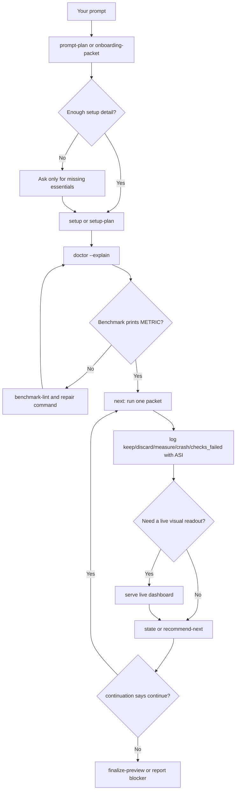
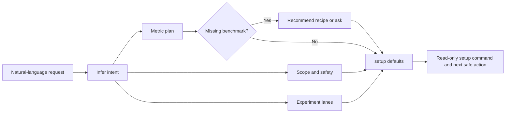
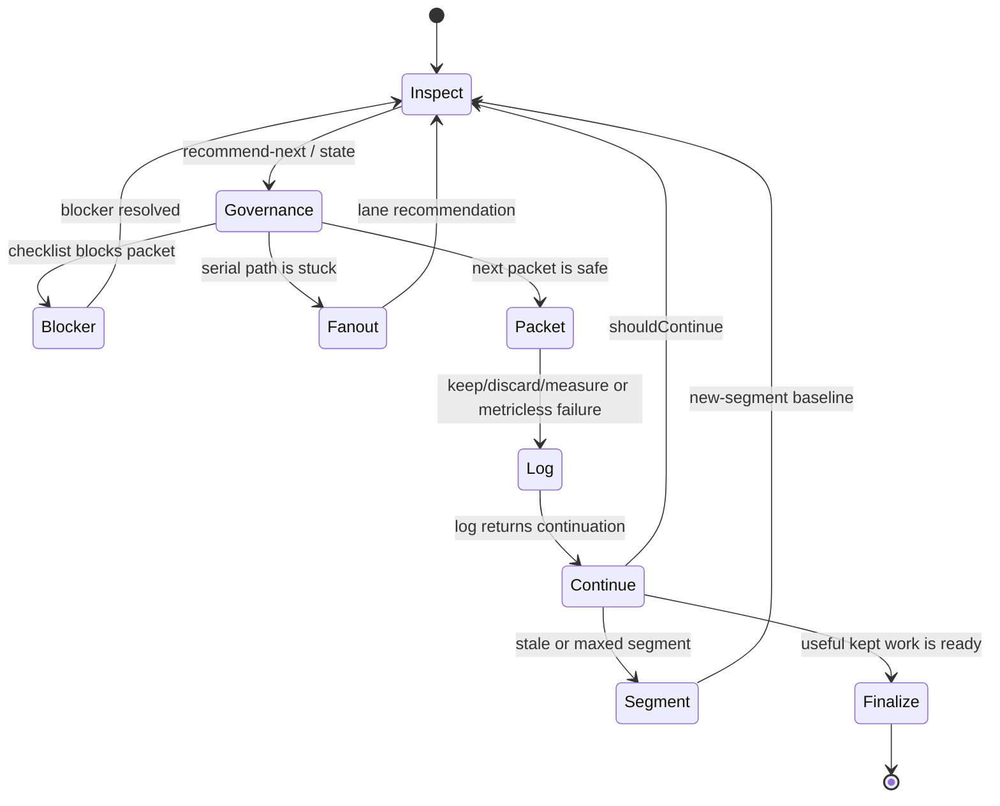
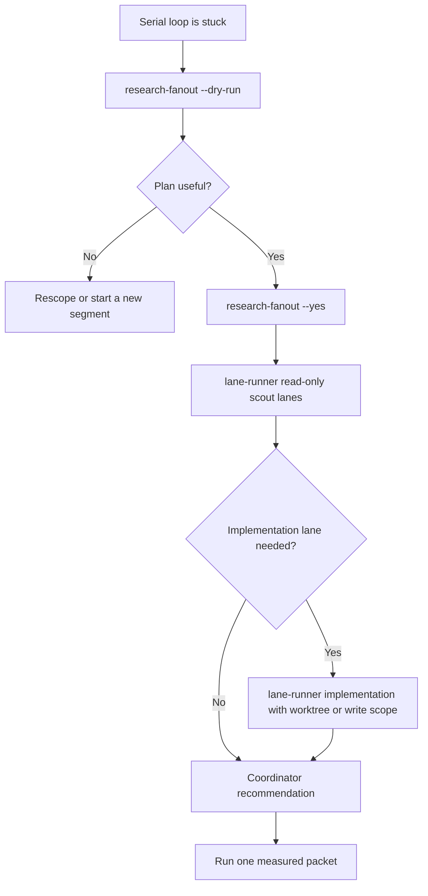
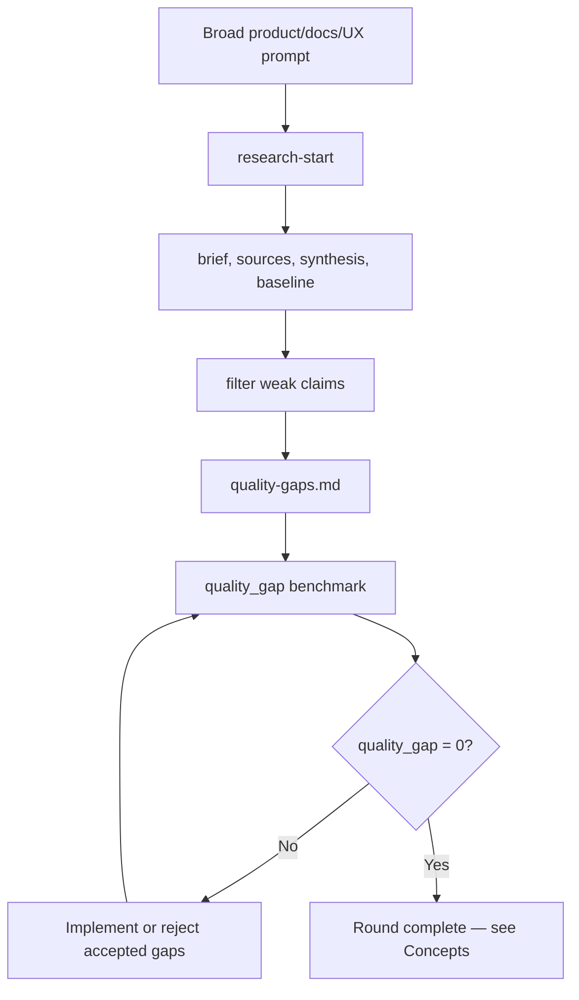
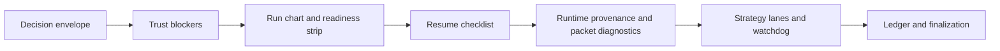

# Workflow Diagrams

Codex Autoresearch is easiest to understand as a few small loops: setup, packet, governance, research fanout, and finalization.

## First five minutes

```mermaid
flowchart TD
  A["Your prompt"] --> B["prompt-plan or onboarding-packet"]
  B --> C{"Enough setup detail?"}
  C -- "No" --> D["Ask only for missing essentials"]
  C -- "Yes" --> E["setup or setup-plan"]
  D --> E
  E --> F["doctor --explain"]
  F --> G{"Benchmark prints METRIC?"}
  G -- "No" --> H["benchmark-lint and repair command"]
  G -- "Yes" --> I["next: run one packet"]
  H --> F
  I --> J["log keep/discard/measure/crash/checks_failed with ASI"]
  J --> K{"Need a live visual readout?"}
  K -- "Yes" --> L["serve live dashboard"]
  K -- "No" --> M["state or recommend-next"]
  L --> M
  M --> N{"continuation says continue?"}
  N -- "Yes" --> I
  N -- "No" --> O["finalize-preview or report blocker"]
```

## Prompt to loop

```mermaid
flowchart LR
  P["Natural-language request"] --> I["Infer intent"]
  I --> M["Metric plan"]
  I --> S["Scope and safety"]
  I --> E["Experiment lanes"]
  M --> Q{"Missing benchmark?"}
  Q -- "Yes" --> R["Recommend recipe or ask"]
  Q -- "No" --> U["setup defaults"]
  S --> U
  E --> U
  R --> U
  U --> O["Read-only setup command and next safe action"]
```

## Active packet loop

```mermaid
stateDiagram-v2
  [*] --> Inspect
  Inspect --> Governance: recommend-next / state
  Governance --> Blocker: checklist blocks packet
  Blocker --> Inspect: blocker resolved
  Governance --> Fanout: serial path is stuck
  Fanout --> Inspect: lane recommendation
  Governance --> Packet: next packet is safe
  Packet --> Log: keep/discard/measure or metricless failure
  Log --> Continue: log returns continuation
  Continue --> Inspect: shouldContinue
  Continue --> Segment: stale or maxed segment
  Continue --> Finalize: useful kept work is ready
  Segment --> Inspect: new-segment baseline
  Finalize --> [*]
```

## Parallel research lanes

```mermaid
flowchart TD
  A["Serial loop is stuck"] --> B["research-fanout --dry-run"]
  B --> C{"Plan useful?"}
  C -- "No" --> D["Rescope or start a new segment"]
  C -- "Yes" --> E["research-fanout --yes"]
  E --> F["lane-runner read-only scout lanes"]
  F --> G{"Implementation lane needed?"}
  G -- "No" --> H["Coordinator recommendation"]
  G -- "Yes" --> I["lane-runner implementation with worktree or write scope"]
  I --> H
  H --> J["Run one measured packet"]
```

## Quality-gap research

```mermaid
flowchart TD
  A["Broad product/docs/UX prompt"] --> B["research-start"]
  B --> C["brief, sources, synthesis, baseline"]
  C --> D["filter weak claims"]
  D --> E["quality-gaps.md"]
  E --> F["quality_gap benchmark"]
  F --> G{"quality_gap = 0?"}
  G -- "No" --> H["Implement or reject accepted gaps"]
  H --> F
  G -- "Yes" --> I["Round complete — see Concepts"]
```

## Dashboard reading order

```mermaid
flowchart LR
  A["Decision envelope"] --> B["Trust blockers"]
  B --> C["Run chart and readiness strip"]
  C --> D["Resume checklist"]
  D --> E["Runtime provenance and packet diagnostics"]
  E --> F["Strategy lanes and watchdog"]
  F --> G["Ledger and finalization"]
```

---

Previous: [Recipes](recipes.md) · Next: [Architecture](architecture.md).
